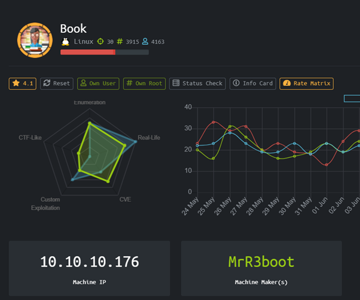
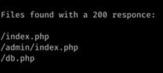
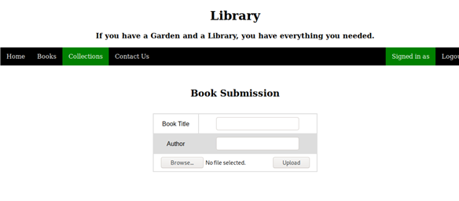
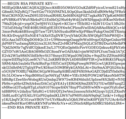
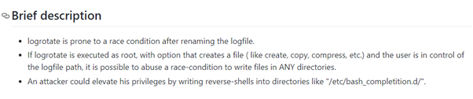
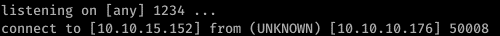

# Book (Linux)



HackTheBox Book dengan operating system Linux, yang menurut rating sangat mirip dengan real life !

### Enumeration

Pertama tama mari kita jalankan nmap terlebih dahulu

```
Starting Nmap 7.80 ( https://nmap.org ) at 2020-06-04 14:38 EDTNmap scan report for 10.10.10.176
Host is up (0.23s latency).
Not shown: 65533 closed ports
PORT   STATE SERVICE VERSION
22/tcp open  ssh     OpenSSH 7.6p1 Ubuntu 4ubuntu0.3 (Ubuntu Linux; protocol 2.0)
| ssh-hostkey: 
|   2048 f7:fc:57:99:f6:82:e0:03:d6:03:bc:09:43:01:55:b7 (RSA)
|   256 a3:e5:d1:74:c4:8a:e8:c8:52:c7:17:83:4a:54:31:bd (ECDSA)
|_  256 e3:62:68:72:e2:c0:ae:46:67:3d:cb:46:bf:69:b9:6a (ED25519)
80/tcp open  http    Apache httpd 2.4.29 ((Ubuntu))
| http-cookie-flags: 
|   /: 
|     PHPSESSID: 
|_      httponly flag not set
|_http-server-header: Apache/2.4.29 (Ubuntu)
|_http-title: LIBRARY - Read | Learn | Have Fun
Service Info: OS: Linux; CPE: cpe:/o:linux:linux_kernel

Service detection performed. Please report any incorrect results at https://nmap.org/submit/ .
Nmap done: 1 IP address (1 host up) scanned in 8272.93 seconds
```

Jika dilihat dari hasil nmap, kita bisa melihat bahwa service yang berjalan berupa web service dan ssh, nampaknya lumayan straightforward.

Menjalankan dirbuster sebentar kita akan mendapatkan hasil berupa



index.php berupa sebuah login page


Namun setelah dilihat page sourcenya kita bisa menemukan sebuah javascript yang menarik

```
<script>
  window.console = window.console || function(t) {};
</script>
<script>
  if (document.location.search.match(/type=embed/gi)) {
    window.parent.postMessage("resize", "*");
  }
function validateForm() {
  var x = document.forms["myForm"]["name"].value;
  var y = document.forms["myForm"]["email"].value;
  if (x == "") {
    alert("Please fill name field. Should not be more than 10 characters");
    return false;
  }
  if (y == "") {
    alert("Please fill email field. Should not be more than 20 characters");
    return false;
  }
}
</script>
```

Kita tidak diperbolehkan mengisi nama lebih dari 10 karakter dan email lebih dari 20 karakter

Pada page /admin/index.php kita bisa melakukan login sebagai admin, disini saya akan menggunakan kelemahan yang bernama SQL Truncation, kelemahan ini bisa di deteksi jika ada limit database mysql, misal email dilimit 20 characters

Contoh email admin adalah admin@book.htb yang jumlahnya 14 huruf maka harus ditambah 6 space dan 1 huruf apa saja. Contoh “admin@book.htb      a”

Hal ini karena “admin@book.htb      a” belum ada di database, namun saat dimasukkan terjadi truncation si huruf a, sisanya adalah 6 spasi yang akan di potong saat dimasukkan ke database.

Register dengan password attacker, maka attacker akan sukses mendapatkan email administrator.



### User

Setelah berhasil masuk kita akan melakukan exploitasi LFI pada mekanisme book submissionnya dengan menggunakan referensi dari

[https://www.noob.ninja/2017/11/local-file-read-via-xss-in-dynamically.html](https://www.noob.ninja/2017/11/local-file-read-via-xss-in-dynamically.html)

XSS to LFI dengan payload yang kita gunakan adalah sebagai berikut.

```
<script>x=new XMLHttpRequest; x.onload=function(){document.write(this.responseText)}; x.open(“GET”, “file:///etc/passwd”); x.send(); </script>
```

File:/// berarti File://localhost/ , karena localhost maka boleh dihilangkan saja.

Kita berencana untuk melakukan dump id_rsa yaitu SSH Private Key dari user reader. Kita mengetahui ada user reader dari dump /etc/passwd tadi.



Perlu diingat bahwa saat membuka pdf di viewer kali linux mungkin ada view yang terpotong sedikit, bukalah di chrome atau pdf viewer yang lain sehingga bisa melihat lebih lengkap. Gambar diatas sudah saya buka menggunakan chrome pdf viewer.

Login menggunakan id_rsa tersebut dan dapatkan user access serta user.txt

### Root

Setelah enumerasi menggunakan LinEnum.sh kita menemukan process yang vulnerable terhadap privilege escalation attack bernama logrotten

Referensi yang digunakan penulis untuk melancarkan exploit berasal dari [https://github.com/whotwagner/logrotten](https://github.com/whotwagner/logrotten)



Exploit logrotten tersebut dapat di compile menggunakan gcc, dan dimasukkan payload reverse shell. Ketika logrotten sedang berjalan dan melakukan rotasi backup, kita dapat mentrigger eksekusi payload reverse shell dengan melakukan login sebagai reader di terminal lain.



# Rooted !