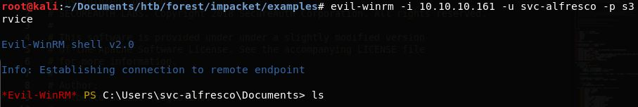

# Forest (Windows)


Kali ini kita akan mengerjakan box dengan OS Windows, OS yang dibenci banyak kalangan orang haha, termasuk saya. First time Windows box.

Terlihat dari review yang diberikan orang orang bahwa kita akan banyak berurusan dengan situasi real life, enumerasi dan eksplotasi menggunakan CVE.

### Enumeration

Mari kita mulai, pertama akan kita lakukan nmap terlebih dahulu.


Tambahkan htb.local ke etc/hosts

Nampaknya kita akan banyak bergelud dengan windows active directory, kita bisa melihat juga ada smb port di 445 tcp. Mari kita lakukan enumerasi yang lebih lengkap menggunakan enumeration tool bernama sparta.

Pada enumerasi sparta di bagian smbenum mengeluarkan hasil seperti

```
########## Getting Netbios name ##########
Doing NBT name scan for addresses from 10.10.10.161
########## Checking for NULL sessions ##########
Could not initialise srvsvc. Error was NT_STATUS_ACCESS_DENIED
 
########## Enumerating domains ##########
name:[HTB] idx:[0x0]
name:[Builtin] idx:[0x0]
 
########## Enumerating password and lockout policies ##########
[+] Attaching to 10.10.10.161 using a NULL share
 
[+] Trying protocol 445/SMB...
 
	[!] Protocol failed: 'NoneType' object has no attribute 'decode'
 
[+] Trying protocol 139/SMB...
 
	[!] Protocol failed: Cannot request session (Called Name:10.10.10.161)
########## Enumerating users ##########
Starting Nmap 7.80 ( https://nmap.org ) at 2019-11-26 22:06 EST
Nmap scan report for 10.10.10.161
Host is up (0.25s latency).
 
PORT    STATE SERVICE
139/tcp open  netbios-ssn
445/tcp open  microsoft-ds
 
Host script results:
|_smb-enum-users: ERROR: Script execution failed (use -d to debug)
Nmap done: 1 IP address (1 host up) scanned in 5.08 seconds
user:[Administrator] rid:[0x1f4]
user:[Guest] rid:[0x1f5]
user:[krbtgt] rid:[0x1f6]
user:[DefaultAccount] rid:[0x1f7]
user:[$331000-VK4ADACQNUCA] rid:[0x463]
user:[SM_2c8eef0a09b545acb] rid:[0x464]
user:[SM_ca8c2ed5bdab4dc9b] rid:[0x465]
user:[SM_75a538d3025e4db9a] rid:[0x466]
user:[SM_681f53d4942840e18] rid:[0x467]
user:[SM_1b41c9286325456bb] rid:[0x468]
user:[SM_9b69f1b9d2cc45549] rid:[0x469]
user:[SM_7c96b981967141ebb] rid:[0x46a]
user:[SM_c75ee099d0a64c91b] rid:[0x46b]
user:[SM_1ffab36a2f5f479cb] rid:[0x46c]
user:[HealthMailboxc3d7722] rid:[0x46e]
user:[HealthMailboxfc9daad] rid:[0x46f]
user:[HealthMailboxc0a90c9] rid:[0x470]
user:[HealthMailbox670628e] rid:[0x471]
user:[HealthMailbox968e74d] rid:[0x472]
user:[HealthMailbox6ded678] rid:[0x473]
user:[HealthMailbox83d6781] rid:[0x474]
user:[HealthMailboxfd87238] rid:[0x475]
user:[HealthMailboxb01ac64] rid:[0x476]
user:[HealthMailbox7108a4e] rid:[0x477]
user:[HealthMailbox0659cc1] rid:[0x478]
user:[sebastien] rid:[0x479]
user:[lucinda] rid:[0x47a]
user:[svc-alfresco] rid:[0x47b]
user:[andy] rid:[0x47e]
user:[mark] rid:[0x47f]
user:[santi] rid:[0x480]
 
########## Enumerating Administrators ##########
 
Couldn't lookup SIDs
########## Enumerating Domain Admins ##########
HTB\Administrator
########## Enumerating groups ##########
Starting Nmap 7.80 ( https://nmap.org ) at 2019-11-26 22:06 EST
Nmap scan report for 10.10.10.161
Host is up (0.26s latency).
 
PORT    STATE SERVICE
139/tcp open  netbios-ssn
445/tcp open  microsoft-ds
 
Host script results:
|_smb-enum-groups: ERROR: Script execution failed (use -d to debug)
Nmap done: 1 IP address (1 host up) scanned in 4.63 seconds
########## Enumerating shares ##########
Starting Nmap 7.80 ( https://nmap.org ) at 2019-11-26 22:06 EST
Nmap scan report for 10.10.10.161
Host is up (0.25s latency).
 
PORT    STATE SERVICE
139/tcp open  netbios-ssn
445/tcp open  microsoft-ds
Host script results:
| smb-enum-shares: 
|   note: ERROR: Enumerating shares failed, guessing at common ones (NT_STATUS_ACCESS_DENIED)
|   account_used: <blank>
|   \\10.10.10.161\ADMIN$: 
|     warning: Couldn't get details for share: NT_STATUS_ACCESS_DENIED
|     Anonymous access: <none>
|   \\10.10.10.161\C$: 
|     warning: Couldn't get details for share: NT_STATUS_ACCESS_DENIED
|     Anonymous access: <none>
|   \\10.10.10.161\IPC$: 
|     warning: Couldn't get details for share: NT_STATUS_ACCESS_DENIED
|     Anonymous access: READ
|   \\10.10.10.161\NETLOGON: 
|     warning: Couldn't get details for share: NT_STATUS_ACCESS_DENIED
|_    Anonymous access: <none>
Nmap done: 1 IP address (1 host up) scanned in 413.41 seconds
########## Bruteforcing all users with 'password', blank and username as password
Hydra v9.0 (c) 2019 by van Hauser/THC - Please do not use in military or secret service organizations, or for illegal purposes.
 
Hydra (https://github.com/vanhauser-thc/thc-hydra) starting at 2019-11-26 22:13:48
[DATA] max 1 task per 1 server, overall 1 task, 96 login tries (l:32/p:3), ~96 tries per task
[DATA] attacking smb://10.10.10.161:445/
[STATUS] 74.00 tries/min, 74 tries in 00:01h, 22 to do in 00:01h, 1 active
1 of 1 target completed, 0 valid passwords found
Hydra (https://github.com/vanhauser-thc/thc-hydra) finished at 2019-11-26 22:15:07
```

### User

Kita mendapatkan beberapa nama user yang menarik, namun pada box kali ini, untuk melancarkan serangan pada user yang memiliki property ‘Do not require Kerberos preauthentication’ (UF_DONT_REQURE_PREAUTH). Kita akan menggunakan sebuah python script dari impacket yang bernama GetNPUsers.py dan mencoba mendapatkan TGT atau Ticket Granting Ticket dari user tersebut. Jika berhasil kita akan menerima sebuah hash yang dapat di crack menggunakan john atau hashcat dan merupakan password dari user tersebut.


Kita sudah mendapatkan hash dari password milik user svc-alfresco, kita bisa crack menggunakan hashcat, penulis menggunakan wordlist rockyou.txt, dan berhasil


Mari kita coba mendapatkan shell dengan menggunakan username svc-alfresco dan password s3rvice, penulis akan menggunakan evil-winrm.



Kita mendapatkan shell, mari kita mengambil user.txtnya


### Root

Sekarang kita harus mendapatkan root.txt, kita sudah ada shell kedalam user svc-alfresco. Setelah melihat lihat forum banyak yang mereferensikan keras menggunakan bloodhound, sebuah tool untuk enumerasi active directory.

Mari kita upload SharpHound.ps1 kedalam folder temporary dimana kita memiliki akses write, dan lakukan enumerasinya dari sana baru mengumpulkan hasil SharpHound.ps1 ke mesin lokal dan di pelajari di mesin lokal kita.

import-module SharpHound.ps1

Invoke-Bloodhound -CollectionMethod All -Domain htb.local -LDAPUser svc-alfresco -LDAPPass s3rvice


Setelah di download ke mesin lokal mari kita inspect dengan menggunakan BloodHound


Karena penggambaran bloodhound yang terlalu complicated, maka saya mencoba untuk melakukan filtering, path yang diambil, apakah svc-alfresco terkoneksi dengan administratornya. Kita mendapatkan keterangan bahwa svc-alfresco yang merupakan group dari service accounts dan berujung di exchange windows permission@htb.local memiliki permission untuk melakukan write access control list, write Dacl. Dikarenakan sebuah user berarti secara tidak langsung diturunkan hak hak dari group yang ada di dalamnya, maka kita bisa berasumsi bahwa svc-alfresco berhak untuk dimasukkan kedalam group exchange windows permission.


Referensi yang digunakan penulis adalah [https://dirkjanm.io/abusing-exchange-one-api-call-away-from-domain-admin/](https://dirkjanm.io/abusing-exchange-one-api-call-away-from-domain-admin/)

Sekarang kita akan memulai proses priviledge escalation, yaitu dengan mencoba mengambil hash yang digunakan administrator dalam proses authentication nya dan jika dapat akan kita pass the hash.

Pertama kita akan menggunakan tool dari impacket yang bernama ntlmrelayx 


Setelah memasukkan command seperti diatas, kita harus mengauthentikasikan diri kita sendiri sebagai user svc-alfresco di mesin local menggunakan browser kita di, localhost. Nanti akan keluar basic http authentication, isilah dengan credentials svc-alfresco.

Note : Perlu diperhatikan, saat pengerjaan penulis menemukan bahwa group akan di reset setiap beberapa waktu, karena for some reason user svc alfresco yang sudah kita masukkan ke “Exchange Windows Permissions” tadi dikeluarkan lagi. Jadi proses harus dilakukan dengan cepat.

Karena sekarang kita sudah melakukan priviledge escalation dari user svc-alfresco kita bisa menggunakan tools secretsdump dari impacket.


Kita mendapatkan domain credentials dari admininstrator domain htb.local, mari kita lakukan attack pass the hash menggunakan tools impacket lagi yaitu wmiexec

Kita mendapatkan root dari machine ini !


# Rooted !