# ForwardSlash (Linux)

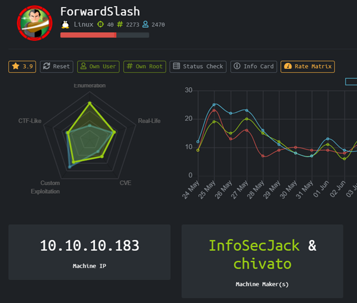

HackTheBox ForwardSlash dengan operating system Linux dengan dan difficulty Hard !

Mari kita mulai dengan enumerasi port menggunakan nmap

### Enumerate

```
Nmap scan report for forwardslash.htb (10.10.10.183)
Host is up (0.016s latency).
Not shown: 65533 closed ports
PORT   STATE SERVICE VERSION
22/tcp open  ssh     OpenSSH 7.6p1 Ubuntu 4ubuntu0.3 (Ubuntu Linux; protocol 2.0)
| ssh-hostkey: 
|   2048 3c:3b:eb:54:96:81:1d:da:d7:96:c7:0f:b4:7e:e1:cf (RSA)
|   256 f6:b3:5f:a2:59:e3:1e:57:35:36:c3:fe:5e:3d:1f:66 (ECDSA)
|_  256 1b:de:b8:07:35:e8:18:2c:19:d8:cc:dd:77:9c:f2:5e (ED25519)
80/tcp open  http    Apache httpd 2.4.29 ((Ubuntu))
|_http-server-header: Apache/2.4.29 (Ubuntu)
|_http-title: Backslash Gang
```

Dari hasil nmap kita bisa melihat 2 port yang terbuka yaitu SSH dan HTTP

Mengakses web dan melakukan dirbuster kita menemukan file note.txt yang berisi

```
Pain, we were hacked by some skids that call themselves the “Backslash Gang”… I know… That name…

Anyway I am just leaving this note here to say that we still have that backup site so we should be fine.

-chiv
```

Dari sini kita bisa mengetahui bahwa ada 2 user di box yang bernama chiv dan pain, serta ada site backup yang harus kita cari.

Enumerating subdomain with wfuzz

```
wfuzz  --hh 0  -H 'Host: FUZZ.forwardslash.htb' -u http://10.10.10.183/ --hc 400 -w /usr/share/wordlists/wfuzz/general/common.txt -c
```

Kita menemukan backup.forwardslash.htb yang berisi login form

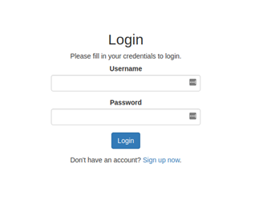

Penulis melakukan dirbuster dan menemukan beberapa file menarik seperti api.php dan config.php

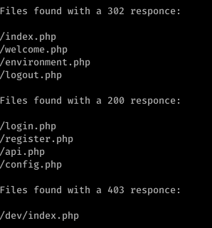

# User

Terdapat sebuah form dimana kita bisa memasukan query  yang kemudian reflected pada GET parameter di URL. penulis berpikir ini kemungkinan besar adalah LFI

Penulis kemudian mencoba mengubah2 parameter didalamnya untuk dumping etc/passwd dan berhasil. penulis kemudian mencoba melihat source code index.php yang tidak di render oleh .php karena penulis b64 encode menggunakan php filters terlebih dahulu.

```
url=file:///etc/passwd
```

```
url=php://filter/convert.base64-encode/resources/var/www/backup.forwardslash.htb/dev/index.php
```

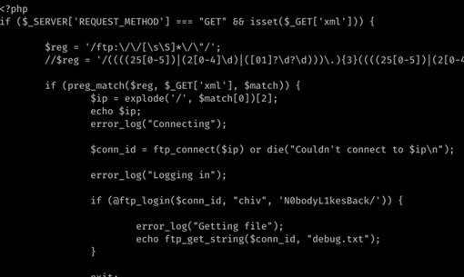

Penulis menemukan pasangan kredensial chiv

chiv:N0bodyL1kesBack/

Kredensial tersebut dapat kita gunakan untuk login melalui SSH

Menggunakan shell chiv, penulis menemukan sebuah file dengan ciphertext dan encryptor yang sepertinya harus kita pecahkan untuk mendapatkan password.

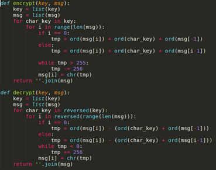

Penulis membuat script untuk mendecrypt tanpa mengetahui key nya terlebih dahulu

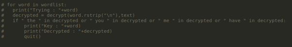

Penulis membuat sebuah if yang mengimplementasikan cipher bruteforce dengan module detectEnglish.py tapi penulis hanya menggunakan sebagian keyword seperti me, have, the, dan you.

Script ini akan mendetect jika proses bruteforce sudah dilakukan dengan benar karena kata inggris terdeteksi.

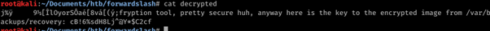

### Root

Namun /var/backups/recovery tidak bisa penulis access, kemungkinan besar itu adalah path to root. Jadi penulis kembali melakukan enumerasi untuk escalate ke user pain dan menemukan /usr/bin/backup

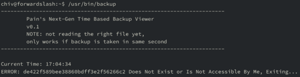

Binary yang melakukan backup sesuai dengan nama file dari proses md5(Jam:Menit:Detik)

Penulis akan membuat bash script untuk mencoba membackup config.php.bak 

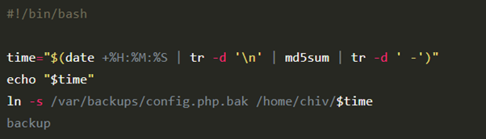

Menjalankan shell scripting syaa berhasil mendapatkan output berupa config.php.bak didalam home directory chiv sehingga bisa penulis cat saja. Isinya sebagai berikut

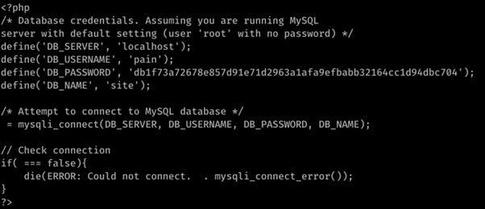

Didapatkan credential pain

pain:db1f73a72678e857d91e71d2963a1afa9efbabb32164cc1d94dbc704s

Login melalui SSH sebagai pain dan melakukan sudo -l

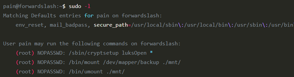

Ingat kembali kita sudah mendapatkan credentials yang kita decrypt tadi untuk /var/backups/recovery

```
cB!6%sdH8Lj^@Y*$C2cf
```

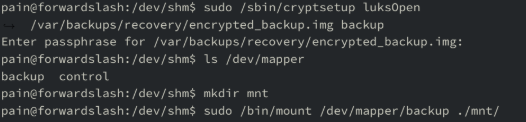

Dapat id_rsa, dan kita bisa connect melalui SSH sebagai root

# Rooted !