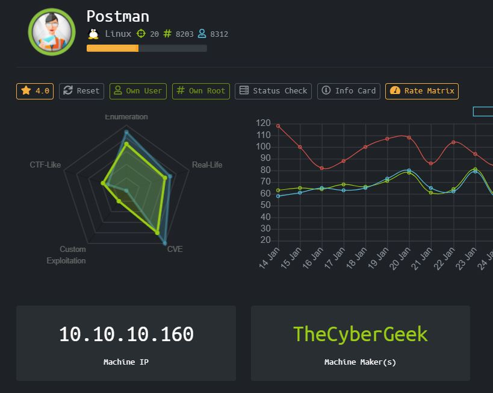

# Postman (Linux)



HackTheBox Postman, dengan OS Linux menurut player HackTheBox lain yang sudah mengerjakan, box ini akan berorientasi pada exploitasi CVE.

### Enumeration

Mari kita lakukan enumerasi pertama dengan melakukan nmap

```
Starting Nmap 7.80 ( https://nmap.org ) at 2020-02-13 01:27 EST
Nmap scan report for 10.10.10.160
Host is up (0.33s latency).
Not shown: 997 closed ports
PORT      STATE SERVICE VERSION
22/tcp    open  ssh     OpenSSH 7.6p1 Ubuntu 4ubuntu0.3 (Ubuntu Linux; protocol 2.0)
| ssh-hostkey: 
|   2048 46:83:4f:f1:38:61:c0:1c:74:cb:b5:d1:4a:68:4d:77 (RSA)
|   256 2d:8d:27:d2:df:15:1a:31:53:05:fb:ff:f0:62:26:89 (ECDSA)
|_  256 ca:7c:82:aa:5a:d3:72:ca:8b:8a:38:3a:80:41:a0:45 (ED25519)
80/tcp    open  http    Apache httpd 2.4.29 ((Ubuntu))
|_http-server-header: Apache/2.4.29 (Ubuntu)
|_http-title: The Cyber Geek's Personal Website
6379/tcp open  redis   Redis key-value store 4.0.9
10000/tcp open  http    MiniServ 1.910 (Webmin httpd)
| http-robots.txt: 1 disallowed entry 
|_/
|_http-server-header: MiniServ/1.910
|_http-title: Site doesn't have a title (text/html; Charset=iso-8859-1).
No exact OS matches for host (If you know what OS is running on it, see https://nmap.org/submit/ ).
TCP/IP fingerprint:
OS:SCAN(V=7.80%E=4%D=2/13%OT=22%CT=1%CU=36676%PV=Y%DS=2%DC=T%G=Y%TM=5E44EC9
OS:1%P=x86_64-pc-linux-gnu)SEQ(SP=107%GCD=1%ISR=10C%TI=Z%TS=A)SEQ(SP=107%GC
OS:D=1%ISR=10D%TI=Z%CI=Z%TS=9)SEQ(SP=107%GCD=1%ISR=10C%TI=Z%CI=Z%II=I%TS=D)
OS:OPS(O1=M54DST11NW7%O2=M54DST11NW7%O3=M54DNNT11NW7%O4=M54DST11NW7%O5=M54D
OS:ST11NW7%O6=M54DST11)WIN(W1=7120%W2=7120%W3=7120%W4=7120%W5=7120%W6=7120)
OS:ECN(R=N)ECN(R=Y%DF=Y%T=40%W=7210%O=M54DNNSNW7%CC=Y%Q=)T1(R=Y%DF=Y%TG=40%
OS:S=O%A=S+%F=AS%RD=0%Q=)T1(R=Y%DF=Y%T=40%S=O%A=S+%F=AS%RD=0%Q=)T2(R=N)T3(R
OS:=N)T4(R=N)T4(R=Y%DF=Y%T=40%W=0%S=O%A=Z%F=R%O=%RD=0%Q=)T5(R=N)T5(R=Y%DF=Y
OS:%T=40%W=0%S=Z%A=O%F=AR%O=%RD=0%Q=)T6(R=N)T6(R=Y%DF=Y%T=40%W=0%S=O%A=Z%F=
OS:R%O=%RD=0%Q=)T7(R=N)T7(R=Y%DF=Y%T=40%W=0%S=Z%A=O%F=AR%O=%RD=0%Q=)U1(R=N)
OS:U1(R=Y%DF=N%T=40%IPL=164%UN=0%RIPL=G%RID=G%RIPCK=G%RUCK=G%RUD=G)IE(R=N)I
OS:E(R=Y%DFI=N%T=40%CD=S)
 
Network Distance: 2 hops
Service Info: OS: Linux; CPE: cpe:/o:linux:linux_kernel
 
TRACEROUTE (using port 110/tcp)
HOP RTT       ADDRESS
1   342.08 ms 10.10.14.1
2   333.33 ms 10.10.10.160
 
OS and Service detection performed. Please report any incorrect results at https://nmap.org/submit/ .
Nmap done: 1 IP address (1 host up) scanned in 84.91 seconds
```
### User

Pertama, penulis membuka service yang running di port 10000 yaitu webmin. Perlu diketahui bahwa jika kita mengaksesnya dengan menggunakan http://10.10.10.160:10000 akan di forward ke page lain, tetapi akan berakhir not responding atau not found. Jadi kita akan mengakses menggunakan https://10.10.10.160:10000.Kita mendapatkan login panel, tetapi penulis masih belum mendapatkan credential yang bisa digunakan untuk login kedalam.


Penulis mencoba untuk mengakses service redis dengan menggunakan telnet. Penulis mencoba untuk mengeksploitasi service redis ini berdasarkan sebuah artikel yang di release oleh developer redisnya sendiri.

https://packetstormsecurity.com/files/134200/Redis-Remote-Command-Execution.html

Kita melakukan pengecekan jika service redis ini perlu authentication terlebih dahulu atau tidak.


Baik, kita tidak memerlukan authentication terlebih dahulu. Pertama penulis melakukan pengecekan config redis yang dapat diubah. Ternyata kita bisa mengubah dir dan dbfilename untuk melakukan injeksi ssh key kita agar kita bisa melakukan ssh menggunakan private key.

Redis basically adalah database nosql dimana penyimpanan data akan disimpan dengan key pair. [Nama key = Isi Value]

Maka kita akan menyimpan public key rsa kita kedalam file authorized_keys di directory /var/lib/redis/.ssh


Ok kita sudah bisa ssh sebagai user redis kedalam machine.

Setelah mengecek di directory /home kita bisa menemukan user Matt, maka kita harus melakukan horizontal priviledge escalation ke Matt untuk mendapatkan user.txt nya.


Kita menemukan private key di directory /opt ,  saya memindahkan file backup ini ke local machine saya menggunakan python simplehttpserver untuk di crack passphrasenya dan login sebagai siapapun orang yang private key nya diletakkan saja disini. Menurut penulis saat itu adalah private key Matt.


Passphrasenya adalah computer2008

Mencoba login menggunakan rsa key tersebut, kita akan mendapatkan closed port on 22. Jadi penulis mencoba melakukan su sebagai Matt didalam shell redis.


### Root

Untuk ke root nya, saya mencoba exploring ke webmin tadi, menggunakan credentials Matt:computer2008 dan ternyata bisa. Tapi setelah searching tidak menemukan apa-apa , penulis mengalihkan perhatiannya ke CVE webmin, tetapi untuk mengecek versi webmin yang benar, penulis mencari configuration file webmin.


Coba kita cari di msfconsole


Ada exploit package update di versi 1.910 dimana kita memerlukan credentials user yang memiliki permission untuk melakukan package update. Kebetulan Matt memiliki permission yang sesuai.


# Rooted !

