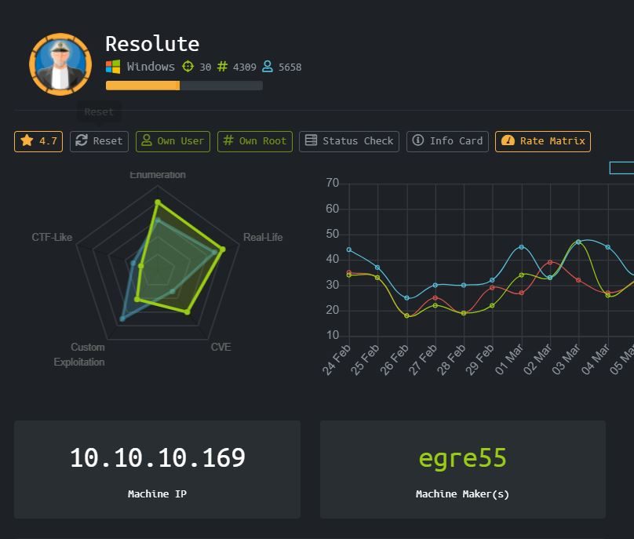
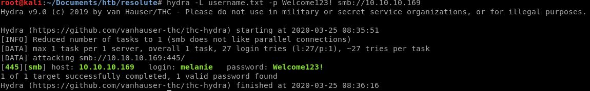
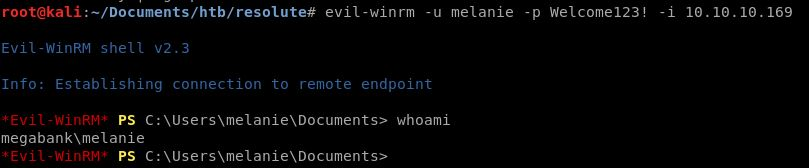
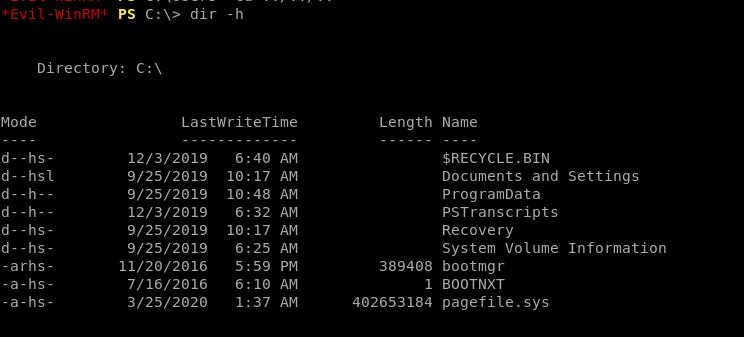
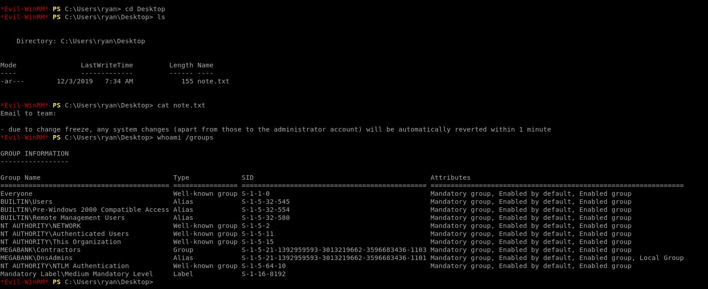
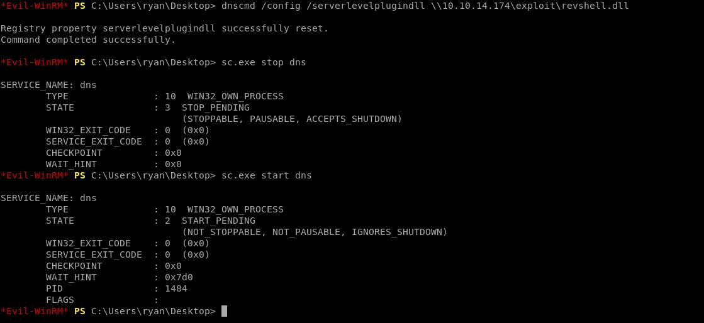
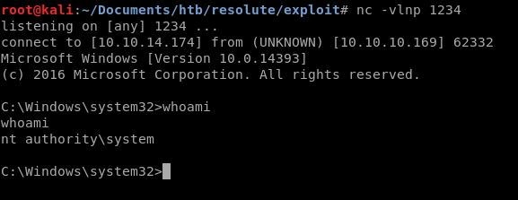

# Resolute (Windows)



HackTheBox machine Resolute dengan operating system Windows. Untuk box kali ini penulis tidak menggunakan tool Sparta lagi karena sepertinya toolnya sedang tidak bisa digunakan saat itu. Maka untuk proses enumeration harus menggunakan tool lain yang terpisah-pisah.

### Enumeration

Mari kita mulai dengan nmap

```
Starting Nmap 7.80 ( https://nmap.org ) at 2020-03-21 00:20 EDT
Nmap scan report for 10.10.10.169
Host is up (0.25s latency).
Not shown: 989 closed ports
PORT     STATE SERVICE      VERSION
53/tcp   open  domain?
| fingerprint-strings: 
|   DNSVersionBindReqTCP: 
|     version
|_    bind
88/tcp   open  kerberos-sec Microsoft Windows Kerberos (server time: 2020-03-21 04:30:38Z)
135/tcp  open  msrpc        Microsoft Windows RPC
139/tcp  open  netbios-ssn  Microsoft Windows netbios-ssn
389/tcp  open  ldap         Microsoft Windows Active Directory LDAP (Domain: megabank.local, Site: Default-First-Site-Name)
445/tcp  open  microsoft-ds Windows Server 2016 Standard 14393 microsoft-ds (workgroup: MEGABANK)
464/tcp  open  kpasswd5?
593/tcp  open  ncacn_http   Microsoft Windows RPC over HTTP 1.0
636/tcp  open  tcpwrapped
3268/tcp open  ldap         Microsoft Windows Active Directory LDAP (Domain: megabank.local, Site: Default-First-Site-Name)
3269/tcp open  tcpwrapped
1 service unrecognized despite returning data. If you know the service/version, please submit the following fingerprint at https://nmap.org/cgi-bin/submit.cgi?new-service :
SF-Port53-TCP:V=7.80%I=7%D=3/21%Time=5E75964B%P=x86_64-pc-linux-gnu%r(DNSV
SF:ersionBindReqTCP,20,"\0\x1e\0\x06\x81\x04\0\x01\0\0\0\0\0\0\x07version\
SF:x04bind\0\0\x10\0\x03");
No exact OS matches for host (If you know what OS is running on it, see https://nmap.org/submit/ ).
TCP/IP fingerprint:
OS:SCAN(V=7.80%E=4%D=3/21%OT=53%CT=1%CU=36449%PV=Y%DS=2%DC=T%G=Y%TM=5E75976
OS:6%P=x86_64-pc-linux-gnu)SEQ(SP=107%GCD=1%ISR=109%TI=I%CI=I%TS=A)SEQ(SP=1
OS:07%GCD=1%ISR=109%TI=I%CI=I%II=I%SS=S%TS=A)SEQ(SP=107%GCD=1%ISR=109%TI=I%
OS:II=I%SS=S%TS=A)OPS(O1=M54DNW8ST11%O2=M54DNW8ST11%O3=M54DNW8NNT11%O4=M54D
OS:NW8ST11%O5=M54DNW8ST11%O6=M54DST11)WIN(W1=2000%W2=2000%W3=2000%W4=2000%W
OS:5=2000%W6=2000)ECN(R=Y%DF=Y%T=80%W=2000%O=M54DNW8NNS%CC=Y%Q=)T1(R=Y%DF=Y
OS:%T=80%S=O%A=S+%F=AS%RD=0%Q=)T2(R=Y%DF=Y%T=80%W=0%S=Z%A=S%F=AR%O=%RD=0%Q=
OS:)T3(R=Y%DF=Y%T=80%W=0%S=Z%A=O%F=AR%O=%RD=0%Q=)T4(R=Y%DF=Y%T=80%W=0%S=A%A
OS:=O%F=R%O=%RD=0%Q=)T5(R=Y%DF=Y%T=80%W=0%S=Z%A=S+%F=AR%O=%RD=0%Q=)T6(R=Y%D
OS:F=Y%T=80%W=0%S=A%A=O%F=R%O=%RD=0%Q=)T7(R=Y%DF=Y%T=80%W=0%S=Z%A=S+%F=AR%O
OS:=%RD=0%Q=)U1(R=Y%DF=N%T=80%IPL=164%UN=0%RIPL=G%RID=G%RIPCK=G%RUCK=G%RUD=
OS:G)IE(R=Y%DFI=N%T=80%CD=Z)
 
Network Distance: 2 hops
Service Info: Host: RESOLUTE; OS: Windows; CPE: cpe:/o:microsoft:windows
 
Host script results:
|_clock-skew: mean: 2h29m12s, deviation: 4h02m30s, median: 9m11s
| smb-os-discovery: 
|   OS: Windows Server 2016 Standard 14393 (Windows Server 2016 Standard 6.3)
|   Computer name: Resolute
|   NetBIOS computer name: RESOLUTE\x00
|   Domain name: megabank.local
|   Forest name: megabank.local
|   FQDN: Resolute.megabank.local
|_  System time: 2020-03-20T21:33:12-07:00
| smb-security-mode: 
|   account_used: <blank>
|   authentication_level: user
|   challenge_response: supported
|_  message_signing: required
| smb2-security-mode: 
|   2.02: 
|_    Message signing enabled and required
| smb2-time: 
|   date: 2020-03-21T04:33:13
|_  start_date: 2020-03-20T20:22:10
 
TRACEROUTE (using port 8080/tcp)
HOP RTT       ADDRESS
1   262.23 ms 10.10.14.1
2   262.35 ms 10.10.10.169
 
OS and Service detection performed. Please report any incorrect results at https://nmap.org/submit/ .
Nmap done: 1 IP address (1 host up) scanned in 318.13 seconds
```

Kita mendapatkan beberapa open ports menarik seperti samba,ldap,dan rpc over http, mari selesaikan enumerasi nya dulu dengan menggunakan enum4linux

Note to self:

[https://docs.microsoft.com/en-us/windows/win32/rpc/remote-procedure-calls-using-rpc-over-http](https://docs.microsoft.com/en-us/windows/win32/rpc/remote-procedure-calls-using-rpc-over-http)

```
 ============================= 
|    Users on 10.10.10.169    |
 ============================= 
index: 0x10b0 RID: 0x19ca acb: 0x00000010 Account: abigail	Name: (null)	Desc: (null)
index: 0xfbc RID: 0x1f4 acb: 0x00000210 Account: Administrator	Name: (null)	Desc: Built-in account for administering the computer/domain
index: 0x10b4 RID: 0x19ce acb: 0x00000010 Account: angela	Name: (null)	Desc: (null)
index: 0x10bc RID: 0x19d6 acb: 0x00000010 Account: annette	Name: (null)	Desc: (null)
index: 0x10bd RID: 0x19d7 acb: 0x00000010 Account: annika	Name: (null)	Desc: (null)
index: 0x10b9 RID: 0x19d3 acb: 0x00000010 Account: claire	Name: (null)	Desc: (null)
index: 0x10bf RID: 0x19d9 acb: 0x00000010 Account: claude	Name: (null)	Desc: (null)
index: 0xfbe RID: 0x1f7 acb: 0x00000215 Account: DefaultAccount	Name: (null)	Desc: A user account managed by the system.
index: 0x10b5 RID: 0x19cf acb: 0x00000010 Account: felicia	Name: (null)	Desc: (null)
index: 0x10b3 RID: 0x19cd acb: 0x00000010 Account: fred	Name: (null)	Desc: (null)
index: 0xfbd RID: 0x1f5 acb: 0x00000215 Account: Guest	Name: (null)	Desc: Built-in account for guest access to the computer/domain
index: 0x10b6 RID: 0x19d0 acb: 0x00000010 Account: gustavo	Name: (null)	Desc: (null)
index: 0xff4 RID: 0x1f6 acb: 0x00000011 Account: krbtgt	Name: (null)	Desc: Key Distribution Center Service Account
index: 0x10b1 RID: 0x19cb acb: 0x00000010 Account: marcus	Name: (null)	Desc: (null)
index: 0x10a9 RID: 0x457 acb: 0x00000210 Account: marko	Name: Marko Novak	Desc: Account created. Password set to Welcome123!
index: 0x10c0 RID: 0x2775 acb: 0x00000010 Account: melanie	Name: (null)	Desc: (null)
index: 0x10c3 RID: 0x2778 acb: 0x00000010 Account: naoki	Name: (null)	Desc: (null)
index: 0x10ba RID: 0x19d4 acb: 0x00000010 Account: paulo	Name: (null)	Desc: (null)
index: 0x10be RID: 0x19d8 acb: 0x00000010 Account: per	Name: (null)	Desc: (null)
index: 0x10a3 RID: 0x451 acb: 0x00000210 Account: ryan	Name: Ryan Bertrand	Desc: (null)
index: 0x10b2 RID: 0x19cc acb: 0x00000010 Account: sally	Name: (null)	Desc: (null)
index: 0x10c2 RID: 0x2777 acb: 0x00000010 Account: simon	Name: (null)	Desc: (null)
index: 0x10bb RID: 0x19d5 acb: 0x00000010 Account: steve	Name: (null)	Desc: (null)
index: 0x10b8 RID: 0x19d2 acb: 0x00000010 Account: stevie	Name: (null)	Desc: (null)
index: 0x10af RID: 0x19c9 acb: 0x00000010 Account: sunita	Name: (null)	Desc: (null)
index: 0x10b7 RID: 0x19d1 acb: 0x00000010 Account: ulf	Name: (null)	Desc: (null)
index: 0x10c1 RID: 0x2776 acb: 0x00000010 Account: zach	Name: (null)	Desc: (null)
```

### User

Pada bagian ini terdapat bagian menarik di descriptionnya, dibilang account marko sudah dibuat dan password di set menjadi Welcome123! (iya tanda seru nya juga -.- , sempat stuck disini karena dikira tanda serunya itu tidak termasuk password)

Saya mengetes menggunakan evil-winrm untuk login ke marko menggunakan password Welcome123! tapi wrong password. Karena tidak melihat cara lain untuk masuk kedalam, penulis mencoba password yang sama ke semua user, membuat user wordlist dengan sedikit sublime magic dan masukin ke hydra



Kita dapet sebuah match sebagai user melanie dengan password Welcome123!

Mari coba login menggunakan Evil-Winrm dengan credentials yang sama



### Root

Berhasil masuk, saya sempat menggunakan WinEnum.bat tapi tidak ada hasil yang menarik maka langsung manual enumeration, ternyata ada user lain bernama ryan.



Bisa ditemukan directory PSTranscripts

```
*Evil-WinRM* PS C:\PSTranscripts\20191203> cat PowerShell_transcript.RESOLUTE.OJuoBGhU.20191203063201.txt
**********************
Windows PowerShell transcript start
Start time: 20191203063201
Username: MEGABANK\ryan
RunAs User: MEGABANK\ryan
Machine: RESOLUTE (Microsoft Windows NT 10.0.14393.0)
Host Application: C:\Windows\system32\wsmprovhost.exe -Embedding
Process ID: 2800
PSVersion: 5.1.14393.2273
PSEdition: Desktop
PSCompatibleVersions: 1.0, 2.0, 3.0, 4.0, 5.0, 5.1.14393.2273
BuildVersion: 10.0.14393.2273
CLRVersion: 4.0.30319.42000
WSManStackVersion: 3.0
PSRemotingProtocolVersion: 2.3
SerializationVersion: 1.1.0.1
**********************
Command start time: 20191203063455
**********************
PS>TerminatingError(): "System error."
>> CommandInvocation(Invoke-Expression): "Invoke-Expression"
>> ParameterBinding(Invoke-Expression): name="Command"; value="-join($id,'PS ',$(whoami),'@',$env:computername,' ',$((gi $pwd).Name),'> ')
if (!$?) { if($LASTEXITCODE) { exit $LASTEXITCODE } else { exit 1 } }"
>> CommandInvocation(Out-String): "Out-String"
>> ParameterBinding(Out-String): name="Stream"; value="True"
**********************
Command start time: 20191203063455
**********************
PS>ParameterBinding(Out-String): name="InputObject"; value="PS megabank\ryan@RESOLUTE Documents> "
PS megabank\ryan@RESOLUTE Documents>
**********************
Command start time: 20191203063515
**********************
PS>CommandInvocation(Invoke-Expression): "Invoke-Expression"
>> ParameterBinding(Invoke-Expression): name="Command"; value="cmd /c net use X: \\fs01\backups ryan Serv3r4Admin4cc123!
 
if (!$?) { if($LASTEXITCODE) { exit $LASTEXITCODE } else { exit 1 } }"
>> CommandInvocation(Out-String): "Out-String"
>> ParameterBinding(Out-String): name="Stream"; value="True"
**********************
Windows PowerShell transcript start
Start time: 20191203063515
Username: MEGABANK\ryan
RunAs User: MEGABANK\ryan
Machine: RESOLUTE (Microsoft Windows NT 10.0.14393.0)
Host Application: C:\Windows\system32\wsmprovhost.exe -Embedding
Process ID: 2800
PSVersion: 5.1.14393.2273
PSEdition: Desktop
PSCompatibleVersions: 1.0, 2.0, 3.0, 4.0, 5.0, 5.1.14393.2273
BuildVersion: 10.0.14393.2273
CLRVersion: 4.0.30319.42000
WSManStackVersion: 3.0
PSRemotingProtocolVersion: 2.3
SerializationVersion: 1.1.0.1
**********************
**********************
Command start time: 20191203063515
**********************
PS>CommandInvocation(Out-String): "Out-String"
>> ParameterBinding(Out-String): name="InputObject"; value="The syntax of this command is:"
cmd : The syntax of this command is:
At line:1 char:1
+ cmd /c net use X: \\fs01\backups ryan Serv3r4Admin4cc123!
+ ~~~~~~~~~~~~~~~~~~~~~~~~~~~~~~~~~~~~~~~~~~~~~~~~~~~~~~~~~
    + CategoryInfo          : NotSpecified: (The syntax of this command is::String) [], RemoteException
    + FullyQualifiedErrorId : NativeCommandError
cmd : The syntax of this command is:
At line:1 char:1
+ cmd /c net use X: \\fs01\backups ryan Serv3r4Admin4cc123!
+ ~~~~~~~~~~~~~~~~~~~~~~~~~~~~~~~~~~~~~~~~~~~~~~~~~~~~~~~~~
    + CategoryInfo          : NotSpecified: (The syntax of this command is::String) [], RemoteException
    + FullyQualifiedErrorId : NativeCommandError
**********************
Windows PowerShell transcript start
Start time: 20191203063515
Username: MEGABANK\ryan
RunAs User: MEGABANK\ryan
Machine: RESOLUTE (Microsoft Windows NT 10.0.14393.0)
Host Application: C:\Windows\system32\wsmprovhost.exe -Embedding
Process ID: 2800
PSVersion: 5.1.14393.2273
PSEdition: Desktop
PSCompatibleVersions: 1.0, 2.0, 3.0, 4.0, 5.0, 5.1.14393.2273
BuildVersion: 10.0.14393.2273
CLRVersion: 4.0.30319.42000
WSManStackVersion: 3.0
PSRemotingProtocolVersion: 2.3
SerializationVersion: 1.1.0.1
**********************
```

Ada semacam log dari powershell, pada bagian invocation kita bisa melihat user dan password ryan sedang digunakan, passwordnya Serv3r4Admin4cc123!

Mari coba lagi di evil-winrm



Ditemukan sebuah note.txt di desktop user ryan yang meyinggung tentang administrator, oleh sebab itu saya mengecek sebenernya role ryan ini apa, karena passwordnya sebenarnya sedikit mencurigakan.

MEGABANK\DnsAdmins

Pencarian google “DnsAdmins” result pertamanya mengeluarkan exploit untuk DnsAdmin

[https://medium.com/techzap/dns-admin-privesc-in-active-directory-ad-windows-ecc7ed5a21a2](https://medium.com/techzap/dns-admin-privesc-in-active-directory-ad-windows-ecc7ed5a21a2)

Sisa step by stepnya tinggal follow blindly dari blog ini





# Rooted !
